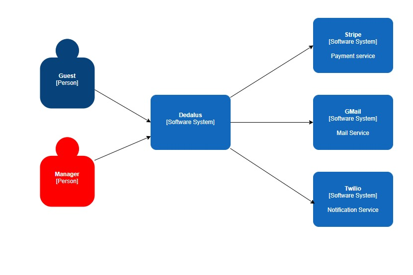
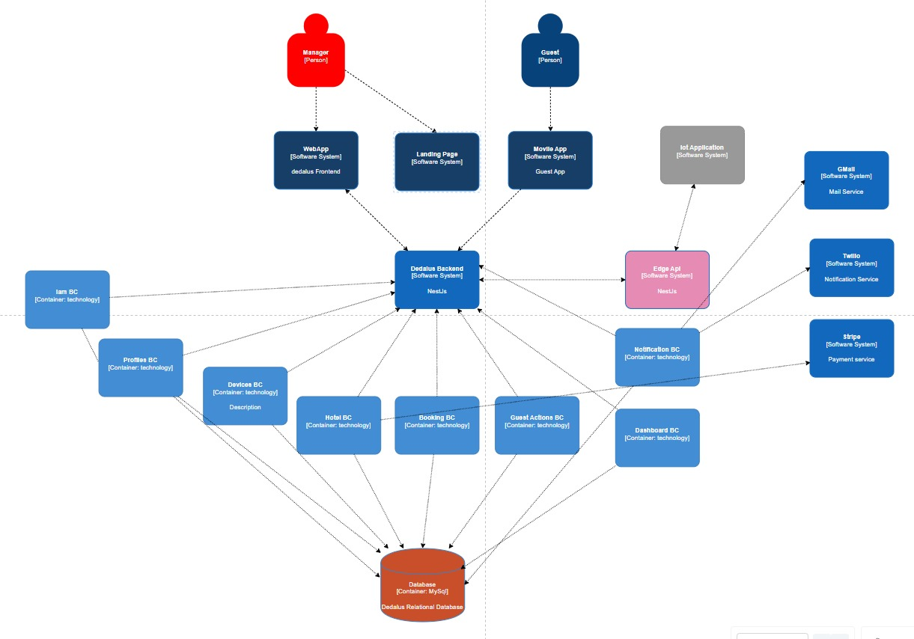

<h1 style="text-align: center;"> Informe del TB1 </h1>
<h3 style="text-align: center;"> Universidad Peruana de Ciencias Aplicadas </h3>

<h5 style="text-align: center"> Área: Ingeniería de Software </h5>

<h5 style="text-align: center"> Curso: Desarrollo de soluciones IOT </h5>
<h5 style="text-align: center"> Sección: 3475 </h5>

<h5 style="text-align: center"> Docente: Marco Antonio Leon Baca </h5>

<h5 style="text-align: center"> Startup: KamaqLabs </h5>

<h5 style="text-align: center"> Producto: Dedalus </h5>

## Team members:

|                  Nombre                  |   Código   |
|:----------------------------------------:|:----------:|
| Vasquez Requejo Augusto Mathias Leonardo | u20221A955 |
|  Cervantes Erequita Valentino Sebastian  | U202110140 |
|  Ccotarma Ttito, Sihuar Eduardo Eusebio  | U20211c736 |
|    Carpio Cornejo, Miguel Ángel Jesús    | u20221c360 |
|Braithuaite Toledo, Gabriel Anthony       | u20201e889 |

<h5 style="text-align: center"> Ciclo 2025-20 </h5>

# Registro de Versiones del Informe

El objetivo de esta sección es resumir las modificaciones relevantes que se realizan al informe durante el ciclo de vida del proyecto. Esta sección inicia en una página nueva y se incluye un cuadro con la siguiente estructura:

| Versión | Fecha      | Autores                     | Descripción de Modificaciones |
|---------|------------|-----------------------------|-------------------------------|
| 1era    | 19/25/2025 | |Carátula, CapítuloI, Capítulo II, Capítulo III, Capítulo IV, Capítulo V  |

## Project Report Collaboration Insights

URL del repositorio para el reporte del proyecto: https://github.com/KamaqLabs/Report

**TB1**

Para el desarrollo del informe perteneciente a la entrega TB1, se dividió la implementación de secciones de la siguiente forma para cada integrante del equipo:

| Integrante                            | Tareas Asignadas                                                                                                                           |
| ------------------------------------- | ------------------------------------------------------------------------------------------------------------------------------------------ |
| Vasquez Requejo Augusto Mathias Leonardo  |Chapters 01,02,03,04,05                   |
|   Cervantes Erequita Valentino Sebastian  | Chapters 01,02,03,04,05|
|   Ccotarma Ttito, Sihuar Eduardo Eusebio   | Chapters 01,02,03,04,05  |
| Carpio Cornejo, Miguel Ángel Jesús | Chapters 01,02,03,04,05|
|Braithuaite Toledo, Gabriel Anthony  | Chapters 01,02,03,04,05|

Los integrantes son:

- Vasquez Requejo Augusto Mathias Leonardo | (Mathifa519)
- Braithuaite Toledo Gabriel Anthony | (Gaboo04)
- Cervantes Erequita Valentino Sebastian |(KiwiAmenazante)
- Ccotarma Ttito, Sihuar Eduardo Eusebio | (Anx0123)
- Carpio Cornejo, Miguel Ángel Jesús | (MiguelCarpioC)
## Contenido
## Índice

- [Capítulo I: Introducción](/docs/Chapter-01.md)
    - [1.1. StartUp Profile](/docs/Chapter-01.md#11-startup-profile)
        - [1.1.1. Descripción de la StartUp](/docs/Chapter-01.md#111-descripción-de-la-startup)
        - [1.1.2. Perfiles de Integrantes del equipo](/docs/Chapter-01.md#112-perfiles-de-integrantes-del-equipo)
    - [1.2. Solution Profile](/docs/Chapter-01.md#12-solution-profile)
        - [1.2.1. Antecedentes y Problemática](/docs/Chapter-01.md#121-antecedentes-y-problemática)
         - [1.2.2. Lean UX Process](/docs/Chapter-01.md#122-lean-ux-process)
            - [1.2.2.1. Problem Statement](/docs/Chapter-01.md#1221-problem-statement)
            - [1.2.2.2. Lean UX Assumptions](/docs/Chapter-01.md#1222-lean-ux-assumptions)
            - [1.2.2.3. User Outcomes](/docs/Chapter-01.md#1223-user-outcomes)
            - [1.2.2.4. Business Outcomes](/docs/Chapter-01.md#1224-business-outcomes)
            - [1.2.2.5. Feature Outcomes](/docs/Chapter-01.md#1225-feature-outcomes)
            - [1.2.2.6. Lean UX Hypothesis Statements](/docs/Chapter-01.md#1226-lean-ux-hypothesis-statements)
            - [1.2.2.7. Lean UX Canvas](/docs/Chapter-01.md#1227-lean-ux-canvas)
    - [1.3. Segmentos objetivo](/docs/Chapter-01.md#13-segmentos-objetivo)

- [Capítulo II: Requirements Elicitation & Analysis](#capítulo-ii-requirements-elicitation--analysis)
    - [2.1. Competidores](#21-competidores)
        - [2.1.1 Análisis competitivo](#211-análisis-competitivo)
        - [2.1.2. Estrategias y tácticas frente a competidores](#212-estrategias-y-tácticas-frente-a-competidores)
    - [2.2. Entrevistas](#22-entrevistas)
        - [2.2.1 Diseño de entrevistas](#221-diseño-de-entrevistas)
        - [2.2.2. Registro de entrevistas](#222-registro-de-entrevistas)
        - [2.2.3. Análisis de entrevistas](#223-análisis-de-entrevistas)
    - [2.3. Needfinding](#23-needfinding)
        - [2.3.1. User Persona](#231-user-persona)
        - [2.3.2. User Task Matrix](#232-user-task-matrix)
        - [2.3.3. User Journey Mapping](#233-user-journey-mapping)
        - [2.3.4. Empathy Mapping](#234-empathy-mapping)
        - [2.4. Big Picture EventStorming](#236-big-picture-eventstorming)
        - [2.5. Ubiquitous Language](#237-ubiquitous-language)

- [Capítulo III: Requirements Specification](#capítulo-iii-requirements-specification)
    - [3.1. User Stories](#31-user-stories)
    - [3.2. Impact Mapping](#32-impact-mapping)
    - [3.3. Product Backlog](#33-product-backlog)

- [Capítulo IV: Solution Software Design](#capítulo-iv-product-design)
    - [4.1. Strategic-Level Domain-Driven Design](#41-style-guidelines)
        - [4.1.1. Design-Level EventStorming](#411-general-style-guidelines)
            - [4.1.1.1. Candidate Context Discovery](#412-web-style-guidelines)
            - [4.1.1.1. Domain Message Flows Modeling](#412-web-style-guidelines)
            - [4.1.1.1. Bounded Context Canvases](#412-web-style-guidelines)
        - [4.1.2. Context Mapping](#42-information-architecture)
        - [4.1.3. Software Architecture](#421-organization-systems)
            - [4.1.3.1. Software Architecture System Landscape Diagram](#421-system-landscape-diagram)
            - [4.1.3.2 Software Architecture Context Level Diagrams](#422-labeling-systems)
            - [4.1.3.3. Software Architecture Container Level Diagrams](#423-searching-systems)
            - [4.1.3.4 Software Architecture Deployment Diagrams](#424-labeling-systems)
    - [4.2. Tactical-Level Domain-Driven Design](#41-style-guidelines)
        - [4.2.1. Bounded Context](#424-searching-systems)
            - [4.2.1.1 Domain Layer](#425-navigation-systems)
            - [4.2.1.2 Interface Layer](#425-navigation-systems)
            - [4.2.1.3 Application Layer](#425-navigation-systems)
            - [4.2.1.4 Infrastructure Layer](#425-navigation-systems)
            - [4.2.1.5 Bounded Context Software Architecture Component Level Diagrams](#425-navigation-systems)
            - [4.2.1.6 Bounded Context Software Architecture Code Level Diagrams](#425-navigation-systems)
                - [4.2.1.6.1 Bounded Context Domain Layer Class Diagrams](#425-navigation-systems)
                - [4.2.1.6.2 Bounded Context Database Design Diagram](#425-navigation-systems)

- [Conclusiones](#conclusiones)
    - [Conclusiones y recomendaciones](#conclusiones-y-recomendaciones)
    - [Video About-the-Team](#video-about-the-team)

- [Bibliografía](#bibliografía)
- [Anexos](#anexos)

# Student Outcome
**ABET – EAC - Student Outcome 5**  
Criterio: La capacidad de funcionar efectivamente en un equipo cuyos miembros juntos proporcionan liderazgo, crean un entorno de colaboración e inclusivo, establecen objetivos, planifican tareas y cumplen objetivos.  

| Criterio Específico | Acciones Realizadas | Conclusiones |
|---|---|---|
| Trabaja en equipo para proporcionar liderazgo en forma conjunta | **Vasquez Requejo Augusto Mathias Leonardo**   **TB1:** Contribuyó al desarrollo de los capítulos iniciales del informe, organizando los apartados de introducción y propuesta de solución, lo que permitió orientar al equipo sobre la estructura general del documento.   **TB2:** Lideró la definición de contenido clave de la Landing (“¿Qué es Dedalus?”) y del formulario de **Contacto** (WI02, WI08), guiando al equipo para mantener coherencia con los lineamientos de UI/UX del Cap. 5.    **Cervantes Erequita Valentino Sebastian**   **TB1:** Aportó en la redacción y consolidación de las secciones relacionadas con la problemática y entrevistas, coordinando con el equipo para definir las ideas clave.   **TB2:** Asumió liderazgo en la **estructura base de la Landing Page** (WI01) y la sección “Miembros del grupo” (WI07); apoyó la preparación del **Sprint Planning 1** y el cuadro de backlog.    **Ccotarma Ttito Sihuar Eduardo Eusebio**   **TB1:** Se enfocó en el análisis de competidores y necesidades de usuario, planteando lineamientos para guiar las decisiones del equipo.   **TB2:** Lideró la sección **“About the product”** (WI04), alineando mensajes con la arquitectura propuesta (Cap. 6.1) y asegurando claridad de beneficios para stakeholders.    **Carpio Cornejo Miguel Ángel Jesús**   **TB1:** Colaboró en la organización del índice y los entregables de especificación de requerimientos, brindando soporte en la redacción y alineación de criterios comunes.   **TB2:** Coordinó la **documentación técnica de despliegue CI/CD** (GitHub Actions + Pages), la pauta de **GitFlow** y **Conventional Commits**; cerró las secciones de **Planes** (WI06) y “About the team” (WI05), asegurando trazabilidad entre tareas, repos y evidencias.    **Gabriel Braithuaite**   **TB1:** Trabajó con el equipo de manera conjunta decidiendo los objetivos de la primera entrega.   **TB2:** Lideró la implementación de **CTA** y **Footer** (WI03, WI09), y apoyó la automatización de deploy (actualización del workflow), aportando a la estabilidad del pipeline. | Se consolidó un liderazgo distribuido por frentes (estructura, contenido, evidencia técnica y despliegue). Cada integrante tomó ownership de secciones críticas y documentación, acelerando decisiones y manteniendo foco en el objetivo del Sprint 1. |
| Crea un entorno colaborativo e inclusivo, establece metas, planifica tareas y cumple objetivos | **Vasquez Requejo Augusto Mathias Leonardo**   **TB1:** Facilitó la coordinación inicial del trabajo, definiendo los primeros objetivos y estableciendo un plan de redacción conjunta.   **TB2:** Trabajó con Trello para refinar WI02/WI08; coordinó validaciones cruzadas de copy/UX; cumplió estimaciones (1h por ítem) y entregó a tiempo para la build.    **Cervantes Erequita Valentino Sebastian**   **TB1:** Apoyó en la revisión cruzada de capítulos y promovió un ambiente inclusivo, asegurando que todas las ideas fueran consideradas.   **TB2:** Estructuró el **skeleton** de la Landing y el cuadro de **Sprint Planning 1** (fecha, asistentes, objetivo y criterio de Done), manteniendo sincronía entre backlog y evidencias.    **Ccotarma Ttito Sihuar Eduardo Eusebio**   **TB1:** Aseguró la integración de los aportes del equipo en las secciones de análisis de usuarios, cumpliendo plazos acordados.   **TB2:** Integró feedback de UX en “About the product”; aseguró consistencia semántica y accesibilidad (Cap. 5.1/5.2); colaboró en pruebas manuales del flujo de lectura.    **Carpio Cornejo Miguel Ángel Jesús**   **TB1:** Coordinó la elaboración de diagramas y apartados técnicos, fomentando la colaboración entre todos los integrantes.   **TB2:** Documentó **SCM** (6.1), **entornos**, **GitFlow** y **convenciones**; orquestó el **deploy automatizado** (workflow, base-href, 404.html para rutas) y dejó evidencias (URL pública, capturas, estructura de repo).    **Gabriel Braithuaite**   **TB1:** En base a los objetivos de la primera entrega, planificó las tareas que debía cumplir para aportar al equipo trabajando de manera colaborativa.   **TB2:** Implementó CTA/Footer y contribuyó al workflow de GitHub Pages; participó en verificación de recursos y tiempos de carga. | El equipo planificó y ejecutó el Sprint 1 conforme al backlog: las WI (WI01–WI09) finalizaron Done, se publicó la Landing con CI/CD activo y se registraron evidencias (commits, capturas, enlace público). Se cumplieron metas con coordinación continua vía Trello, Git y reuniones síncronas. |

# Capítulo I: Introducción

## 1.1. StartUp Profile

### 1.1.1. Descripción de la StartUp

Kamaqlabs es una startup tecnológica enfocada en el desarrollo de soluciones IoT (Internet of Things) para la industria hotelera. Su producto principal, Dedalus IoT, es una plataforma integral que conecta dispositivos inteligentes con aplicaciones web y móviles, permitiendo a los hoteles transformar su operación en espacios inteligentes, seguros y eficientes.

El sistema integra:

- Gestión Web para Gerentes: creación y administración de habitaciones, reservas, credenciales y monitoreo de dispositivos.

- Aplicación Móvil para Huéspedes: acceso seguro a su habitación mediante NFC/Bluetooth/tarjetas físicas, control de luces, cortinas, temperatura y pedidos de servicios en tiempo real.

- Infraestructura IoT: sensores de humo y gas con alertas instantáneas, luces inteligentes con detección de presencia, cerraduras electrónicas y termostatos conectados.

Con este ecosistema, la startup busca cerrar la brecha tecnológica en el sector hotelero peruano y latinoamericano, donde predominan procesos manuales, baja digitalización y poca integración de dispositivos inteligentes.

- **Misión**

Impulsar la transformación digital del sector hotelero mediante una plataforma IoT accesible y confiable que mejore la seguridad, optimice la eficiencia energética y eleve la experiencia de los huéspedes.

- **Visión**

Convertirse en la solución IoT hotelera líder en Latinoamérica, reconocida por su capacidad de integrar la gestión operativa con tecnologías inteligentes que generen hoteles sostenibles, rentables y centrados en el cliente.

Propuesta de Valor

- **Para Gerentes:** control total de habitaciones y dispositivos en tiempo real, reducción de costos operativos y seguridad reforzada.

- **Para Huéspedes:** acceso rápido, seguro y personalizado a su habitación, con ambientes adaptados a sus preferencias.

- **Para el Hotel:** un sistema escalable, adaptable y con soporte local que combina la gestión digital con la automatización IoT.

### 1.1.2. Perfiles de Integrantes del equipo

| Nombre Completo del integrante         | Descripcion de Carrera                                                                          | Fotografía                                                                                                                                                                 | Conocimientos y Habilidades a apuntar                                                                                                                                                                                                                                               |
|----------------------------------------|-------------------------------------------------------------------------------------------------|----------------------------------------------------------------------------------------------------------------------------------------------------------------------------|-------------------------------------------------------------------------------------------------------------------------------------------------------------------------------------------------------------------------------------------------------------------------------------|
| Augusto Mathias Vasquez Requejo        | Ingeniería de Software  6to Ciclo 2025-2 Universidad Peruana de Ciencias Aplicadas     |  | - Conocimientos en lenguajes de programación como C++, JavaScript, HTML, CSS.  - Responsabilidad y dedicación con los trabajos grupales.                                                                                                                                         |
| Miguel Ángel Carpio Cornejo         | Ingeniería de Software  7mo Ciclo 2025-2 Universidad Peruana de Ciencias Aplicadas     |                                                                                   | - Conocimientos en lenguajes de programacion como C++, C#, Python, JavaScript, etc. - Trabajo bien bajo presion y aporto con ideas óptimas para la solucion de diferentes problemas.                                                                                             |
| Gabriel Anthony Braithuaite Toledo     | Ingeniería de Software  6to Ciclo   2025-2   Universidad Peruana de Ciencias aplicadas |                                                                           | - Conocimientos en lenguajes de programación como C++, Python, Html y CSS.Considero que puedo aportar en el equipo, ya que soy responsable y trato de cumplir con las partes que se delegan en el equipo. A la vez, colaboro con ideas para poder lograr un buen trabajo en equipo. |.      
| Eduardo Eusebio SIhuar Ccotarma Ttito  | Ingeniería de Software  7mo Ciclo 2025-2 Universidad Peruana de Ciencias Aplicadas     |;">                                                                                           | - Me gusta mucho el mundo de la informática, tecnología y los videojuegos. Me gustan los shooters y mobas. De vez en cuando diseño pequeños proyectos de juegos como replicar mecánicas o interfaces que me parecen interesantes.                                                   |
| Valentino Sebastián Cervantes Erequita | Ingeniería de Software  7mo Ciclo 2025-2 Universidad Peruana de Ciencias Aplicadas     |                                                                        | - Soy un estudiante de 6 ciclo de la UPC, me especializo en frontend y base de datos, me gusta la música y los videojuegos.                                                                                                                                                         |

## 1.2. Solution Profile

## 1.2.1 Antecedentes y Problemática

### What (¿Qué ofrece nuestra aplicación?)
- **Dedalus** es una plataforma que integra **IoT con gestión hotelera digital**.
- Permite a los hoteles gestionar reservas, accesos y dispositivos inteligentes desde una sola solución.
- **Administradores (Web):** creación de habitaciones, gestión de reservas, monitoreo de sensores de humo/gas, control de iluminación y energía.
- **Huéspedes (App móvil):** apertura de cerraduras con NFC/Bluetooth, personalización del ambiente (luces, cortinas, termostato) y pedidos de servicio.

**¿Qué soluciones específicas aporta la aplicación?**
- Elimina procesos manuales, centralizando toda la gestión.
- Eleva la seguridad hotelera mediante sensores y accesos digitales.
- Reduce costos energéticos con luces y climatización inteligentes.
- Mejora la experiencia del huésped con automatización personalizada.

---

### Where (¿Dónde se aplica la solución?)
- La plataforma puede implementarse en hoteles de todo el Perú y Latinoamérica.
- Especialmente en destinos turísticos con alto flujo (Cusco, Arequipa, Lima, Riviera Maya).

**¿Dónde impacta más?**
- En hoteles pequeños y medianos que no cuentan con sistemas digitales ni infraestructura tecnológica avanzada.
- **Dedalus** actúa como un puente entre la informalidad y la profesionalización tecnológica.

---

### When (¿Cuándo es más útil?)
- La solución es relevante todo el año.
- Tiene mayor valor en **temporadas altas de turismo**, cuando la demanda de habitaciones se incrementa.

**¿Cuándo surgió la necesidad?**
- Tras la pandemia, cuando el turismo se reactivó rápidamente.
- Los hoteles evidenciaron **limitaciones tecnológicas** para atender la demanda con seguridad y eficiencia.

---

### Who (¿Quiénes se benefician y quiénes enfrentan el problema?)
- **Beneficiarios directos:**
    - **Administradores:** control total de reservas y dispositivos desde la web.
    - **Personal operativo:** mayor claridad de tareas y alertas en tiempo real.
    - **Huéspedes:** estancia personalizada, segura y fluida.

- **Quienes enfrentan el problema actualmente:**
    - Hoteles sin digitalización, con procesos manuales y llaves físicas.
    - Establecimientos medianos que no pueden costear soluciones IoT premium internacionales.

---

### Why (¿Por qué ofrecemos esta aplicación?)
- Porque existe una **brecha tecnológica**: muchos hoteles operan con sistemas manuales o básicos.
- Esto genera **errores en reservas, inseguridad en accesos y altos costos de energía**.

**¿Por qué es importante mejorar la gestión hotelera con IoT?**
- Porque la eficiencia operativa y la seguridad son factores clave para la competitividad turística.
- Un hotel inteligente no solo reduce costos, sino que también **aumenta la satisfacción y fidelización de los huéspedes**.

---

### How (¿Cómo funciona la plataforma?)
- **Para administradores:** panel web con gestión de reservas, monitoreo de sensores, control de dispositivos y seguridad de accesos.
- **Para huéspedes:** app móvil con acceso seguro a su habitación y control total de su ambiente.
- **Integración IoT:** dispositivos conectados mediante protocolos seguros (MQTT/REST) que reportan y reciben órdenes en tiempo real.

**¿Cómo apoyamos la implementación?**
- Brindamos **capacitación, soporte técnico y despliegue gradual**.
- Incluso hoteles con poca experiencia tecnológica podrán usar el sistema de manera efectiva.

---

### How Much (¿Cuánto cuesta y cuánto se puede ahorrar?)
- **Modelo de negocio:** planes de suscripción mensual por número de habitaciones + costos de instalación inicial de dispositivos IoT.
- **Ahorro estimado:**
    - Hasta **30% en consumo energético** con luces y climatización inteligentes.
    - Reducción del **80% en errores de reservas y accesos**.
    - Incremento proyectado de **15–20% en satisfacción y retención de huéspedes**.

### 1.2.2. Lean UX Process

### 1.2.2.1 Problem Statement
- El sector hotelero en Perú y Latinoamérica enfrenta problemas de **informalidad, baja digitalización y deficiencias en seguridad y eficiencia operativa**.
- Los hoteles pequeños y medianos suelen operar con procesos manuales, llaves físicas y sistemas dispersos, lo que genera **errores en reservas, pérdidas económicas y experiencias negativas en huéspedes**.
- Al mismo tiempo, los huéspedes demandan **estancias más seguras, rápidas y personalizadas**, en línea con la transformación digital global.

**Pregunta clave:**  
¿Cómo podemos integrar tecnología IoT en la gestión hotelera para mejorar la eficiencia, garantizar la seguridad y ofrecer experiencias personalizadas a los huéspedes?

---

### Domain
- El dominio de **Dedalus** es el sector turístico y hotelero, con enfoque en la **automatización inteligente de hoteles**.
- Se centra en la conexión de **dispositivos IoT (cerraduras, sensores, luces, termostatos, cortinas inteligentes)** con aplicaciones digitales (web y móvil).
- El objetivo es profesionalizar los procesos hoteleros, elevar la competitividad y transformar la experiencia de los huéspedes.

---

### Customer Segments
- **Administradores de hoteles:** buscan digitalizar procesos, reducir costos energéticos, controlar accesos y mejorar la seguridad.
- **Personal operativo:** necesita claridad en las tareas y notificaciones en tiempo real para responder a emergencias o solicitudes.
- **Huéspedes:** desean accesos rápidos y seguros (NFC/Bluetooth), personalización de la habitación y procesos de check-in/out más fluidos.

---

### Pain Points
1. **Administradores:**
    - Procesos manuales en reservas y accesos.
    - Falta de control en consumo energético.
    - Baja visibilidad en la seguridad de habitaciones y ambientes.

2. **Personal operativo:**
    - Comunicación deficiente con recepción.
    - Alertas poco claras ante incidentes (fugas, incendios, ocupación).
    - Duplicidad de tareas y tiempos muertos.

3. **Huéspedes:**
    - Check-in lento y dependiente de llaves físicas.
    - Habitaciones poco adaptadas a sus preferencias.
    - Baja percepción de seguridad y confianza.

---

### Gap (Brecha Identificada)
- Actualmente, no existe en el mercado una solución IoT integral que combine:
    - **Gestión de reservas + automatización de habitaciones + control de accesos + sensores de seguridad.**
- Las soluciones existentes (PMS tradicionales, domótica de lujo, integraciones parciales) son **costosas, poco accesibles o no adaptadas al contexto hotelero latinoamericano**.
- **Dedalus llena esta brecha** ofreciendo un ecosistema accesible, modular y escalable.

---

### Vision / Strategy
- **Visión:** construir un ecosistema de **hoteles inteligentes** que integren seguridad, eficiencia y confort.
- **Estrategia:**
    - Centralizar en una sola plataforma la gestión de reservas, accesos y dispositivos IoT.
    - Reducir costos operativos mediante sensores y automatización energética.
    - Mejorar la experiencia del huésped con accesos seguros y ambientes personalizados.
    - Implementar un modelo escalable y accesible para hoteles pequeños y medianos.

---

### Initial Segment
- Los primeros en adoptar serán **hoteles independientes y medianos** en zonas de alto turismo (Cusco, Arequipa, Lima, Cartagena).
- Estos hoteles carecen de digitalización, pero enfrentan **alta demanda turística** y están más motivados en modernizar sus servicios.
- Representan el grupo más propenso a adoptar soluciones IoT por su necesidad de:
    - Reducir errores en reservas y accesos.
    - Mejorar la seguridad.
    - Diferenciarse de la competencia informal.

---

### 1.2.2.2 Lean UX Assumptions

**Business Assumptions**
- Los hoteles necesitan mejorar eficiencia, seguridad y gestión energética.
- La aplicación IoT que centralice reservas, accesos y dispositivos cubrirá esta necesidad.
- El valor más importante para los clientes será la **automatización segura y confiable de sus procesos**.
- La adquisición de clientes será principalmente mediante **alianzas estratégicas con agencias de turismo, publicidad digital y referencias entre hoteles**.
- El modelo de ingresos combinará **suscripciones mensuales** y **instalación inicial de dispositivos IoT**.
- La competencia serán PMS internacionales y sistemas de domótica de lujo, a los cuales superaremos con una solución **más accesible y contextualizada al mercado local**.
- El principal riesgo será la **resistencia al cambio tecnológico**. Esto se mitigará con **capacitaciones y soporte continuo**.
- El éxito se medirá en:
    - Reducción de errores en reservas y accesos.
    - Ahorro energético comprobado.
    - Incremento en satisfacción y retención de huéspedes.

**User Assumptions**
- **Usuarios:** administradores, personal operativo y huéspedes.
- **Problemas resueltos:** reservas desorganizadas, accesos inseguros, consumo energético excesivo y mala experiencia de huéspedes.
- **Características clave:**
    - Accesos inteligentes (NFC, Bluetooth, tarjeta).
    - Automatización de luces, cortinas y temperatura.
    - Reservas y gestión centralizada desde la web.
    - Alertas de humo/gas en tiempo real.
- **Uso en la vida real:**
    - **Administrador:** cada vez que gestiona reservas, controla dispositivos o responde a alertas.
    - **Huésped:** cada vez que abre su habitación, personaliza el ambiente o solicita un servicio.
- **Expectativas:**
    - Interfaz intuitiva.
    - Seguridad y confiabilidad.
    - Experiencia rápida y sin fricciones.

---

### 1.2.2.3 User Outcomes

1. **Administradores:**
    - Control total sobre reservas y accesos.
    - Monitoreo en tiempo real de sensores y dispositivos.
    - Ahorro energético comprobado.

2. **Huéspedes:**
    - Acceso rápido y seguro.
    - Ambientes personalizados durante su estancia.
    - Experiencia confiable y sin complicaciones.

3. **Personal operativo:**
    - Tareas claras y en tiempo real.
    - Alertas automáticas para responder a incidentes.
    - Menos tiempos muertos y duplicidad de esfuerzos.

---

### 1.2.2.4 Business Outcomes
- Reducción de **errores en reservas y accesos en un 80%**.
- Ahorro de **30% en consumo energético promedio**.
- Incremento de **15–20% en satisfacción y retención de huéspedes**.
- Formalización y escalabilidad del hotel, permitiendo certificaciones y alianzas.

---

### 1.2.2.5 Feature Outcomes
- **Gestión de reservas y accesos:** reservas en línea, credenciales digitales autodestructivas al hacer check-out.
- **Automatización inteligente:** luces con detección de movimiento, termostatos regulados automáticamente, cortinas inteligentes.
- **Seguridad reforzada:** sensores de humo y gas con alertas inmediatas al sistema.
- **Experiencia huésped:** aplicación móvil para pedidos, control de ambiente y acceso seguro.

### 1.2.2.6 Lean UX Hypothesis Statements

- **Hipótesis 1 — Acceso sin llaves (NFC/Bluetooth)**
    - *Creemos que*, al implementar credenciales móviles (NFC/Bluetooth) con revocación automática en checkout, **reduciremos el tiempo de check-in** y acceso a habitaciones para los huéspedes.
    - *Sabremos que hemos tenido éxito cuando* el **tiempo medio de check-in** disminuya **≥ 60%** y los **incidentes por llaves extraviadas** bajen **≥ 90%** durante los **primeros 3 meses** post-lanzamiento.

- **Hipótesis 2 — Seguridad IoT (sensores de humo/gas)**
    - *Creemos que*, al integrar sensores de humo y gas con alertas en tiempo real hacia la API y panel web, **mejoraremos la detección temprana de incidentes** y la respuesta operativa.
    - *Sabremos que hemos tenido éxito cuando* el **tiempo de detección-a-alerta** sea **< 5 s**, y el **tiempo de atención de alertas críticas (p95)** se reduzca **≥ 40%** en **90 días**.

- **Hipótesis 3 — Ahorro energético (luces + termostato + ocupación)**
    - *Creemos que*, al automatizar iluminación y climatización mediante detección de presencia y escenas eco, **disminuiremos el consumo energético por habitación-noche**.
    - *Sabremos que hemos tenido éxito cuando* el **kWh/hab-noche** baje **≥ 25–35%** y el **tiempo con luces encendidas en habitaciones desocupadas** se reduzca **≥ 70%** dentro de los **primeros 4 meses**.

- **Hipótesis 4 — Automatización de ambiente (luces, cortinas, termostato)**
    - *Creemos que*, al permitir al huésped personalizar su ambiente desde la app, **incrementaremos la satisfacción de la estancia** y la percepción de confort.
    - *Sabremos que hemos tenido éxito cuando* el **NPS** suba **≥ +15 puntos** y la **puntuación de “confort de la habitación”** en encuestas in-app aumente **≥ 20%** en **3 meses**.

- **Hipótesis 5 — Reservas web (administración)**
    - *Creemos que*, al centralizar reserva/cancelación/modificación en la web del gerente con validaciones y calendario, **reduciremos errores operativos y sobreasignaciones**.
    - *Sabremos que hemos tenido éxito cuando* los **errores de reserva** disminuyan **≥ 80%** y el **tiempo de gestión por reserva** baje **≥ 50%** en los **primeros 2 sprints**.

- **Hipótesis 6 — IAM unificado (web y móvil)**
    - *Creemos que*, al implementar registro de hotel (post-pago), validación/edición/recuperación de credenciales y RBAC, **disminuiremos fricciones de acceso al sistema** y **mejoraremos la seguridad**.
    - *Sabremos que hemos tenido éxito cuando* la **tasa de incidencias por credenciales** caiga **≥ 70%** y el **tiempo de recuperación de cuenta** sea **< 2 min** en **3 meses**.

- **Hipótesis 7 — Pedidos a habitación (in-app)**
    - *Creemos que*, al habilitar pedidos y servicios desde la app del huésped, **aumentaremos el consumo de amenities y el ingreso por upselling**.
    - *Sabremos que hemos tenido éxito cuando* el **ingreso por servicios complementarios/hab-noche** crezca **≥ 10–15%** y el **tiempo de atención de pedidos (p50)** se reduzca **≥ 30%** en **90 días**.

- **Hipótesis 8 — Operación y respuesta (housekeeping/mantenimiento)**
    - *Creemos que*, al orquestar alertas IoT hacia tareas operativas (luces encendidas, ventana abierta, fuga), **aceleraremos los tiempos de resolución** y **reduciremos reprocesos**.
    - *Sabremos que hemos tenido éxito cuando* el **MTTR** (tiempo medio de resolución) baje **≥ 40%** y los **reingresos por la misma incidencia** disminuyan **≥ 50%** durante los **primeros 3 meses**.

#### 1.2.2.7. Lean UX Canvas

- Mediante la realizacion Lean UX Canvas podemos mostrar toda informacion anterior pero de una manera resumida, didactica y mas accesible al lector. Tambien se resume la problematica que estamos abordando y la solucion que proponemos, junto con los supuestos de las hipotesis y los puntos mas importantes de las mismas.

## 1.3. Segmento Objetivo

### 1.3.1 Administradores / Gerentes
- **Perfil:**  
  Propietarios y administradores de hoteles pequeños y medianos, así como gerentes de operaciones en cadenas hoteleras.
- **Necesidades principales:**
    - Control centralizado de reservas y habitaciones.
    - Monitoreo de dispositivos IoT (sensores de humo/gas, iluminación, climatización).
    - Reducción de costos energéticos y operativos.
    - Seguridad reforzada en accesos a habitaciones y áreas comunes.
    - Reportes en tiempo real para toma de decisiones.
- **Expectativas:**
    - Disminuir errores de reserva y sobreasignación.
    - Obtener visibilidad en tiempo real de lo que ocurre en el hotel.
    - Profesionalizar la gestión, integrando tecnología sin depender de sistemas costosos o extranjeros.
- **Beneficios esperados:**
    - **Ahorro energético (≥ 30%)** con automatización de luces y climatización.
    - **Reducción de errores en reservas (≥ 80%)** mediante validaciones digitales.
    - **Mayor seguridad** con registros de accesos y credenciales digitales.

---

### 1.3.2 Huéspedes / Usuarios
- **Perfil:**  
  Viajeros nacionales e internacionales que buscan una experiencia hotelera personalizada, rápida y segura.
- **Necesidades principales:**
    - Check-in ágil y sin llaves físicas.
    - Control de su habitación desde el móvil (luces, cortinas, temperatura).
    - Acceso seguro con NFC/Bluetooth o tarjeta física.
    - Posibilidad de hacer pedidos o solicitar servicios desde la app.
- **Expectativas:**
    - Procesos de check-in/out en segundos.
    - Habitaciones personalizadas según sus preferencias (ejemplo: temperatura a 22 °C, cortinas cerradas al dormir).
    - Comunicación rápida con el hotel sin depender de llamadas a recepción.
- **Beneficios esperados:**
    - **Mayor satisfacción (NPS +15 puntos)** gracias a experiencias personalizadas.
    - **Seguridad y confianza** en el acceso a la habitación.
    - **Comodidad en la estancia** mediante automatización IoT y servicios bajo demanda.

---

# 2 Capítulo II: Requirements Elicitation & Analysis
##  2.1 Competidores

IoT Hotel Management se diferencia de competidores como Cloudbeds, Opera PMS y Control4 al integrar la gestión hotelera tradicional con un ecosistema IoT accesible y escalable. Mientras que Opera PMS es robusto y orientado a grandes cadenas con altos costos de implementación, y Cloudbeds facilita la gestión de reservas pero carece de integración con dispositivos inteligentes, Control4 ofrece soluciones de domótica premium enfocadas en el lujo residencial más que en el sector hotelero. En cambio, IoT Hotel Management combina la digitalización de reservas y accesos con la automatización de luces, cortinas, termostatos y sensores de seguridad, brindando a los hoteles pequeños y medianos una solución integral, económica y contextualizada, que mejora la eficiencia operativa y eleva la experiencia personalizada del huésped.

## 2.1.1 Análisis Competitivo

<table>
   <tr>
      <td align="center" colspan="6"><b>Competitive Analysis Landscape</b></td>
   </tr>
   <tr>
      <td colspan="2"><b>¿Por qué llevar a cabo este análisis?</b></td>
      <td colspan="4">¿Cómo podemos proporcionar una gestión hotelera eficiente que además de optimizar las operaciones, fomente una experiencia personalizada y excelente para los huéspedes?</td>
   </tr>
   <tr align="center">
      <td colspan="2"></td>
      <td><b>IoT Hotel Management</b> </td>
      <td><b>Cloudbeds</b> </td>
      <td><b>RoomRaccoon</b> </td>
      <td><b>Mews</b> </td>
   </tr>

   <tr>
      <td rowspan="2"><b>Perfil</b></td>
      <td><b>Overview</b></td>
      <td>IoT Hotel Management es una plataforma innovadora que ofrece una solución integral para la gestión hotelera, combinando funciones operativas con un enfoque en la experiencia del cliente. Además de optimizar la administración, se enfoca en crear un entorno que fomente la interacción social y la personalización.</td>
      <td>Cloudbeds es una plataforma moderna para la gestión hotelera que integra PMS, motor de reservas y canal de distribución, destacándose por su facilidad de uso y su enfoque en la automatización y centralización de operaciones para hoteles de distintos tamaños.</td>
      <td>RoomRaccoon es una solución todo-en-uno diseñada para pequeños y medianos hoteles, que combina gestión de reservas, un motor de reservas en línea y herramientas de facturación.</td>
      <td>Mews ofrece una plataforma moderna y flexible que automatiza gran parte de las operaciones hoteleras, enfocándose en mejorar la eficiencia y la experiencia del huésped.</td>
   </tr>
   <tr>
      <td><b>Ventaja competitiva. ¿Qué valor ofrece a los clientes?</b></td>
      <td>IoT Hotel Management se diferencia al integrar la gestión hotelera con funciones sociales para crear una comunidad interactiva entre los hoteles y sus huéspedes, mejorando la experiencia del cliente a través de la personalización y comunicación directa.</td>
      <td>Cloudbeds combina gestión, distribución y automatización en una única plataforma, facilitando la administración hotelera desde una interfaz intuitiva y accesible.</td>
      <td>RoomRaccoon ofrece una interfaz intuitiva para pequeños hoteles, con un enfoque en la facilidad de uso y precios accesibles.</td>
      <td>Mews se centra en la automatización y la experiencia del usuario, con un diseño moderno y adaptable, aunque su integración personalizada puede ser limitada.</td>
   </tr>
   <tr>
      <td rowspan="2"><b>Perfil de Marketing</b></td>
      <td><b>Mercado Objetivo</b></td>
      <td>El mercado objetivo de IoT Hotel Management incluye hoteles de tamaño mediano y grande que buscan optimizar sus operaciones y mejorar la experiencia del huésped mediante la tecnología. También apunta a cadenas hoteleras que desean mejorar la personalización y el servicio al cliente.</td>
      <td>Hoteles y alojamientos de diversos tamaños que buscan una solución todo-en-uno para centralizar y automatizar su gestión operativa y de reservas.</td>
      <td>Pequeños y medianos hoteles que buscan una solución todo-en-uno con funcionalidades simples y una curva de aprendizaje baja.</td>
      <td>Hoteles que valoran la automatización y buscan mejorar la experiencia del huésped a través de una plataforma moderna y flexible.</td>
   </tr>
   <tr>
      <td><b>Estrategias de Marketing</b></td>
      <td>IoT Hotel Management se centrará en campañas digitales dirigidas a hoteles medianos y grandes, promoviendo su capacidad para mejorar la personalización y la experiencia del huésped. Además, se buscarán alianzas estratégicas con grupos hoteleros y eventos del sector.</td>
      <td>Cloudbeds promueve su solución como una plataforma integral que simplifica la gestión hotelera mediante la automatización, dirigida a alojamientos que buscan centralizar y optimizar sus operaciones.</td>
      <td>RoomRaccoon se promociona principalmente a través de campañas en línea, con un enfoque en la facilidad de uso y los precios accesibles para pequeños hoteles.</td>
      <td>Mews invierte en marketing digital y en la creación de una marca que se asocia con la modernidad y la innovación en la gestión hotelera.</td>
   </tr>
   <tr>
      <td rowspan="3"><b>Perfil de Producto</b></td>
      <td><b>Productos & Servicios</b></td>
      <td>Solución integral de gestión hotelera, combinando administración de reservas, comunicación directa con huéspedes, y herramientas para personalizar la experiencia del cliente.</td>
      <td>PMS, motor de reservas, gestor de canales, y herramientas para automatizar operaciones y mejorar la experiencia del huésped.</td>
      <td>Gestión de reservas, motor de reservas en línea, herramientas de facturación y PMS, diseñado para pequeños hoteles.</td>
      <td>Automatización de operaciones, gestión de reservas y experiencias del huésped, todo dentro de una interfaz moderna.</td>
   </tr>
   <tr>
      <td><b>Precios & Costos</b></td>
      <td>Ofreceremos un modelo de suscripción con opciones escalables según el tamaño del hotel y las funciones necesarias, además de herramientas adicionales para personalización y servicios exclusivos.</td>
      <td>Modelo de suscripción escalable según las necesidades del hotel, con opciones de pago mensuales y personalización de funcionalidades.</td>
      <td>Precios accesibles con paquetes todo-en-uno adaptados a pequeños hoteles.</td>
      <td>Suscripción basada en el tamaño del hotel y las funcionalidades necesarias, con opciones adicionales para automatización avanzada.</td>
   </tr>
   <tr>
      <td><b>Canales de Distribución (Web y/o Móvil)</b></td>
      <td>Web y app móvil con sincronización en tiempo real entre dispositivos para una gestión fluida en múltiples plataformas.</td>
      <td>Web y app móvil con sincronización entre todas las herramientas, accesible desde cualquier dispositivo.</td>
      <td>Web y aplicaciones móviles, con una interfaz sencilla y accesible desde cualquier dispositivo.</td>
      <td>Web y móvil, con un diseño adaptable para distintos tipos de dispositivos.</td>
   </tr>

   <tr>
      <td rowspan="5"><b>Análisis SWOT</b></td>
      <td><b>Fortalezas</b></td>
      <td>Enfoque en la experiencia personalizada del huésped, comunidad interactiva, e integración fluida entre funciones operativas y sociales.</td>
      <td>Plataforma integral que centraliza la gestión y distribución, con una interfaz intuitiva y accesible para hoteles de distintos tamaños.</td>
      <td>Interfaz fácil de usar y precios accesibles para pequeños hoteles.</td>
      <td>Automatización avanzada y diseño moderno.</td>
   </tr>
   <tr>
      <td><b>Debilidades</b></td>
      <td>Dependencia inicial de alianzas estratégicas para atraer grandes cadenas hoteleras.</td>
      <td>Dependencia en su modelo SaaS para alojamientos de menor tamaño, lo que puede limitar su adopción en cadenas grandes.</td>
      <td>Limitado a hoteles pequeños y medianos.</td>
      <td>Limitaciones en integraciones personalizadas.</td>
   </tr>
   <tr>
      <td><b>Oportunidades</b></td>
      <td>Expansión en mercados internacionales, adopción de tecnologías emergentes, y crecimiento en la digitalización hotelera.</td>
      <td>Creciente demanda de soluciones automatizadas y centralizadas, expansión a nuevos mercados geográficos.</td>
      <td>Mayor demanda de soluciones accesibles y eficientes para hoteles pequeños y medianos.</td>
      <td>Creciente interés en automatización hotelera y tecnología moderna.</td>
   </tr>
   <tr>
      <td><b>Amenazas</b></td>
      <td>Competencia fuerte en el mercado de gestión hotelera, cambios en las tendencias tecnológicas.</td>
      <td>Aumento de la competencia en soluciones todo-en-uno y herramientas más especializadas para hoteles grandes.</td>
      <td>Aumento en la competencia de otras soluciones todo-en-uno.</td>
      <td>Nuevas plataformas que ofrezcan soluciones más flexibles o especializadas.</td>
   </tr>
</table>

### 2.1.2 Estrategias y Tácticas frente a Competidores

Para diferenciarse en un mercado competitivo donde destacan soluciones como Cloudbeds, Opera PMS, RoomRaccoon o plataformas de domótica premium (Control4, Lutron), **IoT Hotel Management** plantea una estrategia basada en accesibilidad, integración IoT y soporte local.

#### Estrategias
- **Accesibilidad económica:**  
  Ofrecer planes de suscripción escalables adaptados al tamaño del hotel, junto con precios competitivos en la instalación de dispositivos IoT.

- **Soporte y capacitación local:**  
  Acompañar la implementación con soporte en español, entrenamientos virtuales y presenciales, y guías de buenas prácticas, minimizando la resistencia al cambio tecnológico.

- **Experiencia integral IoT:**  
  Diferenciarse integrando en una sola plataforma:
    - Reservas web.
    - Accesos inteligentes (NFC/Bluetooth).
    - Sensores de humo y gas con alertas.
    - Automatización de luces, cortinas y termostatos.

- **Escalabilidad:**  
  Permitir que hoteles pequeños empiecen con un número reducido de habitaciones conectadas e incrementen el alcance de forma gradual sin necesidad de migrar a otra plataforma.

- **Estrategia de marca y marketing:**  
  Posicionarse como la **primera plataforma IoT accesible para hoteles en Latinoamérica**, resaltando la reducción de costos energéticos, la seguridad reforzada y la mejora en la experiencia del huésped.

#### Tácticas
- **Partnerships estratégicos:**  
  Colaboración con proveedores de hardware IoT (cerraduras, sensores, iluminación inteligente) para reducir costos de integración.

- **Campañas digitales segmentadas:**  
  Promoción en LinkedIn y Facebook Ads enfocada en **administradores hoteleros y propietarios de hoteles independientes**.

- **Casos de éxito locales:**  
  Mostrar pilotos y hoteles que ya han reducido costos y mejorado la satisfacción de huéspedes tras la implementación.

- **Marketing de contenidos:**  
  Publicación de artículos, webinars y talleres sobre beneficios de la hotelería inteligente (ahorro energético, seguridad, eficiencia operativa).

- **Expansión progresiva:**  
  Iniciar en mercados turísticos clave (Cusco, Arequipa, Lima, Cartagena) y luego escalar a otros países de la región, validando métricas de éxito en cada etapa.

## 2.2 Entrevistas

### 2.2.1   Diseño de Entrevistas

#### 2.2.1.1. Preguntas para Gestores de Empresas Hoteleras

#### 2.2.1.2. Información Demográfica

<table class="min-w-full bg-white border border-gray-300 mb-6">  
        <thead>  
            <tr>  
                <th class="border border-gray-300 p-2">Categoría</th>  
                <th class="border border-gray-300 p-2">Preguntas</th>  
            </tr>  
        </thead>  
        <tbody>  
            <tr>  
                <td class="border border-gray-300 p-2">Edad y género</td>  
                <td class="border border-gray-300 p-2">  
                    - ¿Podrías indicarme tu edad y género?    
                    - ¿Crees que tu edad influye en la forma en que gestionas un hotel?  
                </td>  
            </tr>  
            <tr>  
                <td class="border border-gray-300 p-2">Ubicación del hotel</td>  
                <td class="border border-gray-300 p-2">  
                    - ¿En qué ciudad o región se encuentra tu hotel?    
                    - ¿Cómo influye la ubicación del hotel en la estrategia de gestión y reservas?  
                </td>  
            </tr>  
            <tr>  
                <td class="border border-gray-300 p-2">Experiencia en el sector hotelero</td>  
                <td class="border border-gray-300 p-2">  
                    - ¿Cuántos años de experiencia tienes en la gestión hotelera?    
                    - ¿Cómo ha cambiado tu enfoque de gestión con el tiempo?  
                </td>  
            </tr>  
        </tbody>  
    </table>  

#### 1.2. Características Personales y Profesionales

<table class="min-w-full bg-white border border-gray-300 mb-6">  
        <thead>  
            <tr>  
                <th class="border border-gray-300 p-2">Categoría</th>  
                <th class="border border-gray-300 p-2">Preguntas</th>  
            </tr>  
        </thead>  
        <tbody>  
            <tr>  
                <td class="border border-gray-300 p-2">Motivaciones y objetivos</td>  
                <td class="border border-gray-300 p-2">  
                    - ¿Qué te motiva en la gestión de un hotel y cuáles son tus principales objetivos (e.g., maximización de ocupación, satisfacción del cliente, etc.)?    
                    - ¿Cómo evalúas el éxito de tu gestión hotelera?  
                </td>  
            </tr>  
            <tr>  
                <td class="border border-gray-300 p-2">Herramientas y plataformas</td>  
                <td class="border border-gray-300 p-2">  
                    - ¿Qué sistemas o plataformas utilizas para gestionar reservas y operaciones hoteleras?    
                    - ¿Has probado alguna solución integrada para la gestión hotelera? ¿Cuál ha sido tu experiencia?  
                </td>  
            </tr>  
            <tr>  
                <td class="border border-gray-300 p-2">Retos y frustraciones</td>  
                <td class="border border-gray-300 p-2">  
                    - ¿Cuáles son los principales desafíos que enfrentas en la gestión hotelera?    
                    - ¿Cómo abordas estos desafíos? ¿Hay alguna área específica donde sientas que necesitas más apoyo o mejores herramientas?  
                </td>  
            </tr>  
            <tr>  
                <td class="border border-gray-300 p-2">Expectativas tecnológicas</td>  
                <td class="border border-gray-300 p-2">  
                    - ¿Qué características tecnológicas consideras esenciales en un sistema de gestión hotelera?    
                    - ¿Qué te gustaría que una plataforma como IoT Hotel Management mejorara o incluyera para facilitar la gestión de tu hotel?  
                </td>  
            </tr>  
        </tbody>  
    </table>  

### 2. Preguntas para Huéspedes:

#### 2.1. Información Demográfica

<table class="min-w-full bg-white border border-gray-300 mb-6">  
        <thead>  
            <tr>  
                <th class="border border-gray-300 p-2">Categoría</th>  
                <th class="border border-gray-300 p-2">Preguntas</th>  
            </tr>  
        </thead>  
        <tbody>  
            <tr>  
                <td class="border border-gray-300 p-2">Edad y género</td>  
                <td class="border border-gray-300 p-2">  
                    - ¿Podrías indicarme tu edad y género?    
                    - ¿En qué rango de edad sueles realizar más reservas?  
                </td>  
            </tr>  
            <tr>  
                <td class="border border-gray-300 p-2">Distrito de residencia</td>  
                <td class="border border-gray-300 p-2">  
                    - ¿En qué distrito o ciudad resides actualmente?    
                    - ¿Prefieres realizar reservas cerca de tu residencia o estás dispuesto a viajar?  
                </td>  
            </tr>  
            <tr>  
                <td class="border border-gray-300 p-2">Ocupación</td>  
                <td class="border border-gray-300 p-2">  
                    - ¿Cuál es tu ocupación actual?    
                    - ¿Tu ocupación influye en la frecuencia con la que realizas reservas?  
                </td>  
            </tr>  
        </tbody>  
    </table>  

#### 2.2. Características Personales y Preferencias

<table class="min-w-full bg-white border border-gray-300 mb-6">  
        <thead>  
            <tr>  
                <th class="border border-gray-300 p-2">Categoría</th>  
                <th class="border border-gray-300 p-2">Preguntas</th>  
            </tr>  
        </thead>  
        <tbody>  
            <tr>  
                <td class="border border-gray-300 p-2">Tipos de reservas preferidos</td>  
                <td class="border border-gray-300 p-2">  
                    - ¿Qué tipo de servicios sueles reservar con mayor frecuencia (restaurantes, hoteles, eventos, etc.)?    
                    - ¿Qué aspectos consideras al realizar una reserva (ubicación, precio, reputación, etc.)?  
                </td>  
            </tr>  
            <tr>  
                <td class="border border-gray-300 p-2">Experiencia en reservas</td>  
                <td class="border border-gray-300 p-2">  
                    - ¿Qué es lo que más valoras al realizar una reserva?    
                    - ¿Hay algún aspecto que te haya frustrado o decepcionado en reservas anteriores?  
                </td>  
            </tr>  
            <tr>  
                <td class="border border-gray-300 p-2">Uso de plataformas para realizar reservas</td>  
                <td class="border border-gray-300 p-2">  
                    - ¿Qué plataformas o métodos usas para realizar reservas?    
                    - ¿Prefieres realizar tus reservas en línea o en persona? ¿Por qué?  
                </td>  
            </tr>  
            <tr>  
                <td class="border border-gray-300 p-2">Interacción con la tecnología</td>  
                <td class="border border-gray-300 p-2">  
                    - ¿Qué tan cómodo te sientes usando aplicaciones móviles o plataformas web para buscar y realizar reservas?    
                    - ¿Qué características tecnológicas te gustaría ver en una plataforma que gestione reservas?  
                </td>  
            </tr>  
            <tr>  
                <td class="border border-gray-300 p-2">Comunicación con proveedores de servicios</td>  
                <td class="border border-gray-300 p-2">  
                    - ¿Qué tan importante es para ti recibir actualizaciones o notificaciones del proveedor antes y durante el servicio reservado?    
                    - ¿Te gustaría tener la opción de comunicarte directamente con el proveedor a través de la plataforma?  
                </td>  
            </tr>  
        </tbody>  
    </table>  

#### Conclusión de la Entrevista

<table class="min-w-full bg-white border border-gray-300 mb-6">  
        <thead>  
            <tr>  
                <th class="border border-gray-300 p-2">Categoría</th>  
                <th class="border border-gray-300 p-2">Pregunta</th>  
            </tr>  
        </thead>  
        <tbody>  
            <tr>  
                <td class="border border-gray-300 p-2">Pregunta Final</td>  
                <td class="border border-gray-300 p-2">  
                    - ¿Hay algo más que consideras importante compartir sobre tu experiencia como organizador o usuario de reservas?  
                </td>  
            </tr>  
  </table>  

##   2.2.2 Registro de entrevistas
### Segmento: Huespedes

#### Entrevista 1
| **Datos del entrevistado**                                                                                                                                                                                                                                                                                                                                                  | 
|-----------------------------------------------------------------------------------------------------------------------------------------------------------------------------------------------------------------------------------------------------------------------------------------------------------------------------------------------------------------------------|
| **Nombre:**  Gael Dario Lopez Diaz                                                                                                                                                                                                                                                                                                                                          |
| **Link del video:** [Entrevista1](https://drive.google.com/file/d/1EPXh2uOpNsgF34G0p8iSC4UL8Y7gb2Qx/view?usp=sharing)                                                                                                                                                                                                                                                       |
| **Edad:**  20 años                                                                                                                                                                                                                                                                                                                                                          |
| **Procedencia:**  Lima, Ate                                                                                                                                                                                                                                                                                                                                                 |
|                                                                                                                                                                                                                                                                                                                                      |
| **Resumen:** .  Gael Dario Lopez es un joven estudiante de 20 años que suele ir a hoteles y nos menciona que en lo que se fija para escoger un hotel se fija en la atención y  respuesta rapida a la hora de reservar lo que le hace valorar un hotel de acuerdo al trato que reciba , sugiere que podriamos implementar la atención de llamada  a la hora de realizar reserva |

#### Entrevista 2
| **Datos del entrevistado**                                                                                                                                                                                                                                | 
|-----------------------------------------------------------------------------------------------------------------------------------------------------------------------------------------------------------------------------------------------------------|
| **Nombre:**  Jose Shuan Saavedra                                                                                                                                                                                                                          |
| **Minuto del video:**  [Entrevista2](https://drive.google.com/file/d/1X4yapYgPJr4VhR2G6nROnUhCia8YWVfc/view?usp=sharing)                                                                                                                                  |
| **Edad:**  20 años                                                                                                                                                                                                                                        |
| **Procedencia:**  Lima, Lima                                                                                                                                                                                                                              |
|                                                                                                                                                                                                                    |
| **Resumen:** Jose Shuan Saavedra es un estudiante de 24 años nos menciona que valora en un hotel la atención y trato que le dan al cliente , como sugerencia que puedas ver notificaciones por alguna promoción o descuento que se llegue a dar en el hotel |

#### Entrevista 3
| **Datos del entrevistado**                                                                                                                                                                                                                                                                                                                                                                      | 
|-------------------------------------------------------------------------------------------------------------------------------------------------------------------------------------------------------------------------------------------------------------------------------------------------------------------------------------------------------------------------------------------------|
| **Nombre:** Sebastian Mesias                                                                                                                                                                                                                                                                                                                                                                    |
| **Edad:** 19 años                                                                                                                                                                                                                                                                                                                                                                               |
| **Minuto del video:**  10:23                                                                                                                                                                                                                                                                                                                                                                    |
| **Procedencia:** San Miguel, Lima                                                                                                                                                                                                                                                                                                                                                               |
|                                                                                                                                                                                                                                                                                                                                                          |
| **Resumen:**  Estudiante de 19 años nos menciona que prefieree reservar hoteles en distintos lugares del país debido a que le gusta viajar , nos menciona que su mayor dificultad a la de reservar es que hay veces que los hoteles suelen confundirse con el tipo de habitación que el solicita y que una sugerencia puede ser realizar una mejor organización a la hora de agendar sus reservas |

### Segmento: Empresas Hoteleras

#### Entrevista 4
| **Datos del entrevistado**                                                                                                                                                                                                                                                                                                                                                                                            | 
|-----------------------------------------------------------------------------------------------------------------------------------------------------------------------------------------------------------------------------------------------------------------------------------------------------------------------------------------------------------------------------------------------------------------------|
| **Nombre:** Gino Tineo                                                                                                                                                                                                                                                                                                                                                                                                |
| **Edad:** 21 años                                                                                                                                                                                                                                                                                                                                                                                                     |
| **Link  del video:**  [Entrevista4](https://drive.google.com/file/d/1W5k2HvF7aKuh52XiQ8ZY9lHs8-faRJr7/view?usp=sharing)                                                                                                                                                                                                                                                                                               |
| **Procedencia:**  Lima                                                                                                                                                                                                                                                                                                                                                                                                |
|                                                                                                                                                                                                                                                                                                                                                                                |
| **Resumen:** Gino Tineo es un joven Gestor Hotelero de 21 años el considera que su edad si influye para gestionar un hotel porque aún no tiene tanta experiencia y nos menciona que tiene una herramienta tecnologica para su hotel pero esta no es tan especializada y su principal desafio es que su pagina web ayude a automatizar los procesos de pedido de reserva y que gestione las redes sociales de su empresa |

#### Entrevista 5
| **Datos del entrevistado**                                                                                                                                                                                                                                                                                                                                                                            | 
|-------------------------------------------------------------------------------------------------------------------------------------------------------------------------------------------------------------------------------------------------------------------------------------------------------------------------------------------------------------------------------------------------------|
| **Nombre:** Mauricio Muñoz                                                                                                                                                                                                                                                                                                                                                                            |
| **Edad:** 21 años                                                                                                                                                                                                                                                                                                                                                                                     |
| **Link del video:** [Entrevista5](https://drive.google.com/file/d/1tkAYCXns-7XTWoCbqovsGES0hfqhnQ8G/view?usp=sharing)                                                                                                                                                                                                                                                                                 |
| **Procedencia:**  Perú                                                                                                                                                                                                                                                                                                                                                                                |
|                                                                                                                                                                                                                                                                                                                                                           |
| **Resumen:**  Nauricio Muñoz es un Gestor Hotelero de 21 años el considera que su edad si influye a la hora de gestionar un hotel ademas nos menciona que si utiliza herramientas tecnologicas para gestionar su hotel sin embargo le gusta usar metodos tradicionales como lapiz y papel porque se siente más familiarizado y su principal desafio que ha enfrentado es la comunicación con el staff . |

### 2.2.3 Análisis de entrevistas
Después de llevar a cabo y describir los registros de los entrevistados, esta sección desarrollará una estrategia conjunta que permitirá al equipo identificar ciertos aspectos y puntos en común. Este análisis ayudará a obtener una visión más analítica y concreta sobre el desarrollo de la aplicación IoT Hotel Management.

### Segmento 1: Huéspedes

1. **Tipo de Reserva y Preferencias**
    - **Tipo de Reserva:** El 70% de los huéspedes prefieren realizar reservas en línea utilizando plataformas como Airbnb y Booking.
    - **Preferencias:** Valoran principalmente el precio, la ubicación y las opiniones de otros usuarios. La comodidad del smartphone para hacer reservas es una ventaja clave.

2. **Prioridades al Reservar**
    - **Principales Prioridades:** Según el 90%, los huéspedes buscan precios competitivos, ubicaciones convenientes y transparencia en las tarifas adicionales. También valoran la posibilidad de recibir notificaciones y tener opciones de personalización.

3. **Herramientas Actuales**
    - **Herramientas Utilizadas:** El 60% usa plataformas en línea como Airbnb, mientras que el 40% utiliza aplicaciones como Booking para gestionar sus reservas.

4. **Características Deseadas en la Aplicación**
    - **Características Deseadas:** El 60% de los usuarios desean opciones avanzadas de personalización, recordatorios automáticos y mayor transparencia en tarifas. También consideran importante la integración de chat en vivo y recomendaciones basadas en inteligencia artificial.

### Segmento 2: Empresas Hoteleras

1. **Desafíos y Prioridades en la Gestión**
    - **Desafíos Actuales:** El 65% de los administradores de hoteles enfrentan dificultades con la falta de integración entre plataformas de gestión y la coordinación del personal.
    - **Prioridades:** Valoran la eficiencia operativa y la capacidad de manejar múltiples tareas simultáneamente, como la asignación de habitaciones y la gestión de reservas.

2. **Uso de Herramientas Actuales**
    - **Herramientas Utilizadas:** El 70% utiliza varias plataformas de gestión hotelera pero encuentra que la falta de integración es un problema significativo.

3. **Características Deseadas en la Plataforma**
    - **Características Deseadas:** El 60% de los administradores busca implementar inteligencia artificial para optimizar la asignación de habitaciones y gestionar solicitudes en tiempo real. También desean actualizaciones en tiempo real y opciones de comunicación directa con los huéspedes.

4. **Objetivos al Usar la Aplicación**
    - **Objetivos:** El 100% espera que la aplicación les ayude a mejorar la eficiencia operativa y optimizar la gestión de reservas y eventos, además de proporcionar una mejor comunicación con los huéspedes y clientes.

## 2.3 Needfinding
### 2.3.1 User Persona

##### Huesped

![image]assets/User%20Persona%20Huesped.png)

##### Administrador
![María Delia Martínez]assets/User%20persona%20Admin.png)

#### 2.3.2 User Task Matrix

En esta sección se presenta el user task matrix, que es una herramienta que nos permite identificar las tareas más importantes y frecuentes que realizan los User Personas en su entorno laboral. A través de esta matriz, podemos comparar y contrastar las tareas realizadas por los gerentes y los trabajadores, identificando las diferencias y similitudes en términos de frecuencia e importancia. Esto nos ayuda a comprender mejor las necesidades y desafíos de nuestros usuarios y a priorizar las características y funcionalidades de nuestro producto en función de sus tareas críticas.

### 2.3.2 Matriz de Tareas del Usuario

| **Tareas**                               | **Frecuencia (Admin)** | **Importancia (Admin)** | **Frecuencia (Huésped)** | **Importancia (Huésped)** |
|------------------------------------------|-------------------------|--------------------------|---------------------------|----------------------------|
| Gestionar reservas de huéspedes           | Alta                    | Alta                     | -                         | -                          |
| Coordinar y asignar tareas al personal    | Media                   | Alta                     | -                         | -                          |
| Automatizar la facturación                | Media                   | Media                    | -                         | -                          |
| Monitorear rendimiento de operaciones     | Alta                    | Alta                     | -                         | -                          |
| Controlar accesos digitales (NFC/Bluetooth)| Alta                   | Alta                     | Media                     | Alta                       |
| Buscar y comparar opciones de alojamiento | -                       | -                        | Alta                      | Alta                       |
| Realizar reservas en línea                | -                       | -                        | Alta                      | Alta                       |
| Personalizar experiencia de estancia      | -                       | -                        | Media                     | Alta                       |
| Recibir notificaciones y actualizaciones  | -                       | -                        | Alta                      | Media                      |
| Comunicarse con el hotel                  | -                       | -                        | Media                     | Alta                       |

### Explicación de las Tareas

- **Tareas con mayor frecuencia e importancia**:
    - Para los **gestores de hoteles**, las tareas más frecuentes e importantes son "Gestionar reservas de huéspedes" y "Monitorear rendimiento de operaciones", ya que estas son críticas para la operación diaria y la satisfacción del cliente.
    - Para los **viajeros**, las tareas más frecuentes e importantes son "Buscar y comparar opciones de alojamiento" y "Realizar reservas en línea", dado que son esenciales para planificar y asegurar sus viajes.

- **Principales diferencias**:
    - Los gestores de hotel se centran en la administración y eficiencia operativa.
    - Los viajeros se enfocan en la personalización y conveniencia de la experiencia de alojamiento.

- **Coincidencias**:
    - Ambos segmentos valoran la **comunicación eficiente** y la **automatización** para mejorar la experiencia general.

### 2.3.3 User Journey Mapping

#### Huesped

![image]assets/User%20Journey%20Mapping%20Huesped.png)

#### Administrador
![image]assets/User%20Journey%20Mapping%20Admin.png)

### 2.3.4 Empathy Mapping

#### Huesped
![Huesped empathy map]assets/Empathy%20map%20Huesped.png)

#### Administrador
![Hotel empathy map]assets/Empathy%20map%20Admin.png)

## 2.4 Big Picture EventStorming
![Event storming]assets/Big%20Picture%20Eventstorming.jpg)

Link Miro: https://miro.com/app/board/uXjVJF6ySiI=/?share_link_id=547814286151

**Storytelling:**

Imagina que eres un huésped que decide hospedarse en un hotel gestionado por Kamaqlabs.

Desde tu casa, haces una reserva en línea a través de la plataforma web del hotel. El administrador revisa la solicitud y confirma la reserva. El sistema genera automáticamente una credencial digital para acceso a tu habitación, y la envía junto con una invitación a tu correo o app.

Días después, llegas al hotel. Al acercarte a la recepción, inicias el check‑in express desde tu celular. El sistema valida tu identidad, verifica la reserva, y completa el check‑in.

Te diriges a tu habitación y, al acercar tu celular a la cerradura, la puerta se abre mediante NFC.
Apenas entras, los sensores de movimiento activan la luz. La temperatura se ajusta sola, porque el sistema reconoce tus preferencias anteriores.

Durante tu estadía, haces un pedido de servicio de habitación desde la app.
Pero de repente, un sensor detecta humo en un área cercana. Se envía una alerta crítica al panel del administrador y se notifica al personal operativo.
El personal es asignado, se dirige al lugar y resuelve el incidente rápidamente.

Finalmente, decides partir. Desde tu móvil, inicias el check‑out, el cual se completa sin pasar por recepción. Las credenciales de acceso se revocan automáticamente.

## 2.5  Ubiquitous Language

| **Término (Inglés)** | **Término (Español)** | **Definición** |
|----------------------|-----------------------|----------------|
| Reservation          | Reserva               | Proceso mediante el cual un huésped asegura una habitación en el hotel para una fecha específica. |
| Check-in             | Registro de entrada   | Proceso de recepción y registro de un huésped en el hotel al inicio de su estancia. |
| Check-out            | Registro de salida    | Proceso de salida y finalización de la estancia de un huésped en el hotel. |
| Guest                | Huésped               | Persona que se aloja en el hotel. |
| Room Service         | Servicio de habitaciones | Servicio proporcionado por el hotel para entregar alimentos y bebidas directamente a la habitación del huésped. |
| Housekeeping         | Limpieza              | Departamento encargado de la limpieza y mantenimiento de las habitaciones y áreas comunes del hotel. |
| Front Desk           | Recepción             | Área del hotel donde se realizan las funciones de check-in, check-out y atención al cliente. |
| Occupancy Rate       | Tasa de ocupación     | Porcentaje de habitaciones ocupadas en el hotel en un período de tiempo específico. |
| No-show              | No presentación       | Situación en la que un huésped no se presenta para su reserva sin haberla cancelado previamente. |
| Overbooking          | Sobreventa            | Práctica de aceptar más reservas de las que hay disponibles, anticipando que algunas reservas no se presentarán. |
| Revenue Management   | Gestión de ingresos   | Estrategia para optimizar los ingresos del hotel mediante el ajuste de precios y la gestión de la disponibilidad de habitaciones. |
| Conference Room      | Sala de conferencias  | Espacio en el hotel destinado a reuniones y eventos corporativos. |

# Capítulo III: Requirements Specification

## 3.1. User Stories.

Las User Stories son una herramienta fundamental para definir los requisitos del proyecto. Cada User Story incluye criterios de aceptación que deben ser comprobables y redactados en tiempo presente, tercera persona, siguiendo la estructura de Gherkin (Given-When-Then). Además, se consideran User Stories para el sitio web estático (Landing Page) y Technical Stories para los features del RESTful API.

### Épicas del Proyecto
- **EPIC001 – Gestión de Habitaciones y Reservas**
- **EPIC002 – Accesos Seguros e IoT (cerraduras, credenciales NFC/Bluetooth)**
- **EPIC003 – Automatización de Ambiente (luces, cortinas, termostato)**
- **EPIC004 – Seguridad y Sensores Inteligentes (humo, gas, notificaciones)**
- **EPIC005 – Creación de la Landing Page**

---

### EPIC001 – Gestión de Habitaciones y Reservas
| **Story ID** | **Título**               | **Descripción**                                                                                      | **Criterios de Aceptación**                                                                                                                                           | **Relacionado con (Epic ID)** |
|--------------|--------------------------|------------------------------------------------------------------------------------------------------|-----------------------------------------------------------------------------------------------------------------------------------------------------------------------|-------------------------------|
| US001        | Crear habitación         | Como *administrador*, quiero crear habitaciones en el sistema, para gestionar disponibilidad.        | Dado que el administrador accede al panel web, cuando selecciona "Crear Habitación", entonces el sistema debe registrar la nueva habitación con los datos ingresados. | EPIC001                       |
| US002        | Editar habitación        | Como *administrador*, quiero editar habitaciones, para actualizar datos como tipo o estado.          | Dado que el administrador selecciona una habitación existente, cuando actualiza los campos, entonces el sistema debe guardar los cambios correctamente.               | EPIC001                       |
| US003        | Eliminar habitación      | Como *administrador*, quiero eliminar habitaciones, para mantener actualizado el inventario.         | Dado que el administrador selecciona una habitación, cuando confirma la eliminación, entonces esta debe desaparecer de la lista.                                      | EPIC001                       |
| US004        | Crear/gestionar reservas | Como *administrador*, quiero crear, modificar y cancelar reservas, para evitar sobreasignaciones.    | Dado que el administrador accede al módulo de reservas, cuando gestiona una reserva, entonces el sistema debe reflejar el cambio en la disponibilidad.                | EPIC001                       |
| US005        | Reporte de ocupación     | Como *administrador*, quiero ver un reporte de ocupación de habitaciones, para optimizar la gestión. | Dado que el administrador solicita el reporte, cuando se genera, entonces debe mostrar porcentaje de ocupación y reservas activas.                                    | EPIC001                       |

---

### EPIC002 – Accesos Seguros e IoT
| **Story ID** | **Título**                       | **Descripción**                                                                                           | **Criterios de Aceptación**                                                                                                           | **Relacionado con (Epic ID)** |
|--------------|----------------------------------|-----------------------------------------------------------------------------------------------------------|---------------------------------------------------------------------------------------------------------------------------------------|-------------------------------|
| US006        | Acceso con NFC                   | Como *huésped*, quiero abrir mi habitación con NFC, para ingresar sin usar llave física.                  | Dado que el huésped tiene credenciales válidas, cuando acerca el móvil al lector, entonces la cerradura debe abrirse.                 | EPIC002                       |
| US007        | Acceso con Bluetooth             | Como *huésped*, quiero abrir mi habitación con Bluetooth, para acceder sin tarjeta.                       | Dado que el huésped tiene acceso activo, cuando se conecta vía Bluetooth, entonces el sistema debe desbloquear la cerradura.          | EPIC002                       |
| US008        | Uso de tarjeta física            | Como *huésped*, quiero usar tarjeta física, para entrar en caso de no tener NFC/Bluetooth.                | Dado que el huésped recibe tarjeta física, cuando la desliza en la cerradura, entonces debe abrirse la puerta.                        | EPIC002                       |
| US009        | Revocación de acceso en checkout | Como *administrador*, quiero que los accesos digitales se revocan en checkout, para garantizar seguridad. | Dado que el huésped hace checkout, cuando finaliza su estancia, entonces el sistema debe desactivar sus credenciales.                 | EPIC002                       |
| US010        | Registro de accesos              | Como *administrador*, quiero ver un historial de accesos, para auditar la seguridad.                      | Dado que el administrador accede al panel, cuando consulta accesos, entonces el sistema debe mostrar fecha, hora y método de entrada. | EPIC002                       |

---

### EPIC003 – Automatización de Ambiente
| **Story ID** | **Título**                  | **Descripción**                                                                                          | **Criterios de Aceptación**                                                                                                    | **Relacionado con (Epic ID)** |
|--------------|-----------------------------|----------------------------------------------------------------------------------------------------------|--------------------------------------------------------------------------------------------------------------------------------|-------------------------------|
| US011        | Control de luces            | Como *huésped*, quiero encender y apagar las luces desde la app, para ajustar el ambiente.               | Dado que el huésped accede a la app, cuando activa o desactiva las luces, entonces el cambio debe reflejarse en la habitación. | EPIC003                       |
| US012        | Control de cortinas         | Como *huésped*, quiero abrir o cerrar cortinas desde la app, para personalizar la iluminación.           | Dado que el huésped está en la app, cuando selecciona "Abrir/Cerrar Cortinas", entonces estas deben responder en tiempo real.  | EPIC003                       |
| US013        | Control de temperatura      | Como *huésped*, quiero regular el termostato desde la app, para tener confort climático.                 | Dado que el huésped accede al control, cuando ajusta la temperatura, entonces el termostato debe actualizarse.                 | EPIC003                       |
| US014        | Escena de bienvenida        | Como *administrador*, quiero que al check-in se activen luces y clima, para recibir al huésped.          | Dado que se activa un check-in, cuando el huésped ingresa, entonces el sistema debe aplicar la escena configurada.             | EPIC003                       |
| US015        | Escena de ahorro energético | Como *administrador*, quiero que luces y clima se apaguen al detectar desocupación, para reducir costos. | Dado que no se detecta ocupación, cuando la habitación queda vacía, entonces el sistema debe apagar luces y climatización.     | EPIC003                       |

---

### EPIC004 – Seguridad y Sensores Inteligentes
| **Story ID** | **Título**                      | **Descripción**                                                                                      | **Criterios de Aceptación**                                                                                              | **Relacionado con (Epic ID)** |
|--------------|---------------------------------|------------------------------------------------------------------------------------------------------|--------------------------------------------------------------------------------------------------------------------------|-------------------------------|
| US016        | Detección de humo               | Como *administrador*, quiero recibir alertas de humo, para actuar rápidamente.                       | Dado que un sensor detecta humo, cuando se activa, entonces el sistema debe enviar alerta inmediata al panel y app.      | EPIC004                       |
| US017        | Detección de gas                | Como *administrador*, quiero recibir alertas de gas, para evitar emergencias.                        | Dado que un sensor detecta gas, cuando el nivel es alto, entonces debe generar alerta inmediata.                         | EPIC004                       |
| US018        | Notificación en tiempo real     | Como *huésped*, quiero recibir notificaciones de seguridad, para sentirme protegido.                 | Dado que ocurre un incidente, cuando se emite una alerta, entonces el huésped debe recibir notificación push en su app.  | EPIC004                       |
| US019        | Registro histórico de alertas   | Como *administrador*, quiero consultar historial de alertas, para tener trazabilidad.                | Dado que accedo al módulo de seguridad, cuando pido historial, entonces el sistema debe mostrar fecha, tipo y respuesta. | EPIC004                       |
| US020        | Integración con tareas de staff | Como *administrador*, quiero que alertas IoT generen tareas automáticas, para acelerar la respuesta. | Dado que se activa una alerta, cuando esta se recibe, entonces debe asignarse una tarea al personal correspondiente.     | EPIC004                       |

---

### EPIC005 – Creación de la Landing Page
| **Story ID** | **Título**                 | **Descripción**                                                                                                 | **Criterios de Aceptación**                                                                                                                                                                                                                                                                                                                                   | **Relacionado con (Epic ID)** |
|--------------|----------------------------|-----------------------------------------------------------------------------------------------------------------|---------------------------------------------------------------------------------------------------------------------------------------------------------------------------------------------------------------------------------------------------------------------------------------------------------------------------------------------------------------|-------------------------------|
| US021        | Página inicial             | Como *visitante*, quiero ver la página inicial, para obtener una visión general del sistema.                    | Dado que accedo al sitio, cuando cargo la landing, entonces debe mostrar una introducción clara al producto.    Dado que accede al sitio, cuando visualiza el encabezado, entonces debe poder navegar hacia las secciones principales del sitio.                                                                                                        | EPIC005                       |
| US022        | Sección Proyecto	          | Como *visitante*, quiero ver las características del sistema, para entender sus beneficios.                     | Dado que accede a la sección de características, cuando navega por la landing, entonces debe visualizar una lista de funcionalidades clave del sistema.   Dado que accede a la sección de características, cuando se muestra el contenido, entonces debe incluir información sobre automatización, dashboard en tiempo real, automatización y sensores. | EPIC005                       |
| US023        | Sección de contacto        | Como *visitante*, quiero enviar un mensaje desde la landing, para solicitar más información.                    | Dado que completo el formulario, cuando lo envío, entonces el sistema debe registrar el mensaje y confirmarlo.   Dado que accede a la sección de contacto, cuando visualiza la información, entonces debe poder ver datos de contacto como dirección, teléfono y redes sociales.                                                                        | EPIC005                       |
| US024        | Sección de planes          | Como *visitante*, quiero ver los planes de suscripción, para conocer opciones de precios.                       | Dado que accedo a "Planes de Pago", cuando se muestra  el contenido, entonces debe listar los precios y modalidades disponibles.    Dado que accede a los planes, cuando compara las opciones, entonces debe poder identificar diferencias entre los planes Básico, Pro y Empresarial.                                                                  | EPIC005                       |
| US025        | Llamada a la acción (CTA)  | Como *visitante*, quiero tener un botón de "Probar ahora", para dirigirse a la plataforma.                      | Dado que accedo a la landing, cuando hago clic en CTA, entonces debe redirigirme al Web Application.                                                                                                                                                                                                                                                          | EPIC005                       |
| US026        | Seccion About the Product  | Como *visitante*, quiero conocer detalles técnicos del producto, para evaluar su utilidad.                      | Dado que accede a la sección del producto, cuando se muestra la información, entonces debe incluir una descripción sobre cómo mejora la gestión hotelera.                                                                                                                                                                                                     | EPIC005                       |
| US027        | Seccion About The Team     | Como *visitante*, quiero conocer al equipo detrás del sistema, para confiar en el producto.                     | Dado que accede a la sección del equipo, cuando se muestra el contenido, entonces debe incluir nombres y roles de los miembros del equipo.                                                                                                                                                                                                                    | EPIC005                       |
| US028        | Seccion Miembros del grupo | Como *visitante*, quiero ver los perfiles de los desarrolladores, para saber quiénes están detrás del proyecto. | Dado que accede a la sección de miembros, cuando se muestra la información, entonces debe incluir nombres, fotografías y enlaces a redes sociales.                                                                                                                                                                                                            | EPIC005                       |
| US029        | Seccion Footer             | Como *visitante*, quiero ver el footer en la página para ver los derechos de autor.                             | Dado que navega por la landing, cuando llega al final de la página, entonces debe ver el footer con enlaces a políticas de privacidad, términos de uso y derechos de autor                                                                                                                                                                                    | EPIC005                       |

## 3.2. Impact Mapping.

##### Segmento 1: Empresas Hoteleras

##### Segmento 2: Huespedes

## 3.3 Product Backlog

| **Orden** | **User Story** | **Título**                                 | **Descripción**                                                                                                 | **Story Points** |
|-----------|----------------|--------------------------------------------|-----------------------------------------------------------------------------------------------------------------|------------------|
| 1         | US001          | Crear habitación                           | Como administrador, quiero crear habitaciones en el sistema, para gestionar disponibilidad.                     | 3                |
| 2         | US002          | Editar habitación                          | Como administrador, quiero editar habitaciones, para actualizar datos como tipo o estado.                       | 2                |
| 3         | US003          | Eliminar habitación                        | Como administrador, quiero eliminar habitaciones, para mantener actualizado el inventario.                      | 2                |
| 4         | US004          | Gestionar reservas                         | Como administrador, quiero crear, modificar y cancelar reservas, para evitar sobreasignaciones.                 | 5                |
| 5         | US005          | Reporte de ocupación                       | Como administrador, quiero ver un reporte de ocupación de habitaciones, para optimizar la gestión.              | 3                |
| 6         | US006          | Acceso con NFC                             | Como huésped, quiero abrir mi habitación con NFC, para ingresar sin usar llave física.                          | 5                |
| 7         | US007          | Acceso con Bluetooth                       | Como huésped, quiero abrir mi habitación con Bluetooth, para acceder sin tarjeta.                               | 5                |
| 8         | US008          | Uso de tarjeta física                      | Como huésped, quiero usar tarjeta física, para entrar en caso de no tener NFC/Bluetooth.                        | 2                |
| 9         | US009          | Revocación de acceso en checkout           | Como administrador, quiero que los accesos digitales se revocan en checkout, para garantizar seguridad.         | 3                |
| 10        | US010          | Registro de accesos                        | Como administrador, quiero ver un historial de accesos, para auditar la seguridad.                              | 3                |
| 11        | US011          | Control de luces                           | Como huésped, quiero encender y apagar las luces desde la app, para ajustar el ambiente.                        | 3                |
| 12        | US012          | Control de cortinas                        | Como huésped, quiero abrir o cerrar cortinas desde la app, para personalizar la iluminación.                    | 3                |
| 13        | US013          | Control de temperatura                     | Como huésped, quiero regular el termostato desde la app, para tener confort climático.                          | 5                |
| 14        | US014          | Escena de bienvenida                       | Como administrador, quiero que al check-in se activen luces y clima, para recibir al huésped.                   | 3                |
| 15        | US015          | Escena de ahorro energético                | Como administrador, quiero que luces y clima se apaguen al detectar desocupación, para reducir costos.          | 5                |
| 16        | US016          | Detección de humo                          | Como administrador, quiero recibir alertas de humo, para actuar rápidamente.                                    | 5                |
| 17        | US017          | Detección de gas                           | Como administrador, quiero recibir alertas de gas, para evitar emergencias.                                     | 5                |
| 18        | US018          | Notificación en tiempo real                | Como huésped, quiero recibir notificaciones de seguridad, para sentirme protegido.                              | 3                |
| 19        | US019          | Registro histórico de alertas              | Como administrador, quiero consultar historial de alertas, para tener trazabilidad.                             | 3                |
| 20        | US020          | Integración de alertas con tareas de staff | Como administrador, quiero que alertas IoT generen tareas automáticas, para acelerar la respuesta.              | 5                |
| 21        | US021          | Página inicial de la landing page          | Como visitante, quiero ver la página inicial, para obtener una visión general del sistema.                      | 2                |
| 22        | US022          | Sección Sección Proyecto                   | Como visitante, quiero ver las características del sistema, para entender sus beneficios.                       | 2                |
| 23        | US023          | Sección de contacto en la landing          | Como visitante, quiero enviar un mensaje desde la landing, para solicitar más información.                      | 3                |
| 24        | US024          | Sección de planes de la landing            | Como visitante, quiero ver los planes de suscripción, para conocer opciones de precios.                         | 2                |
| 25        | US025          | Llamada a la acción (CTA – Solicitar demo) | Como visitante, quiero tener un botón de "Solicitar Demo", para pedir una prueba del sistema.                   | 2                |
| 26        | US026          | Sección About the Product                  | Como visitante, quiero conocer detalles técnicos del producto, para evaluar su utilidad.                        | 2                |
| 27        | US027          | Sección About The Team                     | Como visitante, quiero conocer al equipo detrás del sistema, para confiar en el producto.                       | 2                |
| 28        | US028          | Sección Miembros del grupo                 | Como visitante, quiero ver los perfiles de los desarrolladores, para saber quiénes están detrás del proyecto.   | 2                |
| 29        | US029          | Sección Footer                             | Como visitante, quiero ver el footer en la página para ver los derechos de autor.                               | 1                |

## Capítulo IV: Solution Software Design

### 4.1. Strategic-Level Domain-Driven Design

Para abordar la complejidad de un sistema orientado a la gestión integral de operaciones hoteleras, se aplicó el enfoque
de Domain-Driven Design a nivel estratégico. Este enfoque nos permitió identificar los distintos subconjuntos
funcionales del sistema o Bounded Contexts que reflejan las áreas clave de negocio de nuestros usuarios objetivos:
cadenas hoteleras, hoteles boutique y resorts.

El proceso se desarrolló mediante herramientas colaborativas como Event Storming y el Bounded Context Canvas.

### 4.1.1. Design-Level EventStorming

Con el objetivo de comprender en profundidad el dominio del problema, se llevó a cabo una sesión de EventStorming. Con
esta dinámica se pudieron identificar eventos clave dentro del negocio hotelero, facilitando la visualización de
procesos críticos desde la reserva hasta la atención post-estadía del huésped, entre otros puntos de contacto. Esta
actividad no solo ayudó a identificar los eventos, sino que también permitió descubrir las interacciones entre ellos y
cómo se relacionan con los distintos actores involucrados.

**Objetivo de la sesión**: El objetivo de la sesión fue identificar los eventos clave del dominio del problema, así como
los actores involucrados y sus interacciones. A través de esta actividad, se buscó obtener una comprensión profunda del
negocio hotelero y sus procesos críticos.
Durante una sesión de aproximadamente 1 hora y 30 minutos, se desarrollaron las siguientes actividades:

1. **Identificación de eventos**: Se identificaron los eventos clave del dominio del problema, como "Reserva de
   habitación", "Check-in", "Check-out", entre otros. Estos eventos fueron representados en post-its de color naranja,
   lo que facilitó su visualización y comprensión.
2. **Identificación de actores**: Se identificaron los actores involucrados en el proceso, como "Huésped" y "Gerente de hotel".
3. **Interacciones entre eventos y actores**: Se establecieron las interacciones entre los eventos y los actores, lo que
   permitió visualizar cómo se relacionan y cómo influyen en el proceso general del negocio hotelero.
4. **Identificación de comandos y agregados**: Se identificaron los comandos y agregados asociados a cada evento, lo que
   permitió comprender cómo se gestionan los datos y las acciones dentro del sistema.

**Herramienta utilizada:** Para esta sesión se empleó Miro, una herramienta colaborativa que permite crear
diagramas y visualizar procesos de manera efectiva. Esta herramienta facilitó la colaboración entre los participantes y
permitió documentar de manera clara y concisa los resultados de la sesión.

Link del Miro: https://miro.com/app/board/uXjVJG7btVM=/

En esta figura se puede observar el resultado de la sesión de EventStorming, donde el equipo identificó los eventos
clave del dominio del problema, los actores involucrados y sus interacciones.

### 4.1.1.1. Candidate Context Discovery

En esta sección se muestra como se llevó a cabo una sesión de Candidate Context Discovery con el fin de identificar los
posibles Bounded Contexts que estructurarán estratégicamente la solución

**Objetivo de la sesión**: La sesión tuvo como finalidad analizar los eventos, comandos y actores identificados
previamente para determinar los límites dentro del sistema.

**Técnica utilizada**: Look-For-Pivotal-Events

Se destacaron eventos de negocio que marcan cambios de estado significativos:

“Reserva confirmada” (transición de cliente interesado a huésped)

“Check-in completado” (inicio del proceso operativo interno)

“Check-out completado” (cierre del ciclo de atención)

**Herramienta utilizada**: Para esta sesión también se utilizó Lucidchart, para que de manera colaborativa el equipo
pueda crear diagramas y visualizar procesos de manera efectiva.

**Figura 2:**

En esta figura se puede observar el resultado de la sesión de Candidate Context Discovery, donde el equipo utilizó las
técnicas start-with
value, start-with-simple y look-for-pivotal-events.

### 4.1.1.2. Domain Message Flows Modeling

Una vez definidos los Bounded Contexts principales, se procedió a modelar los flujos de colaboración entre ellos mediante la técnica de Domain Storytelling.

**Figura 3:**

Esta figura muestra el flujo de colaboración entre el huésped y el sistema de reservas al momento de realizar una reserva. El proceso inicia con la solicitud del huésped, seguida por la verificación de disponibilidad y la confirmación de la reserva por parte del sistema. Posteriormente, se genera un registro de reserva.

**Figura 4:**

Esta figura ilustra el flujo de Gestión de Usuarios, donde se observa la interacción entre el sistema y el usuario al ingresar a la plataforma. El proceso incluye la autenticación del usuario, la verificación de sus credenciales y la gestión de su perfil.

**Figura 5:**

Esta figura representa el flujo de Gestión de Pagos y Suscripciones, donde se observa la interacción entre el sistema y el usuario al momento de realizar un pago. El proceso incluye la selección del método de pago, la validación de la transacción y la confirmación del pago.

### 4.1.1.3. Bounded Context Canvases

Los Bounded Contexts identificados en la sesión de Candidate Context Discovery fueron documentados utilizando el Bounded Context Canvas. Esta herramienta permite visualizar de manera clara y concisa los límites, interacciones y responsabilidades de cada contexto.

**Figura 6:**

Esta figura muestra el Bounded Context Canvas del contexto de "Guía de Reservas", donde se detallan los límites, interacciones y responsabilidades del sistema de reservas.

**Figura 7:**

Esta figura muestra el Bounded Context Canvas del contexto de "Gestión de Usuarios", donde se detallan los límites, interacciones y responsabilidades del sistema de gestión de usuarios.

**Figura 8:**

Esta figura muestra el Bounded Context Canvas del contexto de "Pagos y Suscripciones", donde se detallan los límites, interacciones y responsabilidades del sistema de gestión de pagos y suscripciones.
### 4.1.2. Context Mapping

Con el fin de establecer las relaciones entre los distintos Bounded Contexts identificados, se realizó un mapeo de contextos. Este mapeo permite visualizar cómo interactúan los diferentes contextos y cómo se comunican entre sí.

**Figura 9:**

Esta figura muestra el mapeo de contextos, donde se pueden observar las relaciones entre los distintos Bounded Contexts. Cada línea representa una relación de comunicación entre los contextos, lo que permite entender cómo fluyen los datos y las interacciones entre ellos.

¿Qué pasaría si movemos una capability?
Se pierde cohesión. Las órdenes responden a eventos que no necesariamente involucran al usuario.

¿Y si partimos un bounded context?
Se pierde la claridad de los límites. La gestión de reservas y la gestión de pagos son procesos interdependientes que deben mantenerse juntos para evitar confusiones y errores en el sistema.

¿Qué pasaría si duplicamos funcionalidad?
Se genera redundancia y confusión. La duplicación de funcionalidades puede llevar a inconsistencias en el sistema y dificultar su mantenimiento.

¿Y si creamos un shared service?
Se genera un acoplamiento innecesario. La creación de un servicio compartido puede llevar a una dependencia excesiva entre los contextos, lo que dificulta su evolución y mantenimiento. Aunque puede ser útil si se conectan más contexts o microservicios. Sería algo escalable en el futuro.

### 4.1.3. Software Architecture

Los diseños C4 son una forma efectiva de representar la arquitectura de un sistema de software de manera clara y concisa. En el caso del proyecto Dedalus, los diseños C4 nos permiten visualizar la estructura y las interacciones entre los diferentes componentes del sistema.

En el nivel más alto, el diseño C4 nos muestra el contexto del sistema, identificando los actores externos y los sistemas con los que interactúa LogistcsMasters. A medida que descendemos en los niveles de detalle, podemos ver los contenedores que componen el sistema, como la aplicación web, la base de datos y los servicios externos. Además, los diagramas C4 nos permiten visualizar los componentes internos de cada contenedor, como los módulos y las clases.

Estos diseños proporcionan una visión clara de la arquitectura del sistema, lo que facilita la comunicación entre los miembros del equipo y ayuda a identificar posibles problemas o mejoras. Al utilizar los diseños C4 en el proyecto LogistcsMasters, podemos asegurarnos de que todos los involucrados tengan una comprensión común de la arquitectura y puedan colaborar de manera efectiva en su implementación y evolución.

### 4.1.3.1. Software Architecture Context Level Diagrams

### 4.1.3.2. Software Architecture Container Level Diagrams

### 4.1.3.3. Software Architecture Deployment Diagrams

### 4.2. Tactical-Level Domain-Driven Design

Esta es la propuesta táctica para el diseño de software de Dedalus, aplicando Domain-Driven Design (DDD).

### 4.2.1. Bounded Context: Guia de Reservas

|Clases|Propósito|Atributos|Métodos|
|------|---------|---------|-------|
| Reservation| Gestiona los datos y estado de una reserva|reservationID(), reservationDate(), numberOfPeople(), table()| createReservation(), cancelReservation(), updateReservation()|
|Customer|Representa al cliente que realiza reservas.|paymentMethod, reservationList|register(), placeReserve(), makeReservation(), cancelReservation()|
|Worker|Empleado del hotel que gestiona reservas.|Position| manageReserve() (overloaded para Order y Reservation)|

- #### 4.2.1.1. Domain Layer
| Clase | Tipo | Propósito |
|-------|------|-----------|
Reserva | Entity | Representa una reserva realizada por un cliente en el sistema.
Customer | Entity | Representa al cliente que realiza una o más reservas.
Worker | Entity | Representa al trabajador asignado a gestionar reservas.
ReservaService | Domain Service | Lógica del negocio como validación de fechas, disponibilidad, etc.
ReservaFactory | Factory | Encargado de crear objetos Reserva consistentes.
IReservaRepository | Repository Interface | Interfaz para acceder a almacenamiento de reservas.
- #### 4.2.1.2. Interface Layer
Clase | Tipo | Propósito
|-|-|-|
ReservaController | Controller | Expone los endpoints de gestión de reservas (crear, cancelar, actualizar).
- #### 4.2.1.3. Application Layer
Clase | Tipo | Propósito
-|-|-
CrearReservaHandler | Command Handler | Ejecuta el proceso de creación de una reserva.
CancelarReservaHandler | Command Handler | Ejecuta la cancelación de una reserva.
ActualizarReservaHandler | Command Handler | Ejecuta la actualización de datos de una reserva.
- #### 4.2.1.4.Infrastructure Layer
Clase | Tipo | Propósito
-|-|-|
MySQLReservaRepository | Repository Implementation | Implementa IReservaRepository para persistencia en base de datos relacional.
EmailNotificacionService | External Service | Servicio de envío de notificaciones por email (ej. al confirmar reserva).
CalendarioAPI | External API | Servicio externo para validar disponibilidad de fechas.
- #### 4.2.1.5.Bounded Context Software Architecture Component Level Diagrams

**Figura 10:**

Este diagrama muestra la arquitectura de componentes del Bounded Context "Guía de Reservas". En él se pueden observar los distintos componentes que interactúan entre sí, así como sus responsabilidades y relaciones.

- #### 4.2.1.6.Bounded Context Software Architecture Code Level Diagrams

**Figura 11:**

Este diagrama muestra la estructura a nivel de clases para el Bounded Context "Guía de Reservas", siguiendo el modelo de capas de software. Se representan las principales entidades, servicios de dominio, controladores de interfaz, handlers de aplicación y componentes de infraestructura.

- #### 4.2.1.6.1.Bounded Context Domain Layer Class Diagrams

**Figura 12:**

### 4.2.2. Bounded Context: Gestión de Usuarios

Clase | Propósito | Atributos | Métodos
-|-|-|-
User | Representa a un usuario del sistema (cliente o trabajador) | id: String, name: String, username: String, password: String, email: String, role: Enum, reserveList: List<Reserva> | login(), logout(), checkReserves()
AuthenticationService | Lógica de autenticación y validación de credenciales | – | authenticate(username, password), logout(user)
UserValidationService | Verifica datos válidos de usuario (correo, contraseña, etc.) | – | validarCorreo(email), validarContrasena(password)
IUserRepository | Interfaz para acceder a usuarios en base de datos | – | save(user), findByUsername(username), delete(id)
MySQLUserRepository | Implementación de acceso a usuarios en base MySQL | – | Implementa IUserRepository
AuthController | Expone los endpoints de autenticación y gestión de sesión | – | POST /login, POST /logout, POST /register
LoginUserHandler | Maneja la lógica de login en la capa de aplicación | – | handle(LoginCommand)
LogoutUserHandler | Maneja el cierre de sesión | – | handle(LogoutCommand)
- #### 4.2.2.1. Domain Layer
Clase | Tipo | Propósito
-|-|-
User | Entity | Representa al usuario del sistema con sus atributos y rol.
AuthenticationService | Domain Service | Realiza autenticación basada en credenciales.
UserValidationService | Domain Service | Valida datos de entrada del usuario.
IUserRepository | Repository Interface | Interfaz para la persistencia y recuperación de usuarios.
- #### 4.2.2.2. Interface Layer
Clase | Tipo | Propósito
-|-|-
AuthController | Controller | Expone endpoints de login, logout y registro.
- #### 4.2.2.3. Application Layer
Clase | Tipo | Propósito
-|-|-
LoginUserHandler | Command Handler | Ejecuta lógica de inicio de sesión.
LogoutUserHandler | Command Handler | Ejecuta cierre de sesión de un usuario.
- #### 4.2.2.4.Infrastructure Layer
Clase | Tipo | Propósito
-|-|-
MySQLUserRepository | Repository Implementation | Implementa interfaz para acceder a datos del usuario.
JWTTokenService | External Service | Genera y valida tokens para autenticación.
EmailService | External Service | Notificación de bienvenida, recuperación de contraseña, etc.
- #### 4.2.2.5.Bounded Context Software Architecture Component Level Diagrams

**Figura 12:**

Este diagrama muestra la arquitectura de componentes del Bounded Context "Gestión de Usuarios". En él se pueden observar los distintos componentes que interactúan entre sí, así como sus responsabilidades y relaciones.

- #### 4.2.2.6.Bounded Context Software Architecture Code Level Diagrams

**Figura 13:**

El siguiente diagrama muestra la estructura a nivel de clases para el Bounded Context Gestión de Usuarios, siguiendo el modelo de capas de software. Se representan las principales entidades, servicios de dominio, controladores de interfaz, handlers de aplicación y componentes de infraestructura.

- #### 4.2.2.6.1.Bounded Context Domain Layer Class Diagrams

**Figura 14:**

### 4.2.3. Bounded Context: Pagos y suscripciones
Clase | Propósito | Atributos | Métodos
-|-|-|-
PaymentMethod | Representa un pago realizado por un cliente | paymentID: String, amount: Float, paymentDate: Date, customerID: String, methodType: Enum | processPayment(), refund()
Suscription | Maneja la suscripción de un usuario a un plan | id: String, type: Enum, price: Float, status: Enum, startDate: Date, endDate: Date, userID: String | activate(), cancel(), renew()
PaymentService | Realiza operaciones de validación y procesamiento de pagos | – | validarPago(...), confirmarTransaccion(...)
SuscriptionService | Controla lógica de negocio de activación y renovación | – | asignarPlan(...), validarSuscripcionActiva(...)
IPaymentRepository | Interfaz para persistencia de pagos | – | save(payment), findByCustomerID(id)
ISuscriptionRepository | Interfaz para persistencia de suscripciones | – | save(suscription), findActiveByUserID(id)
MySQLPaymentRepository | Implementación concreta de IPaymentRepository | – | Implementa métodos de la interfaz
MySQLSuscriptionRepository | Implementación concreta de ISuscriptionRepository | – | Implementa métodos de la interfaz
PaymentController | Expone endpoints relacionados al pago | – | POST /pago, GET /pagos/:clienteId
SubscriptionController | Gestiona suscripciones | – | POST /suscripcion, GET /suscripciones/:usuarioId
ProcessPaymentHandler | Maneja la lógica de realizar un pago | – | handle(PaymentCommand)
RegisterSubscriptionHandler | Registra una suscripción para un usuario | – | handle(SuscriptionCommand)
- #### 4.2.3.1. Domain Layer
Clase | Tipo | Propósito
-|-|-
PaymentMethod | Entity | Representa un pago con monto, tipo y fecha.
Suscription | Entity | Representa un plan de suscripción que puede estar activo o cancelado.
PaymentService | Domain Service | Lógica de validación de pagos.
SuscriptionService | Domain Service | Control de activaciones y renovaciones.
IPaymentRepository | Repository Interface | Abstracción para guardar y consultar pagos.
ISuscriptionRepository | Repository Interface | Abstracción para acceder a suscripciones.
- #### 4.2.3.2. Interface Layer
Clase | Tipo | Propósito
-|-|-
PaymentController | Controller | Endpoint para procesar y consultar pagos.
SubscriptionController | Controller | Endpoint para registrar o consultar planes del usuario.
- #### 4.2.3.3. Application Layer
Clase | Tipo | Propósito
-|-|-
ProcessPaymentHandler | Command Handler | Maneja la lógica completa del flujo de pago.
RegisterSubscriptionHandler | Command Handler | Maneja el registro de una suscripción para un usuario.
- #### 4.2.3.4.Infrastructure Layer
Clase | Tipo | Propósito
-|-|-
MySQLPaymentRepository | Repository Implementation | Almacena y recupera datos de pagos desde base de datos.
MySQLSuscriptionRepository | Repository Implementation | Maneja la persistencia de planes de suscripción.
StripePaymentGateway | External Service | Conecta con Stripe (o similar) para procesar pagos reales.
BillingEmailService | External Service | Notificaciones sobre cobros, renovación o cancelación de planes.
- #### 4.2.3.5.Bounded Context Software Architecture Component Level Diagrams

**Figura 14:**

Este diagrama muestra la arquitectura de componentes del Bounded Context "Pagos y Suscripciones". En él se pueden observar los distintos componentes que interactúan entre sí, así como sus responsabilidades y relaciones.

- #### 4.2.3.6.Bounded Context Software Architecture Code Level Diagrams

**Figura 15:**

El siguiente diagrama muestra la estructura a nivel de clases para el Bounded Context "Pagos y Suscripciones", siguiendo el modelo de capas de software. Se representan las principales entidades, servicios de dominio, controladores de interfaz, handlers de aplicación y componentes de infraestructura.

- #### 4.2.3.6.1.Bounded Context Domain Layer Class Diagrams

**Figura 16:**

### 4.2.4. Bounded Context: Notificaciones y órdenes
Clase | Propósito | Atributos | Métodos
-|-|-|-
Notification | Representa un mensaje enviado al usuario sobre su reserva, orden u otra acción | id: String, type: Enum, message: String, status: Enum, recipientEmail: String | createMessage(), send(), markAsRead()
Controlador | Clase orquestadora que gestiona reservas, servicios y asignaciones a usuarios | orderList: List<Order>, users: List<User>, services: List<Service> | manageReserve(), assignOrderToWorker(), deliverMessage()
Order | Representa un pedido realizado por el cliente que puede incluir servicios adicionales | orderId: String, customerId: String, details: String, status: Enum | confirm(), cancel()
NotificationService | Lógica para envío y gestión de notificaciones | – | sendEmail(), notifyUser(), notifyAdmin()
OrderService | Lógica de negocio para asignar y controlar órdenes | – | assignToWorker(order, worker), trackStatus()
INotificationRepository | Interfaz para persistencia de notificaciones | – | save(notification), findUnreadByUser(id)
IOrderRepository | Interfaz para persistencia de órdenes | – | save(order), getByCustomer(id)
MySQLNotificationRepository | Implementación concreta del repositorio de notificaciones | – | Implementa INotificationRepository
MySQLOrderRepository | Implementación concreta para almacenar órdenes | – | Implementa IOrderRepository
NotificationController | Expone endpoints relacionados a notificaciones | – | GET /notificaciones/:usuarioId, POST /notificaciones
OrderController | Endpoint para gestionar pedidos de servicios | – | POST /orden, GET /orden/:clienteId
SendNotificationHandler | Encapsula el flujo de enviar una notificación | – | handle(NotificationCommand)
AssignOrderHandler | Encapsula el flujo de asignar una orden a un trabajador | – | handle(AssignOrderCommand)
- #### 4.2.4.1. Domain Layer
Clase | Tipo | Propósito
-|-|-
Notification | Entity | Almacena y gestiona información de mensajes hacia el usuario.
Order | Entity | Representa una solicitud de servicio o producto por parte del cliente.
NotificationService | Domain Service | Lógica de envío y validación de notificaciones.
OrderService | Domain Service | Maneja reglas de negocio de órdenes y asignación a trabajadores.
INotificationRepository | Repository Interface | Para persistencia de notificaciones.
IOrderRepository | Repository Interface | Para persistencia de órdenes.
- #### 4.2.4.2. Interface Layer
Clase | Tipo | Propósito
-|-|-
NotificationController | Controller | Exposición de notificaciones para clientes y administradores.
OrderController | Controller | Exposición de pedidos y solicitudes de servicio por los usuarios.
- #### 4.2.4.3. Application Layer
Clase | Tipo | Propósito
-|-|-
SendNotificationHandler | Command Handler | Lógica para crear y enviar una notificación.
AssignOrderHandler | Command Handler | Asigna un pedido a un trabajador para ejecución.
- #### 4.2.4.4.Infrastructure Layer
Clase | Tipo | Propósito
-|-|-
MySQLNotificationRepository | Repository Implementation | Persistencia de notificaciones en base de datos relacional.
MySQLOrderRepository | Repository Implementation | Manejo de órdenes persistidas por clientes.
EmailNotificationAdapter | External Service | Encapsula lógica de envío real vía SMTP, SendGrid, etc.
RealtimeNotificationAdapter | External Service | WebSocket o Pusher para actualizaciones en tiempo real.

- #### 4.2.4.5.Bounded Context Software Architecture Component Level Diagrams

**Figura 16:**

Este diagrama muestra la arquitectura de componentes del Bounded Context "Notificaciones y Órdenes". En él se pueden observar los distintos componentes que interactúan entre sí, así como sus responsabilidades y relaciones.

- #### 4.2.4.6.Bounded Context Software Architecture Code Level Diagrams

**Figura 17:**

El siguiente diagrama muestra la estructura a nivel de clases para el Bounded Context "Notificaciones y Órdenes", siguiendo el modelo de capas de software. Se representan las principales entidades, servicios de dominio, controladores de interfaz, handlers de aplicación y componentes de infraestructura.

- #### 4.2.4.6.1.Bounded Context Domain Layer Class Diagrams

**Figura 18:**

### 2.6.x.6.2.Bounded Context Database Design Diagram

