<h3 style="text-align: center;"> Universidad Peruana de Ciencias Aplicadas </h3>

<h5 style="text-align: center"> Área: Ingeniería de Software </h5>
<h5 style="text-align: center"> Codigo del curso: 1ASI0572 </h5> 
<h5 style="text-align: center"> Curso: Desarrollo de soluciones IOT </h5>
<h5 style="text-align: center"> NRC: 3475 </h5>

<h5 style="text-align: center"> Docente: Marco Antonio Leon Baca </h5>

<h3 style="text-align: center;"> "Informe del trabajo final" </h3>

<h5 style="text-align: center"> Startup: KamaqLabs </h5>

<h5 style="text-align: center"> Producto: Dedalus </h5>

## Team members:

|   Código   |                  Nombre                  |
|:----------------------------------------:|:----------:|
| u20221A955 | Vasquez Requejo Augusto Mathias Leonardo |
| U202110140 |  Cervantes Erequita Valentino Sebastian  |
| U20211c736 |  Ccotarma Ttito, Sihuar Eduardo Eusebio  |
| u20221c360 |    Carpio Cornejo, Miguel Ángel Jesús    |
| u20201e889 | Braithuaite Toledo, Gabriel Anthony       |

<h5 style="text-align: center"> Noviembre 2025 </h5>

# Registro de Versiones del Informe

El objetivo de esta sección es resumir las modificaciones relevantes que se realizan al informe durante el ciclo de vida del proyecto. Esta sección inicia en una página nueva y se incluye un cuadro con la siguiente estructura:

| Versión | Fecha      | Autores                     | Descripción de Modificaciones |
|---------|------------|-----------------------------|-------------------------------|
| 1era    | 19/25/2025 | |Carátula, CapítuloI, Capítulo II, Capítulo III, Capítulo IV, Capítulo V  |

## Project Report Collaboration Insights

URL del repositorio para el reporte del proyecto: https://github.com/KamaqLabs/Report

**TB1**

Para el desarrollo del informe perteneciente a la entrega TB1, se dividió la implementación de secciones de la siguiente forma para cada integrante del equipo:

| Integrante                            | Tareas Asignadas                                                                                                                           |
| ------------------------------------- | ------------------------------------------------------------------------------------------------------------------------------------------ |
| Vasquez Requejo Augusto Mathias Leonardo  |Chapters 01,02,03,04,05                   |
|   Cervantes Erequita Valentino Sebastian  | Chapters 01,02,03,04,05|
|   Ccotarma Ttito, Sihuar Eduardo Eusebio   | Chapters 01,02,03,04,05  |
| Carpio Cornejo, Miguel Ángel Jesús | Chapters 01,02,03,04,05|
|Braithuaite Toledo, Gabriel Anthony  | Chapters 01,02,03,04,05|

Los integrantes son:

- Vasquez Requejo Augusto Mathias Leonardo | (Mathifa519)
- Braithuaite Toledo Gabriel Anthony | (Gaboo04)
- Cervantes Erequita Valentino Sebastian |(KiwiAmenazante)
- Ccotarma Ttito, Sihuar Eduardo Eusebio | (Anx0123)
- Carpio Cornejo, Miguel Ángel Jesús | (MiguelCarpioC)
## Contenido
## Índice

- [Capítulo I: Introducción](/docs/Chapter-01.md)
    - [1.1. StartUp Profile](#11-startup-profile)
        - [1.1.1. Descripción de la StartUp](#111-descripción-de-la-startup)
        - [1.1.2. Perfiles de Integrantes del equipo](#112-perfiles-de-integrantes-del-equipo)
    - [1.2. Solution Profile](#12-solution-profile)
        - [1.2.1. Antecedentes y Problemática](#121-antecedentes-y-problemática)
        - [1.2.2. Lean UX Process](#122-lean-ux-process)
            - [1.2.2.1. Problem Statement / Domain](#1221-problem-statement)
            - [Customer Segments](#customer-segments)
            - [Pain Points](#pain-points)
            - [Gap (Brecha Identificada)](#gap-brecha-identificada)
            - [Vision / Strategy](#vision--strategy)
            - [Initial Segment](#initial-segment)
            - [1.2.2.2. Lean UX Assumptions](#1222-lean-ux-assumptions)
            - [1.2.2.3. User Outcomes](#1223-user-outcomes)
            - [1.2.2.4. Business Outcomes](#1224-business-outcomes)
            - [1.2.2.5. Feature Outcomes](#1225-feature-outcomes)
            - [1.2.2.6. Lean UX Hypothesis Statements](#1226-lean-ux-hypothesis-statements)
            - [1.2.2.7. Lean UX Canvas](#1227-lean-ux-canvas)
    - [1.3. Segmento Objetivo](#13-segmento-objetivo)
        - [1.3.1 Administradores / Gerentes](#131-administradores--gerentes)
        - [1.3.2 Huéspedes / Usuarios](#132-huéspedes--usuarios)

- [Capítulo II: Requirements Elicitation & Analysis](#capítulo-ii-requirements-elicitation--analysis)
    - [2.1. Competidores](#21-competidores)
        - [2.1.1. Análisis competitivo](#211-análisis-competitivo)
        - [2.1.2. Estrategias y tácticas frente a competidores](#212-estrategias-y-tácticas-frente-a-competidores)
    - [2.2. Entrevistas](#22-entrevistas)
        - [2.2.1. Diseño de entrevistas](#221-diseño-de-entrevistas)
            - [2.2.1.1. Preguntas para Gestores de Empresas Hoteleras](#2211-preguntas-gestores)
            - [Características personales y profesionales](#características-personales-y-profesionales)
        - [2.2.2. Registro de entrevistas](#222-registro-de-entrevistas)
        - [2.2.3. Análisis de entrevistas](#223-análisis-de-entrevistas)
    - [2.3. Needfinding](#23-needfinding)
        - [2.3.1. User Persona](#231-user-persona)
        - [2.3.2. User Task Matrix](#232-user-task-matrix)
        - [2.3.3. User Journey Mapping](#233-user-journey-mapping)
        - [2.3.4. Empathy Mapping](#234-empathy-mapping)
    - [2.4. Big Picture EventStorming](#24-big-picture-eventstorming)
    - [2.5. Ubiquitous Language](#25-ubiquitous-language)

- [Capítulo III: Requirements Specification](#capítulo-iii-requirements-specification)
    - [3.1. User Stories](#31-user-stories)
    - [3.2. Impact Mapping](#32-impact-mapping)
    - [3.3. Product Backlog](#33-product-backlog)

- [Capítulo IV: Solution Software Design](#capítulo-iv-solution-software-design)
    - [4.1. Strategic-Level Domain-Driven Design](#41-strategic-level-domain-driven-design)
        - [4.1.1. Design-Level EventStorming](#411-design-level-eventstorming)
            - [4.1.1.1. Candidate Context Discovery](#4111-candidate-context-discovery)
            - [4.1.1.2. Domain Message Flows Modeling](#4112-domain-message-flows-modeling)
            - [4.1.1.3. Bounded Context Canvases](#4113-bounded-context-canvases)
        - [4.1.2. Context Mapping](#412-context-mapping)
        - [4.1.3. Software Architecture](#413-software-architecture)
            - [4.1.3.1. Context Level Diagrams](#4131-software-architecture-context-level-diagrams)
            - [4.1.3.2. Container Level Diagrams](#4132-software-architecture-container-level-diagrams)
            - [4.1.3.3. Deployment Diagrams](#4133-software-architecture-deployment-diagrams)
    - [4.2. Tactical-Level Domain-Driven Design](#42-tactical-level-domain-driven-design)
        - [4.2.1. Bounded Context: Guía de Reservas](#421-bounded-context-guia-de-reservas)
            - [4.2.1.1. Domain Layer](#4211-domain-layer)
            - [4.2.1.2. Interface Layer](#4212-interface-layer)
            - [4.2.1.3. Application Layer](#4213-application-layer)
            - [4.2.1.4. Infrastructure Layer](#4214-infrastructure-layer)
            - [4.2.1.5. Component Level Diagrams](#4215-component-level-diagrams)
            - [4.2.1.6. Code Level Diagrams](#4216-code-level-diagrams)
                - [4.2.1.6.1. Domain Layer Class Diagrams](#42161-domain-layer-class-diagrams)
        - [4.2.2. Bounded Context: Gestión de Usuarios](#422-bounded-context-gestion-de-usuarios)
            - [4.2.2.1. Domain Layer](#4221-domain-layer)
            - [4.2.2.2. Interface Layer](#4222-interface-layer)
            - [4.2.2.3. Application Layer](#4223-application-layer)
            - [4.2.2.4. Infrastructure Layer](#4224-infrastructure-layer)
            - [4.2.2.5. Component Level Diagrams](#4225-component-level-diagrams)
            - [4.2.2.6. Code Level Diagrams](#4226-code-level-diagrams)
                - [4.2.2.6.1. Domain Layer Class Diagrams](#42261-domain-layer-class-diagrams)
        - [4.2.3. Bounded Context: Pagos y Suscripciones](#423-bounded-context-pagos-y-suscripciones)
            - [4.2.3.1. Domain Layer](#4231-domain-layer)
            - [4.2.3.2. Interface Layer](#4232-interface-layer)
            - [4.2.3.3. Application Layer](#4233-application-layer)
            - [4.2.3.4. Infrastructure Layer](#4234-infrastructure-layer)
            - [4.2.3.5. Component Level Diagrams](#4235-component-level-diagrams)
            - [4.2.3.6. Code Level Diagrams](#4236-code-level-diagrams)
        - [4.2.4. Bounded Context: Notificaciones y Órdenes](#424-bounded-context-notificaciones-y-órdenes)
            - [4.2.4.1. Domain Layer](#4241-domain-layer)
            - [4.2.4.2. Interface Layer](#4242-interface-layer)
            - [4.2.4.3. Application Layer](#4243-application-layer)
            - [4.2.4.4. Infrastructure Layer](#4244-infrastructure-layer)
            - [4.2.4.5. Component Level Diagrams](#4245-component-level-diagrams)
            - [4.2.4.6. Code Level Diagrams](#4246-code-level-diagrams)

- [Capítulo V: Solution UI/UX Design](#capítulo-v-solution-uiux-design)
    - [5.1. Style Guidelines](#51-style-guidelines)
        - [5.1.1. General Style Guidelines](#511-general-style-guidelines)
        - [5.1.2. Web, Mobile and IoT Style Guidelines](#512-web-mobile-and-iot-style-guidelines)
    - [5.2. Information Architecture](#52-information-architecture)
        - [5.2.1. Organization Systems](#521-organization-systems)
        - [5.2.2. Labeling Systems](#522-labeling-systems)
        - [5.2.3. SEO Tags and Meta Tags](#523-seo-tags-and-meta-tags)
        - [5.2.4. Searching Systems](#524-searching-systems)
        - [5.2.5. Navigation Systems](#525-navigation-systems)
    - [5.3. Landing Page UI Design](#53-landing-page-ui-design)
    - [5.4. Applications UX/UI Design](#54-applications-uxui-design)
        - [5.4.1. Applications Wireframes](#541-applications-wireframes)
        - [5.4.2. Applications Wireflow Diagrams](#542-applications-wireflow-diagrams)
        - [5.4.3. Applications User Flow Diagrams](#543-applications-user-flow-diagrams)
    - [5.5. Applications Prototyping](#55-applications-prototyping)

- [Capítulo VI: Product Implementation, Validation & Deployment](#capítulo-vi-product-implementation-validation--deployment)
    - [6.1. Software Configuration Management](#61-software-configuration-management)
        - [6.1.1. Software Development Environment Configuration](#611-software-development-environment-configuration)
        - [6.1.2. Source Code Management](#612-source-code-management)
        - [6.1.3. Source Code Style Guide & Conventions](#613-source-code-style-guide--conventions)
        - [6.1.4. Software Deployment Configuration](#614-software-deployment-configuration)
    - [6.2. Landing Page, Services & Applications Implementation](#62-landing-page-services--applications-implementation)
        - [6.2.1. Sprint 1](#621-sprint-1)
            - [6.2.1.1. Sprint Planning 1](#6211-sprint-planning-1)
            - [6.2.1.2. Aspect Leaders and Collaborators](#6212-aspect-leaders-and-collaborators)
            - [6.2.1.3. Sprint Backlog 1](#6213-sprint-backlog-1)
            - [6.2.1.4. Development Evidence for Sprint Review](#6214-development-evidence-for-sprint-review)
            - [6.2.1.5. Testing Suite Evidence for Sprint Review](#6215-testing-suite-evidence-for-sprint-review)
            - [6.2.1.6. Execution Evidence for Sprint Review](#6216-execution-evidence-for-sprint-review)
            - [6.2.1.7. Services Documentation Evidence for Sprint Review](#6217-services-documentation-evidence-for-sprint-review)
            - [6.2.1.8. Software Deployment Evidence for Sprint Review](#6218-software-deployment-evidence-for-sprint-review)
            - [6.2.1.9. Team Collaboration Insights during Sprint](#6219-team-collaboration-insights-during-sprint)
    - [6.4. Video About-the-Product](#64-video-about-the-product)

- [Conclusiones](#conclusiones)
    - [Conclusiones y recomendaciones](#conclusiones-y-recomendaciones)
    - [Video About-the-Team](#video-about-the-team)

- [Bibliografía](#bibliografía)
- [Anexos](#anexos)
- [Registro de Versiones del Informe](#registro-de-versiones-del-informe)
- [Student Outcome](#student-outcome)

# Student Outcome
**ABET – EAC - Student Outcome 5**  
Criterio: La capacidad de funcionar efectivamente en un equipo cuyos miembros juntos proporcionan liderazgo, crean un entorno de colaboración e inclusivo, establecen objetivos, planifican tareas y cumplen objetivos.  

| Criterio Específico | Acciones Realizadas | Conclusiones |
|---|---|---|
| Trabaja en equipo para proporcionar liderazgo en forma conjunta | **Vasquez Requejo Augusto Mathias Leonardo**   **TB1:** Contribuyó al desarrollo de los capítulos iniciales del informe, organizando los apartados de introducción y propuesta de solución, lo que permitió orientar al equipo sobre la estructura general del documento.   **TB2:** Lideró la definición de contenido clave de la Landing (“¿Qué es Dedalus?”) y del formulario de **Contacto** (WI02, WI08), guiando al equipo para mantener coherencia con los lineamientos de UI/UX del Cap. 5.    **Cervantes Erequita Valentino Sebastian**   **TB1:** Aportó en la redacción y consolidación de las secciones relacionadas con la problemática y entrevistas, coordinando con el equipo para definir las ideas clave.   **TB2:** Asumió liderazgo en la **estructura base de la Landing Page** (WI01) y la sección “Miembros del grupo” (WI07); apoyó la preparación del **Sprint Planning 1** y el cuadro de backlog.    **Ccotarma Ttito Sihuar Eduardo Eusebio**   **TB1:** Se enfocó en el análisis de competidores y necesidades de usuario, planteando lineamientos para guiar las decisiones del equipo.   **TB2:** Lideró la sección **“About the product”** (WI04), alineando mensajes con la arquitectura propuesta (Cap. 6.1) y asegurando claridad de beneficios para stakeholders.    **Carpio Cornejo Miguel Ángel Jesús**   **TB1:** Colaboró en la organización del índice y los entregables de especificación de requerimientos, brindando soporte en la redacción y alineación de criterios comunes.   **TB2:** Coordinó la **documentación técnica de despliegue CI/CD** (GitHub Actions + Pages), la pauta de **GitFlow** y **Conventional Commits**; cerró las secciones de **Planes** (WI06) y “About the team” (WI05), asegurando trazabilidad entre tareas, repos y evidencias.    **Gabriel Braithuaite**   **TB1:** Trabajó con el equipo de manera conjunta decidiendo los objetivos de la primera entrega.   **TB2:** Lideró la implementación de **CTA** y **Footer** (WI03, WI09), y apoyó la automatización de deploy (actualización del workflow), aportando a la estabilidad del pipeline. | Se consolidó un liderazgo distribuido por frentes (estructura, contenido, evidencia técnica y despliegue). Cada integrante tomó ownership de secciones críticas y documentación, acelerando decisiones y manteniendo foco en el objetivo del Sprint 1. |
| Crea un entorno colaborativo e inclusivo, establece metas, planifica tareas y cumple objetivos | **Vasquez Requejo Augusto Mathias Leonardo**   **TB1:** Facilitó la coordinación inicial del trabajo, definiendo los primeros objetivos y estableciendo un plan de redacción conjunta.   **TB2:** Trabajó con Trello para refinar WI02/WI08; coordinó validaciones cruzadas de copy/UX; cumplió estimaciones (1h por ítem) y entregó a tiempo para la build.    **Cervantes Erequita Valentino Sebastian**   **TB1:** Apoyó en la revisión cruzada de capítulos y promovió un ambiente inclusivo, asegurando que todas las ideas fueran consideradas.   **TB2:** Estructuró el **skeleton** de la Landing y el cuadro de **Sprint Planning 1** (fecha, asistentes, objetivo y criterio de Done), manteniendo sincronía entre backlog y evidencias.    **Ccotarma Ttito Sihuar Eduardo Eusebio**   **TB1:** Aseguró la integración de los aportes del equipo en las secciones de análisis de usuarios, cumpliendo plazos acordados.   **TB2:** Integró feedback de UX en “About the product”; aseguró consistencia semántica y accesibilidad (Cap. 5.1/5.2); colaboró en pruebas manuales del flujo de lectura.    **Carpio Cornejo Miguel Ángel Jesús**   **TB1:** Coordinó la elaboración de diagramas y apartados técnicos, fomentando la colaboración entre todos los integrantes.   **TB2:** Documentó **SCM** (6.1), **entornos**, **GitFlow** y **convenciones**; orquestó el **deploy automatizado** (workflow, base-href, 404.html para rutas) y dejó evidencias (URL pública, capturas, estructura de repo).    **Gabriel Braithuaite**   **TB1:** En base a los objetivos de la primera entrega, planificó las tareas que debía cumplir para aportar al equipo trabajando de manera colaborativa.   **TB2:** Implementó CTA/Footer y contribuyó al workflow de GitHub Pages; participó en verificación de recursos y tiempos de carga. | El equipo planificó y ejecutó el Sprint 1 conforme al backlog: las WI (WI01–WI09) finalizaron Done, se publicó la Landing con CI/CD activo y se registraron evidencias (commits, capturas, enlace público). Se cumplieron metas con coordinación continua vía Trello, Git y reuniones síncronas. |

# Capítulo I: Introducción

## 1.1. StartUp Profile

### 1.1.1. Descripción de la StartUp

Kamaqlabs es una startup tecnológica enfocada en el desarrollo de soluciones IoT (Internet of Things) para la industria hotelera. Su producto principal, Dedalus IoT, es una plataforma integral que conecta dispositivos inteligentes con aplicaciones web y móviles, permitiendo a los hoteles transformar su operación en espacios inteligentes, seguros y eficientes.

El sistema integra:

- Gestión Web para Gerentes: creación y administración de habitaciones, reservas, credenciales y monitoreo de dispositivos.

- Aplicación Móvil para Huéspedes: acceso seguro a su habitación mediante NFC/Bluetooth/tarjetas físicas, control de luces, cortinas, temperatura y pedidos de servicios en tiempo real.

- Infraestructura IoT: sensores de humo y gas con alertas instantáneas, luces inteligentes con detección de presencia, cerraduras electrónicas y termostatos conectados.

Con este ecosistema, la startup busca cerrar la brecha tecnológica en el sector hotelero peruano y latinoamericano, donde predominan procesos manuales, baja digitalización y poca integración de dispositivos inteligentes.

- **Misión**

Impulsar la transformación digital del sector hotelero mediante una plataforma IoT accesible y confiable que mejore la seguridad, optimice la eficiencia energética y eleve la experiencia de los huéspedes.

- **Visión**

Convertirse en la solución IoT hotelera líder en Latinoamérica, reconocida por su capacidad de integrar la gestión operativa con tecnologías inteligentes que generen hoteles sostenibles, rentables y centrados en el cliente.

Propuesta de Valor

- **Para Gerentes:** control total de habitaciones y dispositivos en tiempo real, reducción de costos operativos y seguridad reforzada.

- **Para Huéspedes:** acceso rápido, seguro y personalizado a su habitación, con ambientes adaptados a sus preferencias.

- **Para el Hotel:** un sistema escalable, adaptable y con soporte local que combina la gestión digital con la automatización IoT.

### 1.1.2. Perfiles de Integrantes del equipo

| Nombre Completo del integrante         | Descripcion de Carrera                                                                          | Fotografía                                                                                                                                                                 | Conocimientos y Habilidades a apuntar                                                                                                                                                                                                                                               |
|----------------------------------------|-------------------------------------------------------------------------------------------------|----------------------------------------------------------------------------------------------------------------------------------------------------------------------------|-------------------------------------------------------------------------------------------------------------------------------------------------------------------------------------------------------------------------------------------------------------------------------------|
| Augusto Mathias Vasquez Requejo        | Ingeniería de Software  6to Ciclo 2025-2 Universidad Peruana de Ciencias Aplicadas     |  | - Conocimientos en lenguajes de programación como C++, JavaScript, HTML, CSS.  - Responsabilidad y dedicación con los trabajos grupales.                                                                                                                                         |
| Miguel Ángel Carpio Cornejo         | Ingeniería de Software  7mo Ciclo 2025-2 Universidad Peruana de Ciencias Aplicadas     |                                                                                   | - Conocimientos en lenguajes de programacion como C++, C#, Python, JavaScript, etc. - Trabajo bien bajo presion y aporto con ideas óptimas para la solucion de diferentes problemas.                                                                                             |
| Gabriel Anthony Braithuaite Toledo     | Ingeniería de Software  6to Ciclo   2025-2   Universidad Peruana de Ciencias aplicadas |                                                                           | - Conocimientos en lenguajes de programación como C++, Python, Html y CSS.Considero que puedo aportar en el equipo, ya que soy responsable y trato de cumplir con las partes que se delegan en el equipo. A la vez, colaboro con ideas para poder lograr un buen trabajo en equipo. |.      
| Eduardo Eusebio SIhuar Ccotarma Ttito  | Ingeniería de Software  7mo Ciclo 2025-2 Universidad Peruana de Ciencias Aplicadas     |;">                                                                                           | - Me gusta mucho el mundo de la informática, tecnología y los videojuegos. Me gustan los shooters y mobas. De vez en cuando diseño pequeños proyectos de juegos como replicar mecánicas o interfaces que me parecen interesantes.                                                   |
| Valentino Sebastián Cervantes Erequita | Ingeniería de Software  7mo Ciclo 2025-2 Universidad Peruana de Ciencias Aplicadas     |                                                                        | - Soy un estudiante de 6 ciclo de la UPC, me especializo en frontend y base de datos, me gusta la música y los videojuegos.                                                                                                                                                         |

## 1.2. Solution Profile

## 1.2.1 Antecedentes y Problemática

### What (¿Qué ofrece nuestra aplicación?)
- **Dedalus** es una plataforma que integra **IoT con gestión hotelera digital**.
- Permite a los hoteles gestionar reservas, accesos y dispositivos inteligentes desde una sola solución.
- **Administradores (Web):** creación de habitaciones, gestión de reservas, monitoreo de sensores de humo/gas, control de iluminación y energía.
- **Huéspedes (App móvil):** apertura de cerraduras con NFC/Bluetooth, personalización del ambiente (luces, cortinas, termostato) y pedidos de servicio.

**¿Qué soluciones específicas aporta la aplicación?**
- Elimina procesos manuales, centralizando toda la gestión.
- Eleva la seguridad hotelera mediante sensores y accesos digitales.
- Reduce costos energéticos con luces y climatización inteligentes.
- Mejora la experiencia del huésped con automatización personalizada.

---

### Where (¿Dónde se aplica la solución?)
- La plataforma puede implementarse en hoteles de todo el Perú y Latinoamérica.
- Especialmente en destinos turísticos con alto flujo (Cusco, Arequipa, Lima, Riviera Maya).

**¿Dónde impacta más?**
- En hoteles pequeños y medianos que no cuentan con sistemas digitales ni infraestructura tecnológica avanzada.
- **Dedalus** actúa como un puente entre la informalidad y la profesionalización tecnológica.

---

### When (¿Cuándo es más útil?)
- La solución es relevante todo el año.
- Tiene mayor valor en **temporadas altas de turismo**, cuando la demanda de habitaciones se incrementa.

**¿Cuándo surgió la necesidad?**
- Tras la pandemia, cuando el turismo se reactivó rápidamente.
- Los hoteles evidenciaron **limitaciones tecnológicas** para atender la demanda con seguridad y eficiencia.

---

### Who (¿Quiénes se benefician y quiénes enfrentan el problema?)
- **Beneficiarios directos:**
    - **Administradores:** control total de reservas y dispositivos desde la web.
    - **Personal operativo:** mayor claridad de tareas y alertas en tiempo real.
    - **Huéspedes:** estancia personalizada, segura y fluida.

- **Quienes enfrentan el problema actualmente:**
    - Hoteles sin digitalización, con procesos manuales y llaves físicas.
    - Establecimientos medianos que no pueden costear soluciones IoT premium internacionales.

---

### Why (¿Por qué ofrecemos esta aplicación?)
- Porque existe una **brecha tecnológica**: muchos hoteles operan con sistemas manuales o básicos.
- Esto genera **errores en reservas, inseguridad en accesos y altos costos de energía**.

**¿Por qué es importante mejorar la gestión hotelera con IoT?**
- Porque la eficiencia operativa y la seguridad son factores clave para la competitividad turística.
- Un hotel inteligente no solo reduce costos, sino que también **aumenta la satisfacción y fidelización de los huéspedes**.

---

### How (¿Cómo funciona la plataforma?)
- **Para administradores:** panel web con gestión de reservas, monitoreo de sensores, control de dispositivos y seguridad de accesos.
- **Para huéspedes:** app móvil con acceso seguro a su habitación y control total de su ambiente.
- **Integración IoT:** dispositivos conectados mediante protocolos seguros (MQTT/REST) que reportan y reciben órdenes en tiempo real.

**¿Cómo apoyamos la implementación?**
- Brindamos **capacitación, soporte técnico y despliegue gradual**.
- Incluso hoteles con poca experiencia tecnológica podrán usar el sistema de manera efectiva.

---

### How Much (¿Cuánto cuesta y cuánto se puede ahorrar?)
- **Modelo de negocio:** planes de suscripción mensual por número de habitaciones + costos de instalación inicial de dispositivos IoT.
- **Ahorro estimado:**
    - Hasta **30% en consumo energético** con luces y climatización inteligentes.
    - Reducción del **80% en errores de reservas y accesos**.
    - Incremento proyectado de **15–20% en satisfacción y retención de huéspedes**.

### 1.2.2. Lean UX Process

### 1.2.2.1 Problem Statement
- El sector hotelero en Perú y Latinoamérica enfrenta problemas de **informalidad, baja digitalización y deficiencias en seguridad y eficiencia operativa**.
- Los hoteles pequeños y medianos suelen operar con procesos manuales, llaves físicas y sistemas dispersos, lo que genera **errores en reservas, pérdidas económicas y experiencias negativas en huéspedes**.
- Al mismo tiempo, los huéspedes demandan **estancias más seguras, rápidas y personalizadas**, en línea con la transformación digital global.

**Pregunta clave:**  
¿Cómo podemos integrar tecnología IoT en la gestión hotelera para mejorar la eficiencia, garantizar la seguridad y ofrecer experiencias personalizadas a los huéspedes?

---

### Domain
- El dominio de **Dedalus** es el sector turístico y hotelero, con enfoque en la **automatización inteligente de hoteles**.
- Se centra en la conexión de **dispositivos IoT (cerraduras, sensores, luces, termostatos, cortinas inteligentes)** con aplicaciones digitales (web y móvil).
- El objetivo es profesionalizar los procesos hoteleros, elevar la competitividad y transformar la experiencia de los huéspedes.

---

### Customer Segments
- **Administradores de hoteles:** buscan digitalizar procesos, reducir costos energéticos, controlar accesos y mejorar la seguridad.
- **Personal operativo:** necesita claridad en las tareas y notificaciones en tiempo real para responder a emergencias o solicitudes.
- **Huéspedes:** desean accesos rápidos y seguros (NFC/Bluetooth), personalización de la habitación y procesos de check-in/out más fluidos.

---

### Pain Points
1. **Administradores:**
    - Procesos manuales en reservas y accesos.
    - Falta de control en consumo energético.
    - Baja visibilidad en la seguridad de habitaciones y ambientes.

2. **Personal operativo:**
    - Comunicación deficiente con recepción.
    - Alertas poco claras ante incidentes (fugas, incendios, ocupación).
    - Duplicidad de tareas y tiempos muertos.

3. **Huéspedes:**
    - Check-in lento y dependiente de llaves físicas.
    - Habitaciones poco adaptadas a sus preferencias.
    - Baja percepción de seguridad y confianza.

---

### Gap (Brecha Identificada)
- Actualmente, no existe en el mercado una solución IoT integral que combine:
    - **Gestión de reservas + automatización de habitaciones + control de accesos + sensores de seguridad.**
- Las soluciones existentes (PMS tradicionales, domótica de lujo, integraciones parciales) son **costosas, poco accesibles o no adaptadas al contexto hotelero latinoamericano**.
- **Dedalus llena esta brecha** ofreciendo un ecosistema accesible, modular y escalable.

---

### Vision / Strategy
- **Visión:** construir un ecosistema de **hoteles inteligentes** que integren seguridad, eficiencia y confort.
- **Estrategia:**
    - Centralizar en una sola plataforma la gestión de reservas, accesos y dispositivos IoT.
    - Reducir costos operativos mediante sensores y automatización energética.
    - Mejorar la experiencia del huésped con accesos seguros y ambientes personalizados.
    - Implementar un modelo escalable y accesible para hoteles pequeños y medianos.

---

### Initial Segment
- Los primeros en adoptar serán **hoteles independientes y medianos** en zonas de alto turismo (Cusco, Arequipa, Lima, Cartagena).
- Estos hoteles carecen de digitalización, pero enfrentan **alta demanda turística** y están más motivados en modernizar sus servicios.
- Representan el grupo más propenso a adoptar soluciones IoT por su necesidad de:
    - Reducir errores en reservas y accesos.
    - Mejorar la seguridad.
    - Diferenciarse de la competencia informal.

---

### 1.2.2.2 Lean UX Assumptions

**Business Assumptions**
- Los hoteles necesitan mejorar eficiencia, seguridad y gestión energética.
- La aplicación IoT que centralice reservas, accesos y dispositivos cubrirá esta necesidad.
- El valor más importante para los clientes será la **automatización segura y confiable de sus procesos**.
- La adquisición de clientes será principalmente mediante **alianzas estratégicas con agencias de turismo, publicidad digital y referencias entre hoteles**.
- El modelo de ingresos combinará **suscripciones mensuales** y **instalación inicial de dispositivos IoT**.
- La competencia serán PMS internacionales y sistemas de domótica de lujo, a los cuales superaremos con una solución **más accesible y contextualizada al mercado local**.
- El principal riesgo será la **resistencia al cambio tecnológico**. Esto se mitigará con **capacitaciones y soporte continuo**.
- El éxito se medirá en:
    - Reducción de errores en reservas y accesos.
    - Ahorro energético comprobado.
    - Incremento en satisfacción y retención de huéspedes.

**User Assumptions**
- **Usuarios:** administradores, personal operativo y huéspedes.
- **Problemas resueltos:** reservas desorganizadas, accesos inseguros, consumo energético excesivo y mala experiencia de huéspedes.
- **Características clave:**
    - Accesos inteligentes (NFC, Bluetooth, tarjeta).
    - Automatización de luces, cortinas y temperatura.
    - Reservas y gestión centralizada desde la web.
    - Alertas de humo/gas en tiempo real.
- **Uso en la vida real:**
    - **Administrador:** cada vez que gestiona reservas, controla dispositivos o responde a alertas.
    - **Huésped:** cada vez que abre su habitación, personaliza el ambiente o solicita un servicio.
- **Expectativas:**
    - Interfaz intuitiva.
    - Seguridad y confiabilidad.
    - Experiencia rápida y sin fricciones.

---

### 1.2.2.3 User Outcomes

1. **Administradores:**
    - Control total sobre reservas y accesos.
    - Monitoreo en tiempo real de sensores y dispositivos.
    - Ahorro energético comprobado.

2. **Huéspedes:**
    - Acceso rápido y seguro.
    - Ambientes personalizados durante su estancia.
    - Experiencia confiable y sin complicaciones.

3. **Personal operativo:**
    - Tareas claras y en tiempo real.
    - Alertas automáticas para responder a incidentes.
    - Menos tiempos muertos y duplicidad de esfuerzos.

---

### 1.2.2.4 Business Outcomes
- Reducción de **errores en reservas y accesos en un 80%**.
- Ahorro de **30% en consumo energético promedio**.
- Incremento de **15–20% en satisfacción y retención de huéspedes**.
- Formalización y escalabilidad del hotel, permitiendo certificaciones y alianzas.

---

### 1.2.2.5 Feature Outcomes
- **Gestión de reservas y accesos:** reservas en línea, credenciales digitales autodestructivas al hacer check-out.
- **Automatización inteligente:** luces con detección de movimiento, termostatos regulados automáticamente, cortinas inteligentes.
- **Seguridad reforzada:** sensores de humo y gas con alertas inmediatas al sistema.
- **Experiencia huésped:** aplicación móvil para pedidos, control de ambiente y acceso seguro.

### 1.2.2.6 Lean UX Hypothesis Statements

- **Hipótesis 1 — Acceso sin llaves (NFC/Bluetooth)**
    - *Creemos que*, al implementar credenciales móviles (NFC/Bluetooth) con revocación automática en checkout, **reduciremos el tiempo de check-in** y acceso a habitaciones para los huéspedes.
    - *Sabremos que hemos tenido éxito cuando* el **tiempo medio de check-in** disminuya **≥ 60%** y los **incidentes por llaves extraviadas** bajen **≥ 90%** durante los **primeros 3 meses** post-lanzamiento.

- **Hipótesis 2 — Seguridad IoT (sensores de humo/gas)**
    - *Creemos que*, al integrar sensores de humo y gas con alertas en tiempo real hacia la API y panel web, **mejoraremos la detección temprana de incidentes** y la respuesta operativa.
    - *Sabremos que hemos tenido éxito cuando* el **tiempo de detección-a-alerta** sea **< 5 s**, y el **tiempo de atención de alertas críticas (p95)** se reduzca **≥ 40%** en **90 días**.

- **Hipótesis 3 — Ahorro energético (luces + termostato + ocupación)**
    - *Creemos que*, al automatizar iluminación y climatización mediante detección de presencia y escenas eco, **disminuiremos el consumo energético por habitación-noche**.
    - *Sabremos que hemos tenido éxito cuando* el **kWh/hab-noche** baje **≥ 25–35%** y el **tiempo con luces encendidas en habitaciones desocupadas** se reduzca **≥ 70%** dentro de los **primeros 4 meses**.

- **Hipótesis 4 — Automatización de ambiente (luces, cortinas, termostato)**
    - *Creemos que*, al permitir al huésped personalizar su ambiente desde la app, **incrementaremos la satisfacción de la estancia** y la percepción de confort.
    - *Sabremos que hemos tenido éxito cuando* el **NPS** suba **≥ +15 puntos** y la **puntuación de “confort de la habitación”** en encuestas in-app aumente **≥ 20%** en **3 meses**.

- **Hipótesis 5 — Reservas web (administración)**
    - *Creemos que*, al centralizar reserva/cancelación/modificación en la web del gerente con validaciones y calendario, **reduciremos errores operativos y sobreasignaciones**.
    - *Sabremos que hemos tenido éxito cuando* los **errores de reserva** disminuyan **≥ 80%** y el **tiempo de gestión por reserva** baje **≥ 50%** en los **primeros 2 sprints**.

- **Hipótesis 6 — IAM unificado (web y móvil)**
    - *Creemos que*, al implementar registro de hotel (post-pago), validación/edición/recuperación de credenciales y RBAC, **disminuiremos fricciones de acceso al sistema** y **mejoraremos la seguridad**.
    - *Sabremos que hemos tenido éxito cuando* la **tasa de incidencias por credenciales** caiga **≥ 70%** y el **tiempo de recuperación de cuenta** sea **< 2 min** en **3 meses**.

- **Hipótesis 7 — Pedidos a habitación (in-app)**
    - *Creemos que*, al habilitar pedidos y servicios desde la app del huésped, **aumentaremos el consumo de amenities y el ingreso por upselling**.
    - *Sabremos que hemos tenido éxito cuando* el **ingreso por servicios complementarios/hab-noche** crezca **≥ 10–15%** y el **tiempo de atención de pedidos (p50)** se reduzca **≥ 30%** en **90 días**.

- **Hipótesis 8 — Operación y respuesta (housekeeping/mantenimiento)**
    - *Creemos que*, al orquestar alertas IoT hacia tareas operativas (luces encendidas, ventana abierta, fuga), **aceleraremos los tiempos de resolución** y **reduciremos reprocesos**.
    - *Sabremos que hemos tenido éxito cuando* el **MTTR** (tiempo medio de resolución) baje **≥ 40%** y los **reingresos por la misma incidencia** disminuyan **≥ 50%** durante los **primeros 3 meses**.

#### 1.2.2.7. Lean UX Canvas

- Mediante la realizacion Lean UX Canvas podemos mostrar toda informacion anterior pero de una manera resumida, didactica y mas accesible al lector. Tambien se resume la problematica que estamos abordando y la solucion que proponemos, junto con los supuestos de las hipotesis y los puntos mas importantes de las mismas.

## 1.3. Segmento Objetivo

### 1.3.1 Administradores / Gerentes
- **Perfil:**  
  Propietarios y administradores de hoteles pequeños y medianos, así como gerentes de operaciones en cadenas hoteleras.
- **Necesidades principales:**
    - Control centralizado de reservas y habitaciones.
    - Monitoreo de dispositivos IoT (sensores de humo/gas, iluminación, climatización).
    - Reducción de costos energéticos y operativos.
    - Seguridad reforzada en accesos a habitaciones y áreas comunes.
    - Reportes en tiempo real para toma de decisiones.
- **Expectativas:**
    - Disminuir errores de reserva y sobreasignación.
    - Obtener visibilidad en tiempo real de lo que ocurre en el hotel.
    - Profesionalizar la gestión, integrando tecnología sin depender de sistemas costosos o extranjeros.
- **Beneficios esperados:**
    - **Ahorro energético (≥ 30%)** con automatización de luces y climatización.
    - **Reducción de errores en reservas (≥ 80%)** mediante validaciones digitales.
    - **Mayor seguridad** con registros de accesos y credenciales digitales.

---

### 1.3.2 Huéspedes / Usuarios
- **Perfil:**  
  Viajeros nacionales e internacionales que buscan una experiencia hotelera personalizada, rápida y segura.
- **Necesidades principales:**
    - Check-in ágil y sin llaves físicas.
    - Control de su habitación desde el móvil (luces, cortinas, temperatura).
    - Acceso seguro con NFC/Bluetooth o tarjeta física.
    - Posibilidad de hacer pedidos o solicitar servicios desde la app.
- **Expectativas:**
    - Procesos de check-in/out en segundos.
    - Habitaciones personalizadas según sus preferencias (ejemplo: temperatura a 22 °C, cortinas cerradas al dormir).
    - Comunicación rápida con el hotel sin depender de llamadas a recepción.
- **Beneficios esperados:**
    - **Mayor satisfacción (NPS +15 puntos)** gracias a experiencias personalizadas.
    - **Seguridad y confianza** en el acceso a la habitación.
    - **Comodidad en la estancia** mediante automatización IoT y servicios bajo demanda.

---

# 2 Capítulo II: Requirements Elicitation & Analysis
##  2.1 Competidores

IoT Hotel Management se diferencia de competidores como Cloudbeds, Opera PMS y Control4 al integrar la gestión hotelera tradicional con un ecosistema IoT accesible y escalable. Mientras que Opera PMS es robusto y orientado a grandes cadenas con altos costos de implementación, y Cloudbeds facilita la gestión de reservas pero carece de integración con dispositivos inteligentes, Control4 ofrece soluciones de domótica premium enfocadas en el lujo residencial más que en el sector hotelero. En cambio, IoT Hotel Management combina la digitalización de reservas y accesos con la automatización de luces, cortinas, termostatos y sensores de seguridad, brindando a los hoteles pequeños y medianos una solución integral, económica y contextualizada, que mejora la eficiencia operativa y eleva la experiencia personalizada del huésped.

## 2.1.1 Análisis Competitivo

<table>
   <tr>
      <td align="center" colspan="6"><b>Competitive Analysis Landscape</b></td>
   </tr>
   <tr>
      <td colspan="2"><b>¿Por qué llevar a cabo este análisis?</b></td>
      <td colspan="4">¿Cómo podemos proporcionar una gestión hotelera eficiente que además de optimizar las operaciones, fomente una experiencia personalizada y excelente para los huéspedes?</td>
   </tr>
   <tr align="center">
      <td colspan="2"></td>
      <td><b>IoT Hotel Management</b> </td>
      <td><b>Cloudbeds</b> </td>
      <td><b>RoomRaccoon</b> </td>
      <td><b>Mews</b> </td>
   </tr>

   <tr>
      <td rowspan="2"><b>Perfil</b></td>
      <td><b>Overview</b></td>
      <td>IoT Hotel Management es una plataforma innovadora que ofrece una solución integral para la gestión hotelera, combinando funciones operativas con un enfoque en la experiencia del cliente. Además de optimizar la administración, se enfoca en crear un entorno que fomente la interacción social y la personalización.</td>
      <td>Cloudbeds es una plataforma moderna para la gestión hotelera que integra PMS, motor de reservas y canal de distribución, destacándose por su facilidad de uso y su enfoque en la automatización y centralización de operaciones para hoteles de distintos tamaños.</td>
      <td>RoomRaccoon es una solución todo-en-uno diseñada para pequeños y medianos hoteles, que combina gestión de reservas, un motor de reservas en línea y herramientas de facturación.</td>
      <td>Mews ofrece una plataforma moderna y flexible que automatiza gran parte de las operaciones hoteleras, enfocándose en mejorar la eficiencia y la experiencia del huésped.</td>
   </tr>
   <tr>
      <td><b>Ventaja competitiva. ¿Qué valor ofrece a los clientes?</b></td>
      <td>IoT Hotel Management se diferencia al integrar la gestión hotelera con funciones sociales para crear una comunidad interactiva entre los hoteles y sus huéspedes, mejorando la experiencia del cliente a través de la personalización y comunicación directa.</td>
      <td>Cloudbeds combina gestión, distribución y automatización en una única plataforma, facilitando la administración hotelera desde una interfaz intuitiva y accesible.</td>
      <td>RoomRaccoon ofrece una interfaz intuitiva para pequeños hoteles, con un enfoque en la facilidad de uso y precios accesibles.</td>
      <td>Mews se centra en la automatización y la experiencia del usuario, con un diseño moderno y adaptable, aunque su integración personalizada puede ser limitada.</td>
   </tr>
   <tr>
      <td rowspan="2"><b>Perfil de Marketing</b></td>
      <td><b>Mercado Objetivo</b></td>
      <td>El mercado objetivo de IoT Hotel Management incluye hoteles de tamaño mediano y grande que buscan optimizar sus operaciones y mejorar la experiencia del huésped mediante la tecnología. También apunta a cadenas hoteleras que desean mejorar la personalización y el servicio al cliente.</td>
      <td>Hoteles y alojamientos de diversos tamaños que buscan una solución todo-en-uno para centralizar y automatizar su gestión operativa y de reservas.</td>
      <td>Pequeños y medianos hoteles que buscan una solución todo-en-uno con funcionalidades simples y una curva de aprendizaje baja.</td>
      <td>Hoteles que valoran la automatización y buscan mejorar la experiencia del huésped a través de una plataforma moderna y flexible.</td>
   </tr>
   <tr>
      <td><b>Estrategias de Marketing</b></td>
      <td>IoT Hotel Management se centrará en campañas digitales dirigidas a hoteles medianos y grandes, promoviendo su capacidad para mejorar la personalización y la experiencia del huésped. Además, se buscarán alianzas estratégicas con grupos hoteleros y eventos del sector.</td>
      <td>Cloudbeds promueve su solución como una plataforma integral que simplifica la gestión hotelera mediante la automatización, dirigida a alojamientos que buscan centralizar y optimizar sus operaciones.</td>
      <td>RoomRaccoon se promociona principalmente a través de campañas en línea, con un enfoque en la facilidad de uso y los precios accesibles para pequeños hoteles.</td>
      <td>Mews invierte en marketing digital y en la creación de una marca que se asocia con la modernidad y la innovación en la gestión hotelera.</td>
   </tr>
   <tr>
      <td rowspan="3"><b>Perfil de Producto</b></td>
      <td><b>Productos & Servicios</b></td>
      <td>Solución integral de gestión hotelera, combinando administración de reservas, comunicación directa con huéspedes, y herramientas para personalizar la experiencia del cliente.</td>
      <td>PMS, motor de reservas, gestor de canales, y herramientas para automatizar operaciones y mejorar la experiencia del huésped.</td>
      <td>Gestión de reservas, motor de reservas en línea, herramientas de facturación y PMS, diseñado para pequeños hoteles.</td>
      <td>Automatización de operaciones, gestión de reservas y experiencias del huésped, todo dentro de una interfaz moderna.</td>
   </tr>
   <tr>
      <td><b>Precios & Costos</b></td>
      <td>Ofreceremos un modelo de suscripción con opciones escalables según el tamaño del hotel y las funciones necesarias, además de herramientas adicionales para personalización y servicios exclusivos.</td>
      <td>Modelo de suscripción escalable según las necesidades del hotel, con opciones de pago mensuales y personalización de funcionalidades.</td>
      <td>Precios accesibles con paquetes todo-en-uno adaptados a pequeños hoteles.</td>
      <td>Suscripción basada en el tamaño del hotel y las funcionalidades necesarias, con opciones adicionales para automatización avanzada.</td>
   </tr>
   <tr>
      <td><b>Canales de Distribución (Web y/o Móvil)</b></td>
      <td>Web y app móvil con sincronización en tiempo real entre dispositivos para una gestión fluida en múltiples plataformas.</td>
      <td>Web y app móvil con sincronización entre todas las herramientas, accesible desde cualquier dispositivo.</td>
      <td>Web y aplicaciones móviles, con una interfaz sencilla y accesible desde cualquier dispositivo.</td>
      <td>Web y móvil, con un diseño adaptable para distintos tipos de dispositivos.</td>
   </tr>

   <tr>
      <td rowspan="5"><b>Análisis SWOT</b></td>
      <td><b>Fortalezas</b></td>
      <td>Enfoque en la experiencia personalizada del huésped, comunidad interactiva, e integración fluida entre funciones operativas y sociales.</td>
      <td>Plataforma integral que centraliza la gestión y distribución, con una interfaz intuitiva y accesible para hoteles de distintos tamaños.</td>
      <td>Interfaz fácil de usar y precios accesibles para pequeños hoteles.</td>
      <td>Automatización avanzada y diseño moderno.</td>
   </tr>
   <tr>
      <td><b>Debilidades</b></td>
      <td>Dependencia inicial de alianzas estratégicas para atraer grandes cadenas hoteleras.</td>
      <td>Dependencia en su modelo SaaS para alojamientos de menor tamaño, lo que puede limitar su adopción en cadenas grandes.</td>
      <td>Limitado a hoteles pequeños y medianos.</td>
      <td>Limitaciones en integraciones personalizadas.</td>
   </tr>
   <tr>
      <td><b>Oportunidades</b></td>
      <td>Expansión en mercados internacionales, adopción de tecnologías emergentes, y crecimiento en la digitalización hotelera.</td>
      <td>Creciente demanda de soluciones automatizadas y centralizadas, expansión a nuevos mercados geográficos.</td>
      <td>Mayor demanda de soluciones accesibles y eficientes para hoteles pequeños y medianos.</td>
      <td>Creciente interés en automatización hotelera y tecnología moderna.</td>
   </tr>
   <tr>
      <td><b>Amenazas</b></td>
      <td>Competencia fuerte en el mercado de gestión hotelera, cambios en las tendencias tecnológicas.</td>
      <td>Aumento de la competencia en soluciones todo-en-uno y herramientas más especializadas para hoteles grandes.</td>
      <td>Aumento en la competencia de otras soluciones todo-en-uno.</td>
      <td>Nuevas plataformas que ofrezcan soluciones más flexibles o especializadas.</td>
   </tr>
</table>

### 2.1.2 Estrategias y Tácticas frente a Competidores

Para diferenciarse en un mercado competitivo donde destacan soluciones como Cloudbeds, Opera PMS, RoomRaccoon o plataformas de domótica premium (Control4, Lutron), **IoT Hotel Management** plantea una estrategia basada en accesibilidad, integración IoT y soporte local.

#### Estrategias
- **Accesibilidad económica:**  
  Ofrecer planes de suscripción escalables adaptados al tamaño del hotel, junto con precios competitivos en la instalación de dispositivos IoT.

- **Soporte y capacitación local:**  
  Acompañar la implementación con soporte en español, entrenamientos virtuales y presenciales, y guías de buenas prácticas, minimizando la resistencia al cambio tecnológico.

- **Experiencia integral IoT:**  
  Diferenciarse integrando en una sola plataforma:
    - Reservas web.
    - Accesos inteligentes (NFC/Bluetooth).
    - Sensores de humo y gas con alertas.
    - Automatización de luces, cortinas y termostatos.

- **Escalabilidad:**  
  Permitir que hoteles pequeños empiecen con un número reducido de habitaciones conectadas e incrementen el alcance de forma gradual sin necesidad de migrar a otra plataforma.

- **Estrategia de marca y marketing:**  
  Posicionarse como la **primera plataforma IoT accesible para hoteles en Latinoamérica**, resaltando la reducción de costos energéticos, la seguridad reforzada y la mejora en la experiencia del huésped.

#### Tácticas
- **Partnerships estratégicos:**  
  Colaboración con proveedores de hardware IoT (cerraduras, sensores, iluminación inteligente) para reducir costos de integración.

- **Campañas digitales segmentadas:**  
  Promoción en LinkedIn y Facebook Ads enfocada en **administradores hoteleros y propietarios de hoteles independientes**.

- **Casos de éxito locales:**  
  Mostrar pilotos y hoteles que ya han reducido costos y mejorado la satisfacción de huéspedes tras la implementación.

- **Marketing de contenidos:**  
  Publicación de artículos, webinars y talleres sobre beneficios de la hotelería inteligente (ahorro energético, seguridad, eficiencia operativa).

- **Expansión progresiva:**  
  Iniciar en mercados turísticos clave (Cusco, Arequipa, Lima, Cartagena) y luego escalar a otros países de la región, validando métricas de éxito en cada etapa.

## 2.2 Entrevistas

### 2.2.1   Diseño de Entrevistas

#### 2.2.1.1. Preguntas para Gestores de Empresas Hoteleras

#### 2.2.1.2. Información Demográfica

<table class="min-w-full bg-white border border-gray-300 mb-6">  
        <thead>  
            <tr>  
                <th class="border border-gray-300 p-2">Categoría</th>  
                <th class="border border-gray-300 p-2">Preguntas</th>  
            </tr>  
        </thead>  
        <tbody>  
            <tr>  
                <td class="border border-gray-300 p-2">Edad y género</td>  
                <td class="border border-gray-300 p-2">  
                    - ¿Podrías indicarme tu edad y género?    
                    - ¿Crees que tu edad influye en la forma en que gestionas un hotel?  
                </td>  
            </tr>  
            <tr>  
                <td class="border border-gray-300 p-2">Ubicación del hotel</td>  
                <td class="border border-gray-300 p-2">  
                    - ¿En qué ciudad o región se encuentra tu hotel?    
                    - ¿Cómo influye la ubicación del hotel en la estrategia de gestión y reservas?  
                </td>  
            </tr>  
            <tr>  
                <td class="border border-gray-300 p-2">Experiencia en el sector hotelero</td>  
                <td class="border border-gray-300 p-2">  
                    - ¿Cuántos años de experiencia tienes en la gestión hotelera?    
                    - ¿Cómo ha cambiado tu enfoque de gestión con el tiempo?  
                </td>  
            </tr>  
        </tbody>  
    </table>  

#### 1.2. Características Personales y Profesionales

<table class="min-w-full bg-white border border-gray-300 mb-6">  
        <thead>  
            <tr>  
                <th class="border border-gray-300 p-2">Categoría</th>  
                <th class="border border-gray-300 p-2">Preguntas</th>  
            </tr>  
        </thead>  
        <tbody>  
            <tr>  
                <td class="border border-gray-300 p-2">Motivaciones y objetivos</td>  
                <td class="border border-gray-300 p-2">  
                    - ¿Qué te motiva en la gestión de un hotel y cuáles son tus principales objetivos (e.g., maximización de ocupación, satisfacción del cliente, etc.)?    
                    - ¿Cómo evalúas el éxito de tu gestión hotelera?  
                </td>  
            </tr>  
            <tr>  
                <td class="border border-gray-300 p-2">Herramientas y plataformas</td>  
                <td class="border border-gray-300 p-2">  
                    - ¿Qué sistemas o plataformas utilizas para gestionar reservas y operaciones hoteleras?    
                    - ¿Has probado alguna solución integrada para la gestión hotelera? ¿Cuál ha sido tu experiencia?  
                </td>  
            </tr>  
            <tr>  
                <td class="border border-gray-300 p-2">Retos y frustraciones</td>  
                <td class="border border-gray-300 p-2">  
                    - ¿Cuáles son los principales desafíos que enfrentas en la gestión hotelera?    
                    - ¿Cómo abordas estos desafíos? ¿Hay alguna área específica donde sientas que necesitas más apoyo o mejores herramientas?  
                </td>  
            </tr>  
            <tr>  
                <td class="border border-gray-300 p-2">Expectativas tecnológicas</td>  
                <td class="border border-gray-300 p-2">  
                    - ¿Qué características tecnológicas consideras esenciales en un sistema de gestión hotelera?    
                    - ¿Qué te gustaría que una plataforma como IoT Hotel Management mejorara o incluyera para facilitar la gestión de tu hotel?  
                </td>  
            </tr>  
        </tbody>  
    </table>  

### 2. Preguntas para Huéspedes:

#### 2.1. Información Demográfica

<table class="min-w-full bg-white border border-gray-300 mb-6">  
        <thead>  
            <tr>  
                <th class="border border-gray-300 p-2">Categoría</th>  
                <th class="border border-gray-300 p-2">Preguntas</th>  
            </tr>  
        </thead>  
        <tbody>  
            <tr>  
                <td class="border border-gray-300 p-2">Edad y género</td>  
                <td class="border border-gray-300 p-2">  
                    - ¿Podrías indicarme tu edad y género?    
                    - ¿En qué rango de edad sueles realizar más reservas?  
                </td>  
            </tr>  
            <tr>  
                <td class="border border-gray-300 p-2">Distrito de residencia</td>  
                <td class="border border-gray-300 p-2">  
                    - ¿En qué distrito o ciudad resides actualmente?    
                    - ¿Prefieres realizar reservas cerca de tu residencia o estás dispuesto a viajar?  
                </td>  
            </tr>  
            <tr>  
                <td class="border border-gray-300 p-2">Ocupación</td>  
                <td class="border border-gray-300 p-2">  
                    - ¿Cuál es tu ocupación actual?    
                    - ¿Tu ocupación influye en la frecuencia con la que realizas reservas?  
                </td>  
            </tr>  
        </tbody>  
    </table>  

#### 2.2. Características Personales y Preferencias

<table class="min-w-full bg-white border border-gray-300 mb-6">  
        <thead>  
            <tr>  
                <th class="border border-gray-300 p-2">Categoría</th>  
                <th class="border border-gray-300 p-2">Preguntas</th>  
            </tr>  
        </thead>  
        <tbody>  
            <tr>  
                <td class="border border-gray-300 p-2">Tipos de reservas preferidos</td>  
                <td class="border border-gray-300 p-2">  
                    - ¿Qué tipo de servicios sueles reservar con mayor frecuencia (restaurantes, hoteles, eventos, etc.)?    
                    - ¿Qué aspectos consideras al realizar una reserva (ubicación, precio, reputación, etc.)?  
                </td>  
            </tr>  
            <tr>  
                <td class="border border-gray-300 p-2">Experiencia en reservas</td>  
                <td class="border border-gray-300 p-2">  
                    - ¿Qué es lo que más valoras al realizar una reserva?    
                    - ¿Hay algún aspecto que te haya frustrado o decepcionado en reservas anteriores?  
                </td>  
            </tr>  
            <tr>  
                <td class="border border-gray-300 p-2">Uso de plataformas para realizar reservas</td>  
                <td class="border border-gray-300 p-2">  
                    - ¿Qué plataformas o métodos usas para realizar reservas?    
                    - ¿Prefieres realizar tus reservas en línea o en persona? ¿Por qué?  
                </td>  
            </tr>  
            <tr>  
                <td class="border border-gray-300 p-2">Interacción con la tecnología</td>  
                <td class="border border-gray-300 p-2">  
                    - ¿Qué tan cómodo te sientes usando aplicaciones móviles o plataformas web para buscar y realizar reservas?    
                    - ¿Qué características tecnológicas te gustaría ver en una plataforma que gestione reservas?  
                </td>  
            </tr>  
            <tr>  
                <td class="border border-gray-300 p-2">Comunicación con proveedores de servicios</td>  
                <td class="border border-gray-300 p-2">  
                    - ¿Qué tan importante es para ti recibir actualizaciones o notificaciones del proveedor antes y durante el servicio reservado?    
                    - ¿Te gustaría tener la opción de comunicarte directamente con el proveedor a través de la plataforma?  
                </td>  
            </tr>  
        </tbody>  
    </table>  

#### Conclusión de la Entrevista

<table class="min-w-full bg-white border border-gray-300 mb-6">  
        <thead>  
            <tr>  
                <th class="border border-gray-300 p-2">Categoría</th>  
                <th class="border border-gray-300 p-2">Pregunta</th>  
            </tr>  
        </thead>  
        <tbody>  
            <tr>  
                <td class="border border-gray-300 p-2">Pregunta Final</td>  
                <td class="border border-gray-300 p-2">  
                    - ¿Hay algo más que consideras importante compartir sobre tu experiencia como organizador o usuario de reservas?  
                </td>  
            </tr>  
  </table>  

##   2.2.2 Registro de entrevistas
### Segmento: Huespedes

#### Entrevista 1
| **Datos del entrevistado**                                                                                                                                                                                                                                                                                                                                                  | 
|-----------------------------------------------------------------------------------------------------------------------------------------------------------------------------------------------------------------------------------------------------------------------------------------------------------------------------------------------------------------------------|
| **Nombre:**  Gael Dario Lopez Diaz                                                                                                                                                                                                                                                                                                                                          |
| **Link del video:** [Entrevista1](https://drive.google.com/file/d/1EPXh2uOpNsgF34G0p8iSC4UL8Y7gb2Qx/view?usp=sharing)                                                                                                                                                                                                                                                       |
| **Edad:**  20 años                                                                                                                                                                                                                                                                                                                                                          |
| **Procedencia:**  Lima, Ate                                                                                                                                                                                                                                                                                                                                                 |
|                                                                                                                                                                                                                                                                                                                                      |
| **Resumen:** .  Gael Dario Lopez es un joven estudiante de 20 años que suele ir a hoteles y nos menciona que en lo que se fija para escoger un hotel se fija en la atención y  respuesta rapida a la hora de reservar lo que le hace valorar un hotel de acuerdo al trato que reciba , sugiere que podriamos implementar la atención de llamada  a la hora de realizar reserva |

#### Entrevista 2
| **Datos del entrevistado**                                                                                                                                                                                                                                | 
|-----------------------------------------------------------------------------------------------------------------------------------------------------------------------------------------------------------------------------------------------------------|
| **Nombre:**  Jose Shuan Saavedra                                                                                                                                                                                                                          |
| **Minuto del video:**  [Entrevista2](https://drive.google.com/file/d/1X4yapYgPJr4VhR2G6nROnUhCia8YWVfc/view?usp=sharing)                                                                                                                                  |
| **Edad:**  20 años                                                                                                                                                                                                                                        |
| **Procedencia:**  Lima, Lima                                                                                                                                                                                                                              |
|                                                                                                                                                                                                                    |
| **Resumen:** Jose Shuan Saavedra es un estudiante de 24 años nos menciona que valora en un hotel la atención y trato que le dan al cliente , como sugerencia que puedas ver notificaciones por alguna promoción o descuento que se llegue a dar en el hotel |

#### Entrevista 3
| **Datos del entrevistado**                                                                                                                                                                                                                                                                                                                                                                      | 
|-------------------------------------------------------------------------------------------------------------------------------------------------------------------------------------------------------------------------------------------------------------------------------------------------------------------------------------------------------------------------------------------------|
| **Nombre:** Sebastian Mesias                                                                                                                                                                                                                                                                                                                                                                    |
| **Edad:** 19 años                                                                                                                                                                                                                                                                                                                                                                               |
| **Minuto del video:**  10:23                                                                                                                                                                                                                                                                                                                                                                    |
| **Procedencia:** San Miguel, Lima                                                                                                                                                                                                                                                                                                                                                               |
|                                                                                                                                                                                                                                                                                                                                                          |
| **Resumen:**  Estudiante de 19 años nos menciona que prefieree reservar hoteles en distintos lugares del país debido a que le gusta viajar , nos menciona que su mayor dificultad a la de reservar es que hay veces que los hoteles suelen confundirse con el tipo de habitación que el solicita y que una sugerencia puede ser realizar una mejor organización a la hora de agendar sus reservas |

### Segmento: Empresas Hoteleras

#### Entrevista 4
| **Datos del entrevistado**                                                                                                                                                                                                                                                                                                                                                                                            | 
|-----------------------------------------------------------------------------------------------------------------------------------------------------------------------------------------------------------------------------------------------------------------------------------------------------------------------------------------------------------------------------------------------------------------------|
| **Nombre:** Gino Tineo                                                                                                                                                                                                                                                                                                                                                                                                |
| **Edad:** 21 años                                                                                                                                                                                                                                                                                                                                                                                                     |
| **Link  del video:**  [Entrevista4](https://drive.google.com/file/d/1W5k2HvF7aKuh52XiQ8ZY9lHs8-faRJr7/view?usp=sharing)                                                                                                                                                                                                                                                                                               |
| **Procedencia:**  Lima                                                                                                                                                                                                                                                                                                                                                                                                |
|                                                                                                                                                                                                                                                                                                                                                                                |
| **Resumen:** Gino Tineo es un joven Gestor Hotelero de 21 años el considera que su edad si influye para gestionar un hotel porque aún no tiene tanta experiencia y nos menciona que tiene una herramienta tecnologica para su hotel pero esta no es tan especializada y su principal desafio es que su pagina web ayude a automatizar los procesos de pedido de reserva y que gestione las redes sociales de su empresa |

#### Entrevista 5
| **Datos del entrevistado**                                                                                                                                                                                                                                                                                                                                                                            | 
|-------------------------------------------------------------------------------------------------------------------------------------------------------------------------------------------------------------------------------------------------------------------------------------------------------------------------------------------------------------------------------------------------------|
| **Nombre:** Mauricio Muñoz                                                                                                                                                                                                                                                                                                                                                                            |
| **Edad:** 21 años                                                                                                                                                                                                                                                                                                                                                                                     |
| **Link del video:** [Entrevista5](https://drive.google.com/file/d/1tkAYCXns-7XTWoCbqovsGES0hfqhnQ8G/view?usp=sharing)                                                                                                                                                                                                                                                                                 |
| **Procedencia:**  Perú                                                                                                                                                                                                                                                                                                                                                                                |
|                                                                                                                                                                                                                                                                                                                                                           |
| **Resumen:**  Nauricio Muñoz es un Gestor Hotelero de 21 años el considera que su edad si influye a la hora de gestionar un hotel ademas nos menciona que si utiliza herramientas tecnologicas para gestionar su hotel sin embargo le gusta usar metodos tradicionales como lapiz y papel porque se siente más familiarizado y su principal desafio que ha enfrentado es la comunicación con el staff . |

### 2.2.3 Análisis de entrevistas
Después de llevar a cabo y describir los registros de los entrevistados, esta sección desarrollará una estrategia conjunta que permitirá al equipo identificar ciertos aspectos y puntos en común. Este análisis ayudará a obtener una visión más analítica y concreta sobre el desarrollo de la aplicación IoT Hotel Management.

### Segmento 1: Huéspedes

1. **Tipo de Reserva y Preferencias**
    - **Tipo de Reserva:** El 70% de los huéspedes prefieren realizar reservas en línea utilizando plataformas como Airbnb y Booking.
    - **Preferencias:** Valoran principalmente el precio, la ubicación y las opiniones de otros usuarios. La comodidad del smartphone para hacer reservas es una ventaja clave.

2. **Prioridades al Reservar**
    - **Principales Prioridades:** Según el 90%, los huéspedes buscan precios competitivos, ubicaciones convenientes y transparencia en las tarifas adicionales. También valoran la posibilidad de recibir notificaciones y tener opciones de personalización.

3. **Herramientas Actuales**
    - **Herramientas Utilizadas:** El 60% usa plataformas en línea como Airbnb, mientras que el 40% utiliza aplicaciones como Booking para gestionar sus reservas.

4. **Características Deseadas en la Aplicación**
    - **Características Deseadas:** El 60% de los usuarios desean opciones avanzadas de personalización, recordatorios automáticos y mayor transparencia en tarifas. También consideran importante la integración de chat en vivo y recomendaciones basadas en inteligencia artificial.

### Segmento 2: Empresas Hoteleras

1. **Desafíos y Prioridades en la Gestión**
    - **Desafíos Actuales:** El 65% de los administradores de hoteles enfrentan dificultades con la falta de integración entre plataformas de gestión y la coordinación del personal.
    - **Prioridades:** Valoran la eficiencia operativa y la capacidad de manejar múltiples tareas simultáneamente, como la asignación de habitaciones y la gestión de reservas.

2. **Uso de Herramientas Actuales**
    - **Herramientas Utilizadas:** El 70% utiliza varias plataformas de gestión hotelera pero encuentra que la falta de integración es un problema significativo.

3. **Características Deseadas en la Plataforma**
    - **Características Deseadas:** El 60% de los administradores busca implementar inteligencia artificial para optimizar la asignación de habitaciones y gestionar solicitudes en tiempo real. También desean actualizaciones en tiempo real y opciones de comunicación directa con los huéspedes.

4. **Objetivos al Usar la Aplicación**
    - **Objetivos:** El 100% espera que la aplicación les ayude a mejorar la eficiencia operativa y optimizar la gestión de reservas y eventos, además de proporcionar una mejor comunicación con los huéspedes y clientes.

## 2.3 Needfinding
### 2.3.1 User Persona

##### Huesped

![image]assets/User%20Persona%20Huesped.png)

##### Administrador
![María Delia Martínez]assets/User%20persona%20Admin.png)

#### 2.3.2 User Task Matrix

En esta sección se presenta el user task matrix, que es una herramienta que nos permite identificar las tareas más importantes y frecuentes que realizan los User Personas en su entorno laboral. A través de esta matriz, podemos comparar y contrastar las tareas realizadas por los gerentes y los trabajadores, identificando las diferencias y similitudes en términos de frecuencia e importancia. Esto nos ayuda a comprender mejor las necesidades y desafíos de nuestros usuarios y a priorizar las características y funcionalidades de nuestro producto en función de sus tareas críticas.

### 2.3.2 Matriz de Tareas del Usuario

| **Tareas**                               | **Frecuencia (Admin)** | **Importancia (Admin)** | **Frecuencia (Huésped)** | **Importancia (Huésped)** |
|------------------------------------------|-------------------------|--------------------------|---------------------------|----------------------------|
| Gestionar reservas de huéspedes           | Alta                    | Alta                     | -                         | -                          |
| Coordinar y asignar tareas al personal    | Media                   | Alta                     | -                         | -                          |
| Automatizar la facturación                | Media                   | Media                    | -                         | -                          |
| Monitorear rendimiento de operaciones     | Alta                    | Alta                     | -                         | -                          |
| Controlar accesos digitales (NFC/Bluetooth)| Alta                   | Alta                     | Media                     | Alta                       |
| Buscar y comparar opciones de alojamiento | -                       | -                        | Alta                      | Alta                       |
| Realizar reservas en línea                | -                       | -                        | Alta                      | Alta                       |
| Personalizar experiencia de estancia      | -                       | -                        | Media                     | Alta                       |
| Recibir notificaciones y actualizaciones  | -                       | -                        | Alta                      | Media                      |
| Comunicarse con el hotel                  | -                       | -                        | Media                     | Alta                       |

### Explicación de las Tareas

- **Tareas con mayor frecuencia e importancia**:
    - Para los **gestores de hoteles**, las tareas más frecuentes e importantes son "Gestionar reservas de huéspedes" y "Monitorear rendimiento de operaciones", ya que estas son críticas para la operación diaria y la satisfacción del cliente.
    - Para los **viajeros**, las tareas más frecuentes e importantes son "Buscar y comparar opciones de alojamiento" y "Realizar reservas en línea", dado que son esenciales para planificar y asegurar sus viajes.

- **Principales diferencias**:
    - Los gestores de hotel se centran en la administración y eficiencia operativa.
    - Los viajeros se enfocan en la personalización y conveniencia de la experiencia de alojamiento.

- **Coincidencias**:
    - Ambos segmentos valoran la **comunicación eficiente** y la **automatización** para mejorar la experiencia general.

### 2.3.3 User Journey Mapping

#### Huesped

![image]assets/User%20Journey%20Mapping%20Huesped.png)

#### Administrador
![image]assets/User%20Journey%20Mapping%20Admin.png)

### 2.3.4 Empathy Mapping

#### Huesped
![Huesped empathy map]assets/Empathy%20map%20Huesped.png)

#### Administrador
![Hotel empathy map]assets/Empathy%20map%20Admin.png)

## 2.4 Big Picture EventStorming
![Event storming]assets/Big%20Picture%20Eventstorming.jpg)

Link Miro: https://miro.com/app/board/uXjVJF6ySiI=/?share_link_id=547814286151

**Storytelling:**

Imagina que eres un huésped que decide hospedarse en un hotel gestionado por Kamaqlabs.

Desde tu casa, haces una reserva en línea a través de la plataforma web del hotel. El administrador revisa la solicitud y confirma la reserva. El sistema genera automáticamente una credencial digital para acceso a tu habitación, y la envía junto con una invitación a tu correo o app.

Días después, llegas al hotel. Al acercarte a la recepción, inicias el check‑in express desde tu celular. El sistema valida tu identidad, verifica la reserva, y completa el check‑in.

Te diriges a tu habitación y, al acercar tu celular a la cerradura, la puerta se abre mediante NFC.
Apenas entras, los sensores de movimiento activan la luz. La temperatura se ajusta sola, porque el sistema reconoce tus preferencias anteriores.

Durante tu estadía, haces un pedido de servicio de habitación desde la app.
Pero de repente, un sensor detecta humo en un área cercana. Se envía una alerta crítica al panel del administrador y se notifica al personal operativo.
El personal es asignado, se dirige al lugar y resuelve el incidente rápidamente.

Finalmente, decides partir. Desde tu móvil, inicias el check‑out, el cual se completa sin pasar por recepción. Las credenciales de acceso se revocan automáticamente.

## 2.5  Ubiquitous Language

| **Término (Inglés)** | **Término (Español)** | **Definición** |
|----------------------|-----------------------|----------------|
| Reservation          | Reserva               | Proceso mediante el cual un huésped asegura una habitación en el hotel para una fecha específica. |
| Check-in             | Registro de entrada   | Proceso de recepción y registro de un huésped en el hotel al inicio de su estancia. |
| Check-out            | Registro de salida    | Proceso de salida y finalización de la estancia de un huésped en el hotel. |
| Guest                | Huésped               | Persona que se aloja en el hotel. |
| Room Service         | Servicio de habitaciones | Servicio proporcionado por el hotel para entregar alimentos y bebidas directamente a la habitación del huésped. |
| Housekeeping         | Limpieza              | Departamento encargado de la limpieza y mantenimiento de las habitaciones y áreas comunes del hotel. |
| Front Desk           | Recepción             | Área del hotel donde se realizan las funciones de check-in, check-out y atención al cliente. |
| Occupancy Rate       | Tasa de ocupación     | Porcentaje de habitaciones ocupadas en el hotel en un período de tiempo específico. |
| No-show              | No presentación       | Situación en la que un huésped no se presenta para su reserva sin haberla cancelado previamente. |
| Overbooking          | Sobreventa            | Práctica de aceptar más reservas de las que hay disponibles, anticipando que algunas reservas no se presentarán. |
| Revenue Management   | Gestión de ingresos   | Estrategia para optimizar los ingresos del hotel mediante el ajuste de precios y la gestión de la disponibilidad de habitaciones. |
| Conference Room      | Sala de conferencias  | Espacio en el hotel destinado a reuniones y eventos corporativos. |

# Capítulo III: Requirements Specification

## 3.1. User Stories.

Las User Stories son una herramienta fundamental para definir los requisitos del proyecto. Cada User Story incluye criterios de aceptación que deben ser comprobables y redactados en tiempo presente, tercera persona, siguiendo la estructura de Gherkin (Given-When-Then). Además, se consideran User Stories para el sitio web estático (Landing Page) y Technical Stories para los features del RESTful API.

### Épicas del Proyecto
- **EPIC001 – Gestión de Habitaciones y Reservas**
- **EPIC002 – Accesos Seguros e IoT (cerraduras, credenciales NFC/Bluetooth)**
- **EPIC003 – Automatización de Ambiente (luces, cortinas, termostato)**
- **EPIC004 – Seguridad y Sensores Inteligentes (humo, gas, notificaciones)**
- **EPIC005 – Creación de la Landing Page**

---

### EPIC001 – Gestión de Habitaciones y Reservas
| **Story ID** | **Título**           | **Descripción**                                                                 | **Criterios de Aceptación**                                                                                                                                                                                                                                   | **Epic** |
|---|---|---|---|---|
| US001 | Crear habitación | Como *administrador*, quiero crear habitaciones en el sistema, para gestionar disponibilidad. | - **CA1:** *Dado* el panel “Habitaciones”, *cuando* completo campos obligatorios (número único, tipo, capacidad, estado), *entonces* el sistema crea la habitación y muestra confirmación. - **CA2:** *Dado* un número de habitación duplicado, *cuando* intento guardar, *entonces* se bloquea el registro y se muestra error claro. - **CA3:** *Dado* un alta exitosa, *cuando* vuelvo al listado, *entonces* la nueva habitación aparece con estado “Disponible” y queda registrada en el log de auditoría. | EPIC001 |
| US002 | Editar habitación | Como *administrador*, quiero editar habitaciones, para actualizar datos como tipo o estado. | - **CA1:** *Dado* una habitación existente, *cuando* modifico tipo/estado/capacidad, *entonces* el sistema guarda cambios y actualiza la tarjeta/listado en < 1 s. - **CA2:** *Dado* que el estado pasa a “Fuera de servicio”, *cuando* guardo, *entonces* se impide su asignación en nuevas reservas. - **CA3:** *Dado* un cambio, *cuando* se guarda, *entonces* se registra en el historial (quién, qué, cuándo). | EPIC001 |
| US003 | Eliminar habitación | Como *administrador*, quiero eliminar habitaciones, para mantener actualizado el inventario. | - **CA1:** *Dado* una habitación sin reservas futuras, *cuando* confirmo eliminar, *entonces* desaparece del listado y se registra el evento. - **CA2:** *Dado* una habitación con reservas activas/futuras, *cuando* intento eliminar, *entonces* el sistema lo bloquea e informa qué reservas impiden la acción. - **CA3:** *Dado* un intento de eliminación, *cuando* cancelo, *entonces* no se realizan cambios. | EPIC001 |
| US004 | Crear/gestionar reservas | Como *administrador*, quiero crear, modificar y cancelar reservas, para evitar sobreasignaciones. | - **CA1:** *Dado* fechas válidas y habitación disponible, *cuando* creo una reserva, *entonces* se bloquea el rango de fechas (no doble booking). - **CA2:** *Dado* una modificación de fechas/habitación, *cuando* guardo, *entonces* se revalida disponibilidad y se actualiza el calendario. - **CA3:** *Dado* una cancelación, *cuando* confirmo, *entonces* se libera la habitación y se notifica (email/app) al huésped si hay contacto registrado. | EPIC001 |
| US005 | Reporte de ocupación | Como *administrador*, quiero ver un reporte de ocupación de habitaciones, para optimizar la gestión. | - **CA1:** *Dado* un rango de fechas, *cuando* genero el reporte, *entonces* muestra % de ocupación por día y total, y reservas activas. - **CA2:** *Dado* filtros por tipo de habitación, *cuando* aplico, *entonces* el cálculo se actualiza acorde al filtro. - **CA3:** *Dado* que necesito exportar, *cuando* selecciono CSV/PDF, *entonces* se descarga el archivo con la misma data visible. | EPIC001 |

---

### EPIC002 – Accesos Seguros e IoT (cerraduras, NFC/Bluetooth)
| **Story ID** | **Título**               | **Descripción**                                                                 | **Criterios de Aceptación**                                                                                                                                                                                                                         | **Epic** |
|---|---|---|---|---|
| US006 | Acceso con NFC | Como *huésped*, quiero abrir mi habitación con NFC, para ingresar sin llave física. | - **CA1:** *Dado* credenciales válidas y vigentes, *cuando* acerco el móvil al lector, *entonces* la cerradura se abre en ≤ 2 s y se registra el acceso (fecha, habitación, método). - **CA2:** *Dado* una credencial expirada, *cuando* intento acceder, *entonces* se deniega y se muestra/retorna código de error. - **CA3:** *Dado* el modo offline del dispositivo, *cuando* intento acceder, *entonces* se aplica la última lista de permisos cacheada con caducidad configurable. | EPIC002 |
| US007 | Acceso con Bluetooth | Como *huésped*, quiero abrir mi habitación con Bluetooth, para acceder sin tarjeta. | - **CA1:** *Dado* la app emparejada, *cuando* pulso “Abrir” cerca de la puerta, *entonces* la cerradura se desbloquea y se registra el evento. - **CA2:** *Dado* que salgo del rango, *cuando* reintento abrir, *entonces* la app indica “fuera de rango” sin accionar la cerradura. - **CA3:** *Dado* múltiples intentos fallidos (>3 en 1 min), *cuando* ocurre, *entonces* se activa alerta de posible abuso. | EPIC002 |
| US008 | Uso de tarjeta física | Como *huésped*, quiero usar tarjeta física, para entrar si no tengo NFC/Bluetooth. | - **CA1:** *Dado* tarjeta válida, *cuando* la presento, *entonces* la puerta abre y se registra método “Tarjeta”. - **CA2:** *Dado* tarjeta reportada como perdida, *cuando* la uso, *entonces* acceso denegado y alerta al administrador. - **CA3:** *Dado* una tarjeta mal codificada, *cuando* la uso, *entonces* se muestra lectura fallida y se solicita reintento. | EPIC002 |
| US009 | Revocación de acceso en checkout | Como *administrador*, quiero que los accesos digitales se revocan en checkout, para garantizar seguridad. | - **CA1:** *Dado* el checkout confirmado, *cuando* se completa, *entonces* las credenciales NFC/BLE quedan inactivas de inmediato. - **CA2:** *Dado* tarjetas físicas, *cuando* se realiza checkout, *entonces* quedan invalidadas en el sistema. - **CA3:** *Dado* que falla la sincronización con la cerradura, *cuando* no se confirma en 60 s, *entonces* se reintenta con backoff y se notifica al staff. | EPIC002 |
| US010 | Registro de accesos | Como *administrador*, quiero ver un historial de accesos, para auditar la seguridad. | - **CA1:** *Dado* filtros por fecha/habitación/usuario/método, *cuando* aplico, *entonces* la tabla se actualiza y pagina resultados. - **CA2:** *Dado* un evento, *cuando* lo abro, *entonces* veo detalle (ID dispositivo, RSSI si BLE/NFC, resultado, latencia). - **CA3:** *Dado* auditoría, *cuando* exporto, *entonces* obtengo CSV con los campos visibles y marca temporal en UTC. | EPIC002 |

---

### EPIC003 – Automatización de Ambiente (luces, cortinas, termostato)
| **Story ID** | **Título**             | **Descripción**                                                               | **Criterios de Aceptación**                                                                                                                                                                                                 | **Epic** |
|---|---|---|---|---|
| US011 | Control de luces | Como *huésped*, quiero encender y apagar las luces desde la app, para ajustar el ambiente. | - **CA1:** *Dado* la vista de habitación, *cuando* alterno el switch de luz, *entonces* el estado físico cambia en ≤ 1 s y se refleja en la UI. - **CA2:** *Dado* pérdida de conexión, *cuando* intento cambiar el estado, *entonces* la app indica error y reintenta en 5 s. - **CA3:** *Dado* un límite de seguridad, *cuando* se detecta sobrecarga, *entonces* se bloquea el encendido y se notifica. | EPIC003 |
| US012 | Control de cortinas | Como *huésped*, quiero abrir o cerrar cortinas desde la app, para personalizar la iluminación. | - **CA1:** *Dado* el control deslizante, *cuando* ajusto al 0–100%, *entonces* las cortinas se mueven al porcentaje solicitado y la UI muestra progreso. - **CA2:** *Dado* un obstáculo detectado, *cuando* cierro, *entonces* el motor se detiene y se muestra alerta de obstrucción. - **CA3:** *Dado* un preset (“Amanecer/Nocturno”), *cuando* lo activo, *entonces* aplica la posición predefinida. | EPIC003 |
| US013 | Control de temperatura | Como *huésped*, quiero regular el termostato desde la app, para tener confort climático. | - **CA1:** *Dado* el selector, *cuando* ajusto a un valor permitido (p. ej., 18–26 °C), *entonces* el termostato actualiza el setpoint y la UI muestra el valor objetivo y actual. - **CA2:** *Dado* un valor fuera de rango, *cuando* intento guardar, *entonces* el sistema impide el cambio y muestra el rango válido. - **CA3:** *Dado* modo “Eco”, *cuando* lo activo, *entonces* el setpoint se ajusta automáticamente a la banda eficiente. | EPIC003 |
| US014 | Escena de bienvenida | Como *administrador*, quiero que al check-in se activen luces y clima, para recibir al huésped. | - **CA1:** *Dado* un check-in confirmado, *cuando* el huésped abre por primera vez, *entonces* se enciende escena “Bienvenida” (luces 50–70%, clima 22–24 °C). - **CA2:** *Dado* una configuración por tipo de habitación, *cuando* se dispara, *entonces* usa el preset correspondiente. - **CA3:** *Dado* un fallo en un dispositivo, *cuando* no responde, *entonces* se registra y se muestra alerta al staff. | EPIC003 |
| US015 | Escena de ahorro energético | Como *administrador*, quiero que luces y clima se apaguen al detectar desocupación, para reducir costos. | - **CA1:** *Dado* sensores sin presencia por N minutos (configurable), *cuando* expira el temporizador, *entonces* se apagan luces y se ajusta clima a “Standby”. - **CA2:** *Dado* reentrada del huésped, *cuando* se detecta presencia, *entonces* se restaura el último estado. - **CA3:** *Dado* que hay una reserva activa, *cuando* no hay presencia por 24 h, *entonces* se notifica al administrador para verificación. | EPIC003 |

---

### EPIC004 – Seguridad y Sensores Inteligentes (humo, gas, notificaciones)
| **Story ID** | **Título**                    | **Descripción**                                                         | **Criterios de Aceptación**                                                                                                                                                                                                 | **Epic** |
|---|---|---|---|---|
| US016 | Detección de humo | Como *administrador*, quiero recibir alertas de humo, para actuar rápidamente. | - **CA1:** *Dado* que un sensor supera umbral, *cuando* se activa, *entonces* se genera alerta en panel y app en ≤ 5 s. - **CA2:** *Dado* múltiples sensores en la misma habitación, *cuando* se activan, *entonces* el sistema correlaciona y evita duplicados en la misma ventana. - **CA3:** *Dado* una alerta, *cuando* se marca como “Atendida”, *entonces* queda registro de usuario, hora y acción. | EPIC004 |
| US017 | Detección de gas | Como *administrador*, quiero recibir alertas de gas, para evitar emergencias. | - **CA1:** *Dado* lectura por encima de umbral alto, *cuando* ocurre, *entonces* se genera alerta crítica y se recomienda evacuación. - **CA2:** *Dado* lectura en umbral de precaución, *cuando* ocurre, *entonces* se genera alerta de advertencia y se inicia verificación técnica. - **CA3:** *Dado* sensores restablecidos, *cuando* vuelven a rango seguro, *entonces* la alerta cambia a “Resuelta” automáticamente. | EPIC004 |
| US018 | Notificación en tiempo real | Como *huésped*, quiero recibir notificaciones de seguridad, para sentirme protegido. | - **CA1:** *Dado* un incidente relevante para mi habitación, *cuando* se emite, *entonces* recibo notificación push con título y acción (“Ver instrucciones”). - **CA2:** *Dado* permisos de notificación desactivados, *cuando* ocurre un incidente, *entonces* la app muestra banner in-app. - **CA3:** *Dado* varios eventos en 1 min, *cuando* se envían, *entonces* se agrupan para no saturar al usuario. | EPIC004 |
| US019 | Registro histórico de alertas | Como *administrador*, quiero consultar historial de alertas, para tener trazabilidad. | - **CA1:** *Dado* filtros por fecha/tipo/estado, *cuando* aplico, *entonces* la lista y métricas (tiempo de respuesta) se actualizan. - **CA2:** *Dado* una alerta, *cuando* abro el detalle, *entonces* veo origen (sensor/ubicación), severidad, acciones realizadas y tiempos. - **CA3:** *Dado* necesidad de auditoría, *cuando* exporto, *entonces* obtengo CSV con timezone normalizado. | EPIC004 |
| US020 | Integración con tareas de staff | Como *administrador*, quiero que alertas IoT generen tareas automáticas, para acelerar la respuesta. | - **CA1:** *Dado* una alerta crítica, *cuando* se crea, *entonces* se genera tarea asignada al rol correspondiente con SLA definido. - **CA2:** *Dado* que una tarea se completa, *cuando* se cierra, *entonces* el estado de la alerta pasa a “Mitigada/Resuelta”. - **CA3:** *Dado* reasignación, *cuando* cambia el responsable, *entonces* queda trazabilidad en el historial. | EPIC004 |

---

### EPIC005 – Creación de la Landing Page
| **Story ID** | **Título**                 | **Descripción**                                                                           | **Criterios de Aceptación**                                                                                                                                                                                                                                   | **Epic** |
|---|---|---|---|---|
| US021 | Página inicial | Como *visitante*, quiero ver la página inicial, para obtener una visión general del sistema. | - **CA1:** *Dado* que accedo a `/`, *cuando* carga, *entonces* veo hero con propuesta de valor y CTA principal en ≤ 2 s en 4G. - **CA2:** *Dado* el header, *cuando* navego, *entonces* puedo ir a secciones (Características, Planes, Contacto) con scroll suave. - **CA3:** *Dado* diferentes dispositivos, *cuando* reduzco la ventana, *entonces* el layout responde (mobile-first, ≥320 px). | EPIC005 |
| US022 | Sección Proyecto | Como *visitante*, quiero ver las características del sistema, para entender sus beneficios. | - **CA1:** *Dado* la sección, *cuando* navego, *entonces* visualizo funcionalidades clave (automatización, dashboard, sensores) con íconos y descripciones. - **CA2:** *Dado* más información, *cuando* hago clic en “Ver más”, *entonces* se despliega detalle sin recargar. - **CA3:** *Dado* SEO básico, *cuando* inspecciono, *entonces* existen etiquetas semánticas (H1–H3, meta description). | EPIC005 |
| US023 | Sección de contacto | Como *visitante*, quiero enviar un mensaje desde la landing, para solicitar más información. | - **CA1:** *Dado* formulario con validaciones, *cuando* envío datos válidos, *entonces* registro exitoso y mensaje de confirmación. - **CA2:** *Dado* un error de red, *cuando* envío, *entonces* se informa el fallo y se conserva el input. - **CA3:** *Dado* accesibilidad, *cuando* navego con teclado, *entonces* puedo completar y enviar (WCAG foco visible). | EPIC005 |
| US024 | Sección de planes | Como *visitante*, quiero ver los planes de suscripción, para conocer opciones de precios. | - **CA1:** *Dado* la tabla de planes, *cuando* comparo, *entonces* distingo beneficios por plan (Básico/Pro/Empresarial). - **CA2:** *Dado* un CTA “Probar”, *cuando* clico, *entonces* me dirige al flujo de registro/checkout correspondiente. - **CA3:** *Dado* precios, *cuando* el viewport es móvil, *entonces* los cards se apilan sin pérdida de información. | EPIC005 |
| US025 | Llamada a la acción (CTA) | Como *visitante*, quiero un botón “Probar ahora”, para dirigirme a la plataforma. | - **CA1:** *Dado* el CTA principal, *cuando* hago clic, *entonces* soy redirigido al WebApp o sign-up según estado de sesión. - **CA2:** *Dado* analítica, *cuando* se hace clic, *entonces* se envía evento a la herramienta de métricas. - **CA3:** *Dado* foco de accesibilidad, *cuando* navego con teclado, *entonces* el CTA es alcanzable y accionable. | EPIC005 |
| US026 | Sección “About the Product” | Como *visitante*, quiero conocer detalles técnicos, para evaluar su utilidad. | - **CA1:** *Dado* la sección técnica, *cuando* la visualizo, *entonces* muestra arquitectura resumida y beneficios operativos. - **CA2:** *Dado* enlaces, *cuando* clico en “Documentación”, *entonces* se abre en nueva pestaña. - **CA3:** *Dado* contenido largo, *cuando* uso “Leer más”, *entonces* se expande/colapsa sin recargar. | EPIC005 |
| US027 | Sección “About the Team” | Como *visitante*, quiero conocer al equipo, para confiar en el producto. | - **CA1:** *Dado* la sección, *cuando* la abro, *entonces* veo nombres, roles y fotos optimizadas (lazy-load). - **CA2:** *Dado* perfiles, *cuando* clico en LinkedIn/GitHub, *entonces* se abren en nueva pestaña. - **CA3:** *Dado* responsive, *cuando* es móvil, *entonces* el grid se convierte en carrusel o lista. | EPIC005 |
| US028 | Sección “Miembros del grupo” | Como *visitante*, quiero ver perfiles de desarrolladores, para saber quiénes están detrás del proyecto. | - **CA1:** *Dado* tarjetas de miembros, *cuando* las veo, *entonces* incluyen nombre, foto, rol y enlaces a redes. - **CA2:** *Dado* accesibilidad, *cuando* navego, *entonces* las imágenes tienen texto alternativo. - **CA3:** *Dado* seguridad, *cuando* se muestran correos, *entonces* se ofuscan para evitar scraping. | EPIC005 |
| US029 | Footer | Como *visitante*, quiero ver el footer para derechos de autor. | - **CA1:** *Dado* el final de página, *cuando* llego, *entonces* veo footer con ©, enlaces a privacidad y términos. - **CA2:** *Dado* enlaces legales, *cuando* abro, *entonces* cargan en nueva pestaña y son legibles en móvil. - **CA3:** *Dado* actualización anual, *cuando* cambia el año, *entonces* el © se actualiza automáticamente. | EPIC005 |

## 3.2. Impact Mapping.

##### Segmento 1: Empresas Hoteleras

##### Segmento 2: Huespedes

## 3.3 Product Backlog

| **Orden** | **User Story** | **Título**                                 | **Descripción**                                                                                                 | **Story Points** |
|-----------|----------------|--------------------------------------------|-----------------------------------------------------------------------------------------------------------------|------------------|
| 1         | US001          | Crear habitación                           | Como administrador, quiero crear habitaciones en el sistema, para gestionar disponibilidad.                     | 3                |
| 2         | US002          | Editar habitación                          | Como administrador, quiero editar habitaciones, para actualizar datos como tipo o estado.                       | 2                |
| 3         | US003          | Eliminar habitación                        | Como administrador, quiero eliminar habitaciones, para mantener actualizado el inventario.                      | 2                |
| 4         | US004          | Gestionar reservas                         | Como administrador, quiero crear, modificar y cancelar reservas, para evitar sobreasignaciones.                 | 5                |
| 5         | US005          | Reporte de ocupación                       | Como administrador, quiero ver un reporte de ocupación de habitaciones, para optimizar la gestión.              | 3                |
| 6         | US006          | Acceso con NFC                             | Como huésped, quiero abrir mi habitación con NFC, para ingresar sin usar llave física.                          | 5                |
| 7         | US007          | Acceso con Bluetooth                       | Como huésped, quiero abrir mi habitación con Bluetooth, para acceder sin tarjeta.                               | 5                |
| 8         | US008          | Uso de tarjeta física                      | Como huésped, quiero usar tarjeta física, para entrar en caso de no tener NFC/Bluetooth.                        | 2                |
| 9         | US009          | Revocación de acceso en checkout           | Como administrador, quiero que los accesos digitales se revocan en checkout, para garantizar seguridad.         | 3                |
| 10        | US010          | Registro de accesos                        | Como administrador, quiero ver un historial de accesos, para auditar la seguridad.                              | 3                |
| 11        | US011          | Control de luces                           | Como huésped, quiero encender y apagar las luces desde la app, para ajustar el ambiente.                        | 3                |
| 12        | US012          | Control de cortinas                        | Como huésped, quiero abrir o cerrar cortinas desde la app, para personalizar la iluminación.                    | 3                |
| 13        | US013          | Control de temperatura                     | Como huésped, quiero regular el termostato desde la app, para tener confort climático.                          | 5                |
| 14        | US014          | Escena de bienvenida                       | Como administrador, quiero que al check-in se activen luces y clima, para recibir al huésped.                   | 3                |
| 15        | US015          | Escena de ahorro energético                | Como administrador, quiero que luces y clima se apaguen al detectar desocupación, para reducir costos.          | 5                |
| 16        | US016          | Detección de humo                          | Como administrador, quiero recibir alertas de humo, para actuar rápidamente.                                    | 5                |
| 17        | US017          | Detección de gas                           | Como administrador, quiero recibir alertas de gas, para evitar emergencias.                                     | 5                |
| 18        | US018          | Notificación en tiempo real                | Como huésped, quiero recibir notificaciones de seguridad, para sentirme protegido.                              | 3                |
| 19        | US019          | Registro histórico de alertas              | Como administrador, quiero consultar historial de alertas, para tener trazabilidad.                             | 3                |
| 20        | US020          | Integración de alertas con tareas de staff | Como administrador, quiero que alertas IoT generen tareas automáticas, para acelerar la respuesta.              | 5                |
| 21        | US021          | Página inicial de la landing page          | Como visitante, quiero ver la página inicial, para obtener una visión general del sistema.                      | 2                |
| 22        | US022          | Sección Sección Proyecto                   | Como visitante, quiero ver las características del sistema, para entender sus beneficios.                       | 2                |
| 23        | US023          | Sección de contacto en la landing          | Como visitante, quiero enviar un mensaje desde la landing, para solicitar más información.                      | 3                |
| 24        | US024          | Sección de planes de la landing            | Como visitante, quiero ver los planes de suscripción, para conocer opciones de precios.                         | 2                |
| 25        | US025          | Llamada a la acción (CTA – Solicitar demo) | Como visitante, quiero tener un botón de "Solicitar Demo", para pedir una prueba del sistema.                   | 2                |
| 26        | US026          | Sección About the Product                  | Como visitante, quiero conocer detalles técnicos del producto, para evaluar su utilidad.                        | 2                |
| 27        | US027          | Sección About The Team                     | Como visitante, quiero conocer al equipo detrás del sistema, para confiar en el producto.                       | 2                |
| 28        | US028          | Sección Miembros del grupo                 | Como visitante, quiero ver los perfiles de los desarrolladores, para saber quiénes están detrás del proyecto.   | 2                |
| 29        | US029          | Sección Footer                             | Como visitante, quiero ver el footer en la página para ver los derechos de autor.                               | 1                |

## Capítulo IV: Solution Software Design

### 4.1. Strategic-Level Domain-Driven Design

Para abordar la complejidad de un sistema orientado a la gestión integral de operaciones hoteleras, se aplicó el enfoque
de Domain-Driven Design a nivel estratégico. Este enfoque nos permitió identificar los distintos subconjuntos
funcionales del sistema o Bounded Contexts que reflejan las áreas clave de negocio de nuestros usuarios objetivos:
cadenas hoteleras, hoteles boutique y resorts.

El proceso se desarrolló mediante herramientas colaborativas como Event Storming y el Bounded Context Canvas.

### 4.1.1. Design-Level EventStorming

Con el objetivo de comprender en profundidad el dominio del problema, se llevó a cabo una sesión de EventStorming. Con
esta dinámica se pudieron identificar eventos clave dentro del negocio hotelero, facilitando la visualización de
procesos críticos desde la reserva hasta la atención post-estadía del huésped, entre otros puntos de contacto. Esta
actividad no solo ayudó a identificar los eventos, sino que también permitió descubrir las interacciones entre ellos y
cómo se relacionan con los distintos actores involucrados.

**Objetivo de la sesión**: El objetivo de la sesión fue identificar los eventos clave del dominio del problema, así como
los actores involucrados y sus interacciones. A través de esta actividad, se buscó obtener una comprensión profunda del
negocio hotelero y sus procesos críticos.
Durante una sesión de aproximadamente 1 hora y 30 minutos, se desarrollaron las siguientes actividades:

1. **Identificación de eventos**: Se identificaron los eventos clave del dominio del problema, como "Reserva de
   habitación", "Check-in", "Check-out", entre otros. Estos eventos fueron representados en post-its de color naranja,
   lo que facilitó su visualización y comprensión.
2. **Identificación de actores**: Se identificaron los actores involucrados en el proceso, como "Huésped" y "Gerente de hotel".
3. **Interacciones entre eventos y actores**: Se establecieron las interacciones entre los eventos y los actores, lo que
   permitió visualizar cómo se relacionan y cómo influyen en el proceso general del negocio hotelero.
4. **Identificación de comandos y agregados**: Se identificaron los comandos y agregados asociados a cada evento, lo que
   permitió comprender cómo se gestionan los datos y las acciones dentro del sistema.

**Herramienta utilizada:** Para esta sesión se empleó Miro, una herramienta colaborativa que permite crear
diagramas y visualizar procesos de manera efectiva. Esta herramienta facilitó la colaboración entre los participantes y
permitió documentar de manera clara y concisa los resultados de la sesión.

Link del Miro: https://miro.com/app/board/uXjVJG7btVM=/

En esta figura se puede observar el resultado de la sesión de EventStorming, donde el equipo identificó los eventos
clave del dominio del problema, los actores involucrados y sus interacciones.

### 4.1.1.1. Candidate Context Discovery

En esta sección se muestra como se llevó a cabo una sesión de Candidate Context Discovery con el fin de identificar los
posibles Bounded Contexts que estructurarán estratégicamente la solución

**Objetivo de la sesión**: La sesión tuvo como finalidad analizar los eventos, comandos y actores identificados
previamente para determinar los límites dentro del sistema.

**Técnica utilizada**: Look-For-Pivotal-Events

Se destacaron eventos de negocio que marcan cambios de estado significativos:

“Reserva confirmada” (transición de cliente interesado a huésped)

“Check-in completado” (inicio del proceso operativo interno)

“Check-out completado” (cierre del ciclo de atención)

**Herramienta utilizada**: Para esta sesión también se utilizó Lucidchart, para que de manera colaborativa el equipo
pueda crear diagramas y visualizar procesos de manera efectiva.

**Figura 2:**

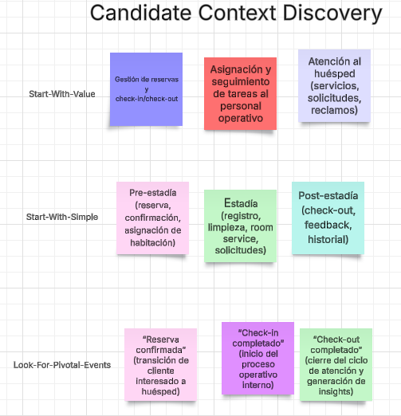

En esta figura se puede observar el resultado de la sesión de Candidate Context Discovery, donde el equipo utilizó las
técnicas start-with
value, start-with-simple y look-for-pivotal-events.

### 4.1.1.2. Domain Message Flows Modeling

Una vez definidos los Bounded Contexts principales, se procedió a modelar los flujos de colaboración entre ellos mediante la técnica de Domain Storytelling.

**Figura 3:**

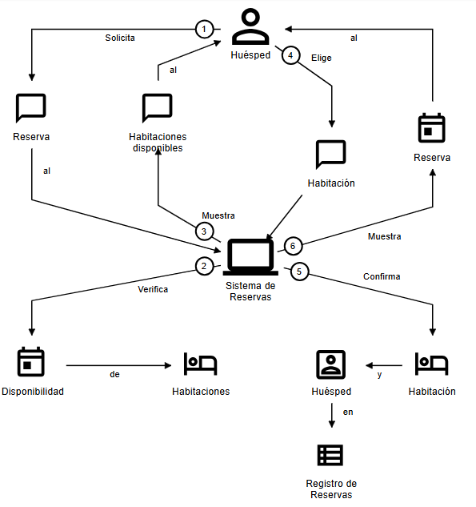

Esta figura muestra el flujo de colaboración entre el huésped y el sistema de reservas al momento de realizar una reserva. El proceso inicia con la solicitud del huésped, seguida por la verificación de disponibilidad y la confirmación de la reserva por parte del sistema. Posteriormente, se genera un registro de reserva.

**Figura 4:**

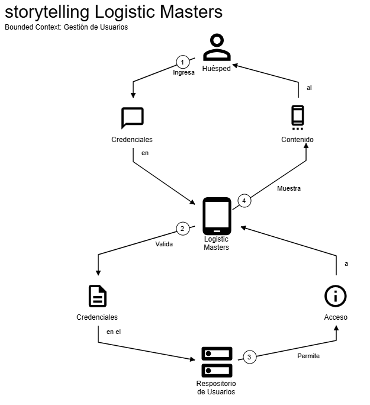

Esta figura ilustra el flujo de Gestión de Usuarios, donde se observa la interacción entre el sistema y el usuario al ingresar a la plataforma. El proceso incluye la autenticación del usuario, la verificación de sus credenciales y la gestión de su perfil.

**Figura 5:**

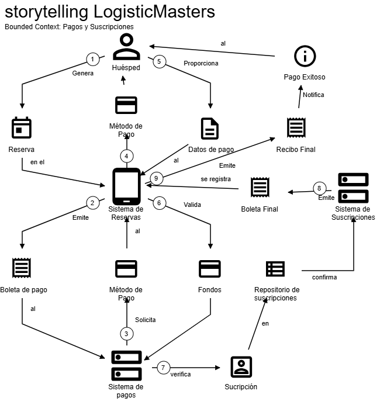

Esta figura representa el flujo de Gestión de Pagos y Suscripciones, donde se observa la interacción entre el sistema y el usuario al momento de realizar un pago. El proceso incluye la selección del método de pago, la validación de la transacción y la confirmación del pago.

### 4.1.1.3. Bounded Context Canvases

Los Bounded Contexts identificados en la sesión de Candidate Context Discovery fueron documentados utilizando el Bounded Context Canvas. Esta herramienta permite visualizar de manera clara y concisa los límites, interacciones y responsabilidades de cada contexto.

**Figura 6:**
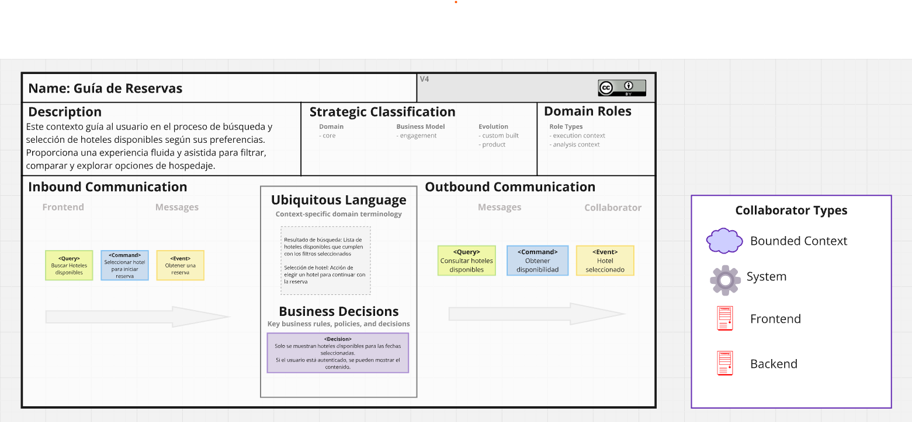
Esta figura muestra el Bounded Context Canvas del contexto de "Guía de Reservas", donde se detallan los límites, interacciones y responsabilidades del sistema de reservas.

**Figura 7:**
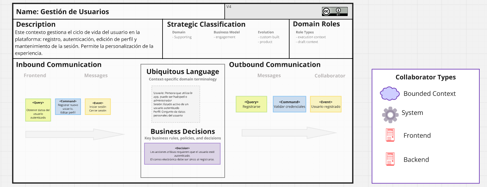
Esta figura muestra el Bounded Context Canvas del contexto de "Gestión de Usuarios", donde se detallan los límites, interacciones y responsabilidades del sistema de gestión de usuarios.

**Figura 8:**
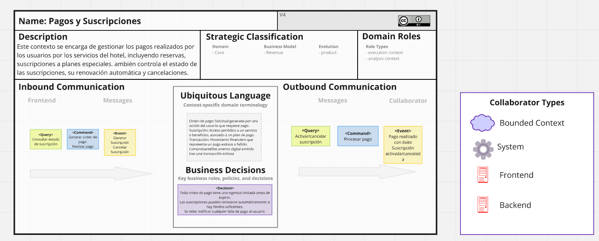
Esta figura muestra el Bounded Context Canvas del contexto de "Pagos y Suscripciones", donde se detallan los límites, interacciones y responsabilidades del sistema de gestión de pagos y suscripciones.
### 4.1.2. Context Mapping

Con el fin de establecer las relaciones entre los distintos Bounded Contexts identificados, se realizó un mapeo de contextos. Este mapeo permite visualizar cómo interactúan los diferentes contextos y cómo se comunican entre sí.

**Figura 9:**
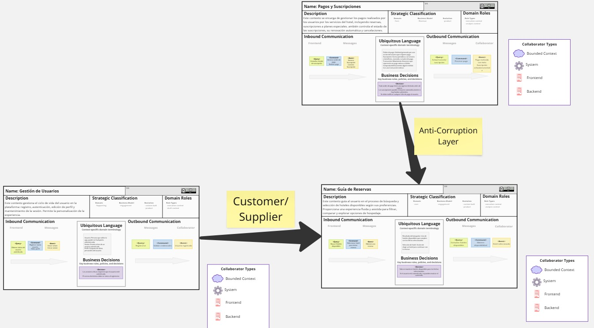

Esta figura muestra el mapeo de contextos, donde se pueden observar las relaciones entre los distintos Bounded Contexts. Cada línea representa una relación de comunicación entre los contextos, lo que permite entender cómo fluyen los datos y las interacciones entre ellos.

¿Qué pasaría si movemos una capability?
Se pierde cohesión. Las órdenes responden a eventos que no necesariamente involucran al usuario.

¿Y si partimos un bounded context?
Se pierde la claridad de los límites. La gestión de reservas y la gestión de pagos son procesos interdependientes que deben mantenerse juntos para evitar confusiones y errores en el sistema.

¿Qué pasaría si duplicamos funcionalidad?
Se genera redundancia y confusión. La duplicación de funcionalidades puede llevar a inconsistencias en el sistema y dificultar su mantenimiento.

¿Y si creamos un shared service?
Se genera un acoplamiento innecesario. La creación de un servicio compartido puede llevar a una dependencia excesiva entre los contextos, lo que dificulta su evolución y mantenimiento. Aunque puede ser útil si se conectan más contexts o microservicios. Sería algo escalable en el futuro.

### 4.1.3. Software Architecture

Los diseños C4 son una forma efectiva de representar la arquitectura de un sistema de software de manera clara y concisa. En el caso del proyecto Dedalus, los diseños C4 nos permiten visualizar la estructura y las interacciones entre los diferentes componentes del sistema.

En el nivel más alto, el diseño C4 nos muestra el contexto del sistema, identificando los actores externos y los sistemas con los que interactúa LogistcsMasters. A medida que descendemos en los niveles de detalle, podemos ver los contenedores que componen el sistema, como la aplicación web, la base de datos y los servicios externos. Además, los diagramas C4 nos permiten visualizar los componentes internos de cada contenedor, como los módulos y las clases.

Estos diseños proporcionan una visión clara de la arquitectura del sistema, lo que facilita la comunicación entre los miembros del equipo y ayuda a identificar posibles problemas o mejoras. Al utilizar los diseños C4 en el proyecto LogistcsMasters, podemos asegurarnos de que todos los involucrados tengan una comprensión común de la arquitectura y puedan colaborar de manera efectiva en su implementación y evolución.

### 4.1.3.1. Software Architecture Context Level Diagrams
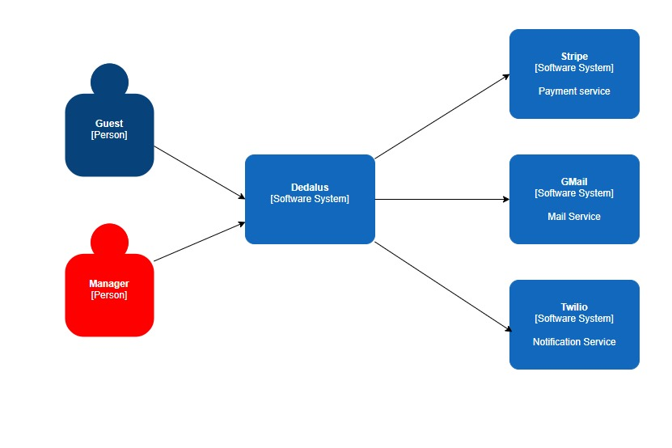
### 4.1.3.2. Software Architecture Container Level Diagrams
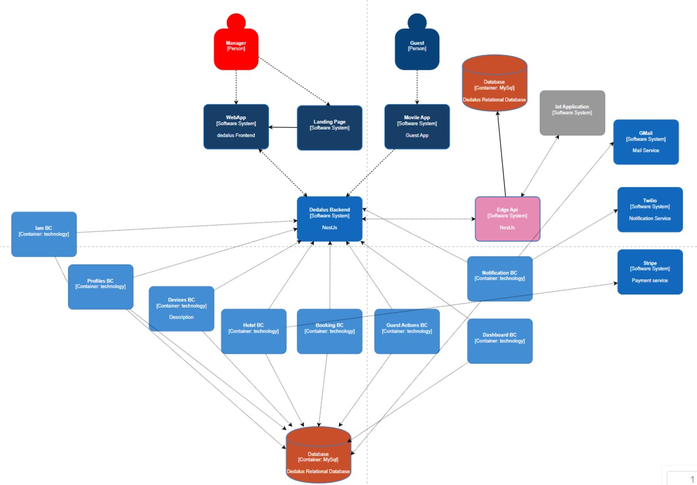
### 4.1.3.3. Software Architecture Deployment Diagrams
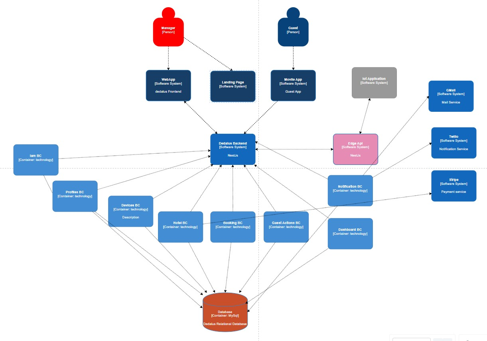

### 4.2. Tactical-Level Domain-Driven Design

Esta es la propuesta táctica para el diseño de software de Dedalus, aplicando Domain-Driven Design (DDD).
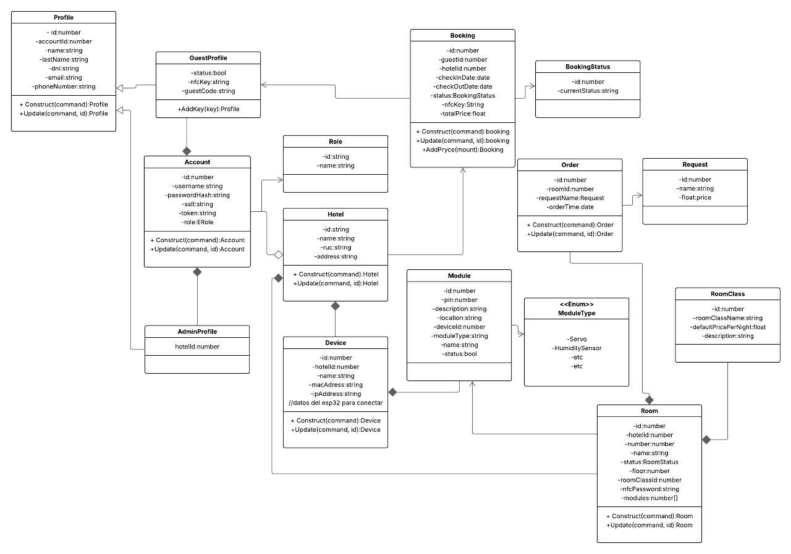

### 4.2.1. Bounded Context: Guia de Reservas

|Clases|Propósito|Atributos|Métodos|
|------|---------|---------|-------|
| Reservation| Gestiona los datos y estado de una reserva|reservationID(), reservationDate(), numberOfPeople(), table()| createReservation(), cancelReservation(), updateReservation()|
|Customer|Representa al cliente que realiza reservas.|paymentMethod, reservationList|register(), placeReserve(), makeReservation(), cancelReservation()|
|Worker|Empleado del hotel que gestiona reservas.|Position| manageReserve() (overloaded para Order y Reservation)|

- #### 4.2.1.1. Domain Layer
| Clase | Tipo | Propósito |
|-------|------|-----------|
Reserva | Entity | Representa una reserva realizada por un cliente en el sistema.
Customer | Entity | Representa al cliente que realiza una o más reservas.
Worker | Entity | Representa al trabajador asignado a gestionar reservas.
ReservaService | Domain Service | Lógica del negocio como validación de fechas, disponibilidad, etc.
ReservaFactory | Factory | Encargado de crear objetos Reserva consistentes.
IReservaRepository | Repository Interface | Interfaz para acceder a almacenamiento de reservas.
- #### 4.2.1.2. Interface Layer
Clase | Tipo | Propósito
|-|-|-|
ReservaController | Controller | Expone los endpoints de gestión de reservas (crear, cancelar, actualizar).
- #### 4.2.1.3. Application Layer
Clase | Tipo | Propósito
-|-|-
CrearReservaHandler | Command Handler | Ejecuta el proceso de creación de una reserva.
CancelarReservaHandler | Command Handler | Ejecuta la cancelación de una reserva.
ActualizarReservaHandler | Command Handler | Ejecuta la actualización de datos de una reserva.
- #### 4.2.1.4.Infrastructure Layer
Clase | Tipo | Propósito
-|-|-|
MySQLReservaRepository | Repository Implementation | Implementa IReservaRepository para persistencia en base de datos relacional.
EmailNotificacionService | External Service | Servicio de envío de notificaciones por email (ej. al confirmar reserva).
CalendarioAPI | External API | Servicio externo para validar disponibilidad de fechas.
- #### 4.2.1.5.Bounded Context Software Architecture Component Level Diagrams

**Figura 10:**

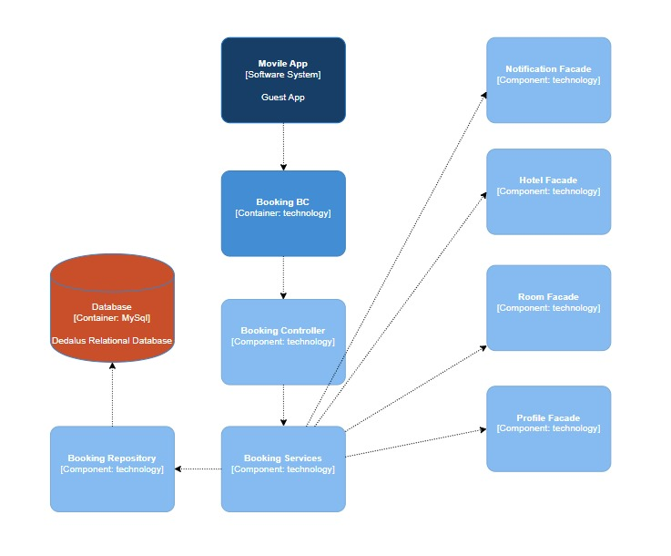

Este diagrama muestra la arquitectura de componentes del Bounded Context "Guía de Reservas". En él se pueden observar los distintos componentes que interactúan entre sí, así como sus responsabilidades y relaciones.

- #### 4.2.1.6.Bounded Context Software Architecture Code Level Diagrams

**Figura 11:**

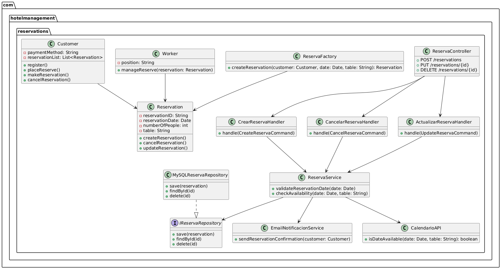

Este diagrama muestra la estructura a nivel de clases para el Bounded Context "Guía de Reservas", siguiendo el modelo de capas de software. Se representan las principales entidades, servicios de dominio, controladores de interfaz, handlers de aplicación y componentes de infraestructura.

- #### 4.2.1.6.1.Bounded Context Domain Layer Class Diagrams

**Figura 12:**

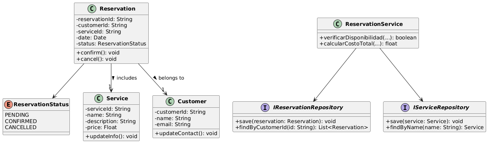

### 4.2.2. Bounded Context: Gestión de Usuarios

Clase | Propósito | Atributos | Métodos
-|-|-|-
User | Representa a un usuario del sistema (cliente o trabajador) | id: String, name: String, username: String, password: String, email: String, role: Enum, reserveList: List<Reserva> | login(), logout(), checkReserves()
AuthenticationService | Lógica de autenticación y validación de credenciales | – | authenticate(username, password), logout(user)
UserValidationService | Verifica datos válidos de usuario (correo, contraseña, etc.) | – | validarCorreo(email), validarContrasena(password)
IUserRepository | Interfaz para acceder a usuarios en base de datos | – | save(user), findByUsername(username), delete(id)
MySQLUserRepository | Implementación de acceso a usuarios en base MySQL | – | Implementa IUserRepository
AuthController | Expone los endpoints de autenticación y gestión de sesión | – | POST /login, POST /logout, POST /register
LoginUserHandler | Maneja la lógica de login en la capa de aplicación | – | handle(LoginCommand)
LogoutUserHandler | Maneja el cierre de sesión | – | handle(LogoutCommand)
- #### 4.2.2.1. Domain Layer
Clase | Tipo | Propósito
-|-|-
User | Entity | Representa al usuario del sistema con sus atributos y rol.
AuthenticationService | Domain Service | Realiza autenticación basada en credenciales.
UserValidationService | Domain Service | Valida datos de entrada del usuario.
IUserRepository | Repository Interface | Interfaz para la persistencia y recuperación de usuarios.
- #### 4.2.2.2. Interface Layer
Clase | Tipo | Propósito
-|-|-
AuthController | Controller | Expone endpoints de login, logout y registro.
- #### 4.2.2.3. Application Layer
Clase | Tipo | Propósito
-|-|-
LoginUserHandler | Command Handler | Ejecuta lógica de inicio de sesión.
LogoutUserHandler | Command Handler | Ejecuta cierre de sesión de un usuario.
- #### 4.2.2.4.Infrastructure Layer
Clase | Tipo | Propósito
-|-|-
MySQLUserRepository | Repository Implementation | Implementa interfaz para acceder a datos del usuario.
JWTTokenService | External Service | Genera y valida tokens para autenticación.
EmailService | External Service | Notificación de bienvenida, recuperación de contraseña, etc.
- #### 4.2.2.5.Bounded Context Software Architecture Component Level Diagrams

**Figura 12:**

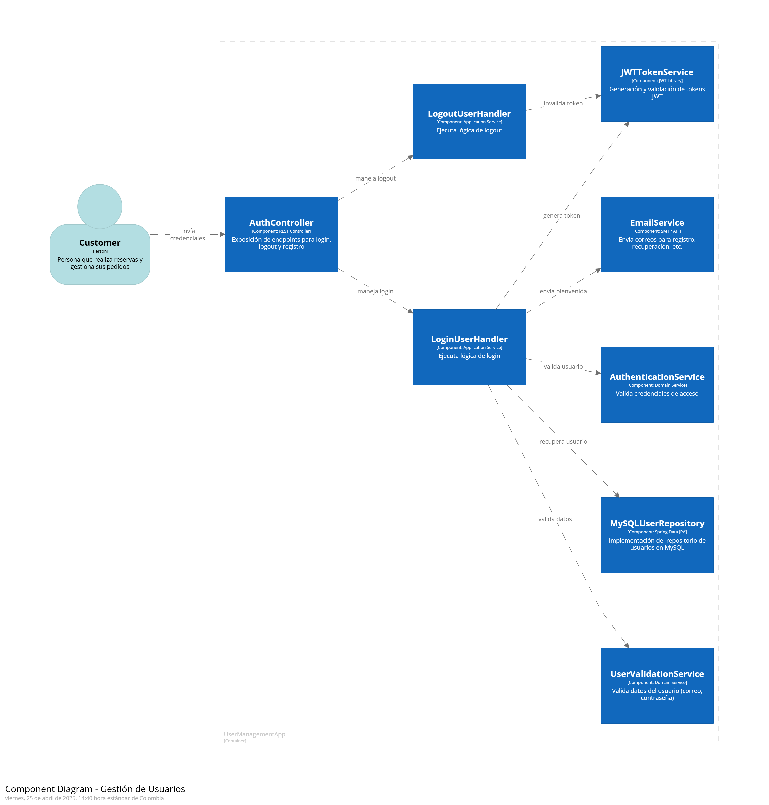

Este diagrama muestra la arquitectura de componentes del Bounded Context "Gestión de Usuarios". En él se pueden observar los distintos componentes que interactúan entre sí, así como sus responsabilidades y relaciones.

- #### 4.2.2.6.Bounded Context Software Architecture Code Level Diagrams

**Figura 13:**

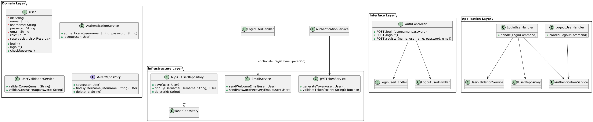

El siguiente diagrama muestra la estructura a nivel de clases para el Bounded Context Gestión de Usuarios, siguiendo el modelo de capas de software. Se representan las principales entidades, servicios de dominio, controladores de interfaz, handlers de aplicación y componentes de infraestructura.

- #### 4.2.2.6.1.Bounded Context Domain Layer Class Diagrams

**Figura 14:**

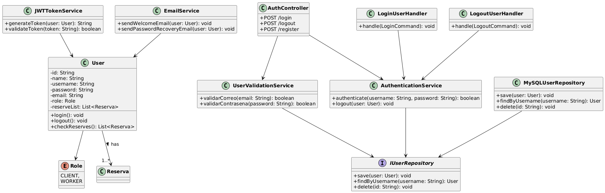

### 4.2.3. Bounded Context: Pagos y suscripciones
Clase | Propósito | Atributos | Métodos
-|-|-|-
PaymentMethod | Representa un pago realizado por un cliente | paymentID: String, amount: Float, paymentDate: Date, customerID: String, methodType: Enum | processPayment(), refund()
Suscription | Maneja la suscripción de un usuario a un plan | id: String, type: Enum, price: Float, status: Enum, startDate: Date, endDate: Date, userID: String | activate(), cancel(), renew()
PaymentService | Realiza operaciones de validación y procesamiento de pagos | – | validarPago(...), confirmarTransaccion(...)
SuscriptionService | Controla lógica de negocio de activación y renovación | – | asignarPlan(...), validarSuscripcionActiva(...)
IPaymentRepository | Interfaz para persistencia de pagos | – | save(payment), findByCustomerID(id)
ISuscriptionRepository | Interfaz para persistencia de suscripciones | – | save(suscription), findActiveByUserID(id)
MySQLPaymentRepository | Implementación concreta de IPaymentRepository | – | Implementa métodos de la interfaz
MySQLSuscriptionRepository | Implementación concreta de ISuscriptionRepository | – | Implementa métodos de la interfaz
PaymentController | Expone endpoints relacionados al pago | – | POST /pago, GET /pagos/:clienteId
SubscriptionController | Gestiona suscripciones | – | POST /suscripcion, GET /suscripciones/:usuarioId
ProcessPaymentHandler | Maneja la lógica de realizar un pago | – | handle(PaymentCommand)
RegisterSubscriptionHandler | Registra una suscripción para un usuario | – | handle(SuscriptionCommand)
- #### 4.2.3.1. Domain Layer
Clase | Tipo | Propósito
-|-|-
PaymentMethod | Entity | Representa un pago con monto, tipo y fecha.
Suscription | Entity | Representa un plan de suscripción que puede estar activo o cancelado.
PaymentService | Domain Service | Lógica de validación de pagos.
SuscriptionService | Domain Service | Control de activaciones y renovaciones.
IPaymentRepository | Repository Interface | Abstracción para guardar y consultar pagos.
ISuscriptionRepository | Repository Interface | Abstracción para acceder a suscripciones.
- #### 4.2.3.2. Interface Layer
Clase | Tipo | Propósito
-|-|-
PaymentController | Controller | Endpoint para procesar y consultar pagos.
SubscriptionController | Controller | Endpoint para registrar o consultar planes del usuario.
- #### 4.2.3.3. Application Layer
Clase | Tipo | Propósito
-|-|-
ProcessPaymentHandler | Command Handler | Maneja la lógica completa del flujo de pago.
RegisterSubscriptionHandler | Command Handler | Maneja el registro de una suscripción para un usuario.
- #### 4.2.3.4.Infrastructure Layer
Clase | Tipo | Propósito
-|-|-
MySQLPaymentRepository | Repository Implementation | Almacena y recupera datos de pagos desde base de datos.
MySQLSuscriptionRepository | Repository Implementation | Maneja la persistencia de planes de suscripción.
StripePaymentGateway | External Service | Conecta con Stripe (o similar) para procesar pagos reales.
BillingEmailService | External Service | Notificaciones sobre cobros, renovación o cancelación de planes.
- #### 4.2.3.5.Bounded Context Software Architecture Component Level Diagrams

**Figura 14:**

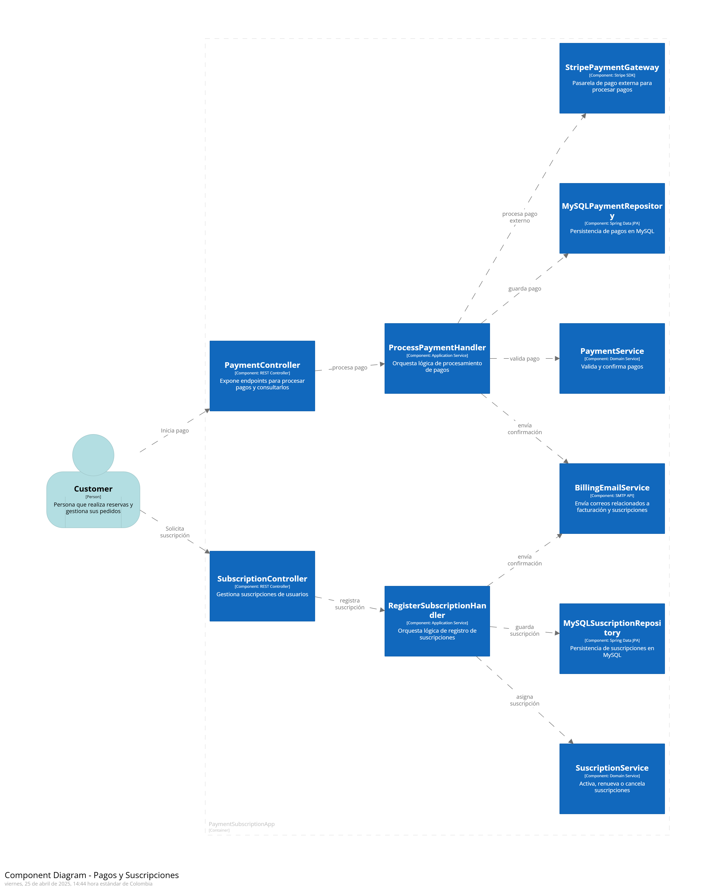

Este diagrama muestra la arquitectura de componentes del Bounded Context "Pagos y Suscripciones". En él se pueden observar los distintos componentes que interactúan entre sí, así como sus responsabilidades y relaciones.

- #### 4.2.3.6.Bounded Context Software Architecture Code Level Diagrams

**Figura 15:**

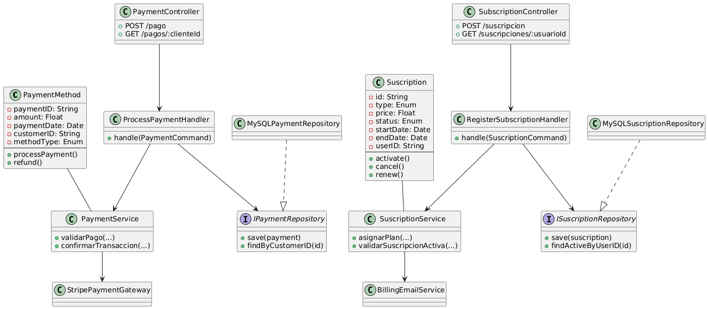

El siguiente diagrama muestra la estructura a nivel de clases para el Bounded Context "Pagos y Suscripciones", siguiendo el modelo de capas de software. Se representan las principales entidades, servicios de dominio, controladores de interfaz, handlers de aplicación y componentes de infraestructura.

- #### 4.2.3.6.1.Bounded Context Domain Layer Class Diagrams

**Figura 16:**

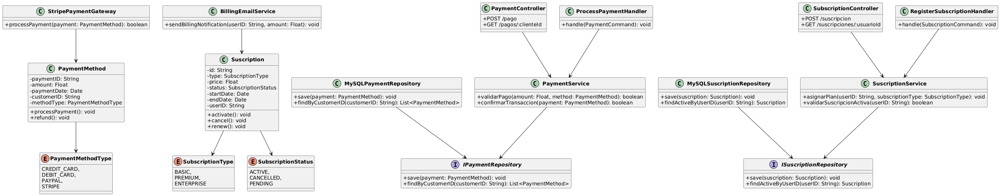

### 4.2.4. Bounded Context: Notificaciones y órdenes
Clase | Propósito | Atributos | Métodos
-|-|-|-
Notification | Representa un mensaje enviado al usuario sobre su reserva, orden u otra acción | id: String, type: Enum, message: String, status: Enum, recipientEmail: String | createMessage(), send(), markAsRead()
Controlador | Clase orquestadora que gestiona reservas, servicios y asignaciones a usuarios | orderList: List<Order>, users: List<User>, services: List<Service> | manageReserve(), assignOrderToWorker(), deliverMessage()
Order | Representa un pedido realizado por el cliente que puede incluir servicios adicionales | orderId: String, customerId: String, details: String, status: Enum | confirm(), cancel()
NotificationService | Lógica para envío y gestión de notificaciones | – | sendEmail(), notifyUser(), notifyAdmin()
OrderService | Lógica de negocio para asignar y controlar órdenes | – | assignToWorker(order, worker), trackStatus()
INotificationRepository | Interfaz para persistencia de notificaciones | – | save(notification), findUnreadByUser(id)
IOrderRepository | Interfaz para persistencia de órdenes | – | save(order), getByCustomer(id)
MySQLNotificationRepository | Implementación concreta del repositorio de notificaciones | – | Implementa INotificationRepository
MySQLOrderRepository | Implementación concreta para almacenar órdenes | – | Implementa IOrderRepository
NotificationController | Expone endpoints relacionados a notificaciones | – | GET /notificaciones/:usuarioId, POST /notificaciones
OrderController | Endpoint para gestionar pedidos de servicios | – | POST /orden, GET /orden/:clienteId
SendNotificationHandler | Encapsula el flujo de enviar una notificación | – | handle(NotificationCommand)
AssignOrderHandler | Encapsula el flujo de asignar una orden a un trabajador | – | handle(AssignOrderCommand)
- #### 4.2.4.1. Domain Layer
Clase | Tipo | Propósito
-|-|-
Notification | Entity | Almacena y gestiona información de mensajes hacia el usuario.
Order | Entity | Representa una solicitud de servicio o producto por parte del cliente.
NotificationService | Domain Service | Lógica de envío y validación de notificaciones.
OrderService | Domain Service | Maneja reglas de negocio de órdenes y asignación a trabajadores.
INotificationRepository | Repository Interface | Para persistencia de notificaciones.
IOrderRepository | Repository Interface | Para persistencia de órdenes.
- #### 4.2.4.2. Interface Layer
Clase | Tipo | Propósito
-|-|-
NotificationController | Controller | Exposición de notificaciones para clientes y administradores.
OrderController | Controller | Exposición de pedidos y solicitudes de servicio por los usuarios.
- #### 4.2.4.3. Application Layer
Clase | Tipo | Propósito
-|-|-
SendNotificationHandler | Command Handler | Lógica para crear y enviar una notificación.
AssignOrderHandler | Command Handler | Asigna un pedido a un trabajador para ejecución.
- #### 4.2.4.4.Infrastructure Layer
Clase | Tipo | Propósito
-|-|-
MySQLNotificationRepository | Repository Implementation | Persistencia de notificaciones en base de datos relacional.
MySQLOrderRepository | Repository Implementation | Manejo de órdenes persistidas por clientes.
EmailNotificationAdapter | External Service | Encapsula lógica de envío real vía SMTP, SendGrid, etc.
RealtimeNotificationAdapter | External Service | WebSocket o Pusher para actualizaciones en tiempo real.

- #### 4.2.4.5.Bounded Context Software Architecture Component Level Diagrams

**Figura 16:**

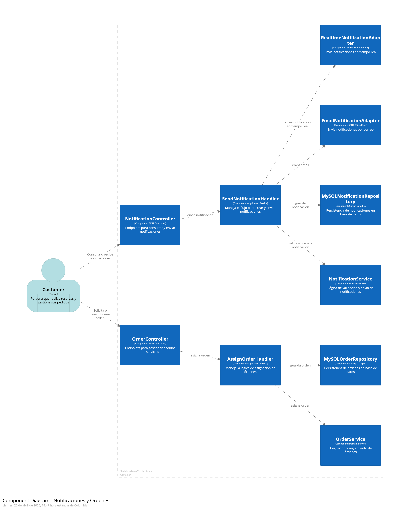

Este diagrama muestra la arquitectura de componentes del Bounded Context "Notificaciones y Órdenes". En él se pueden observar los distintos componentes que interactúan entre sí, así como sus responsabilidades y relaciones.

- #### 4.2.4.6.Bounded Context Software Architecture Code Level Diagrams

**Figura 17:**

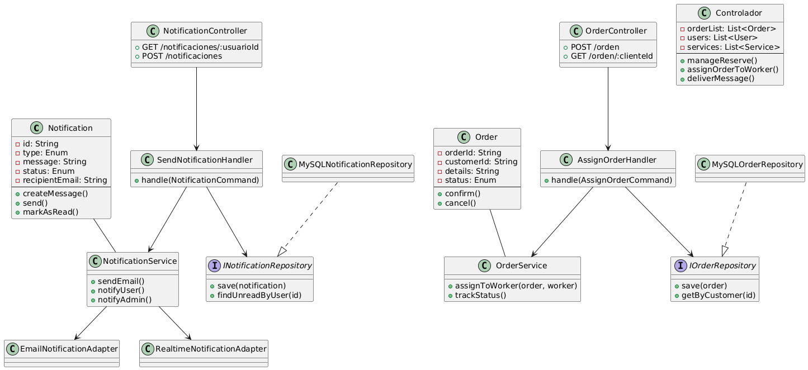

El siguiente diagrama muestra la estructura a nivel de clases para el Bounded Context "Notificaciones y Órdenes", siguiendo el modelo de capas de software. Se representan las principales entidades, servicios de dominio, controladores de interfaz, handlers de aplicación y componentes de infraestructura.

- #### 4.2.4.6.1.Bounded Context Domain Layer Class Diagrams

**Figura 18:**

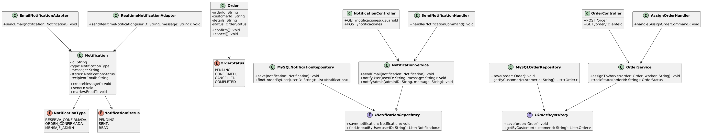

### 2.6.x.6.2.Bounded Context Database Design Diagram
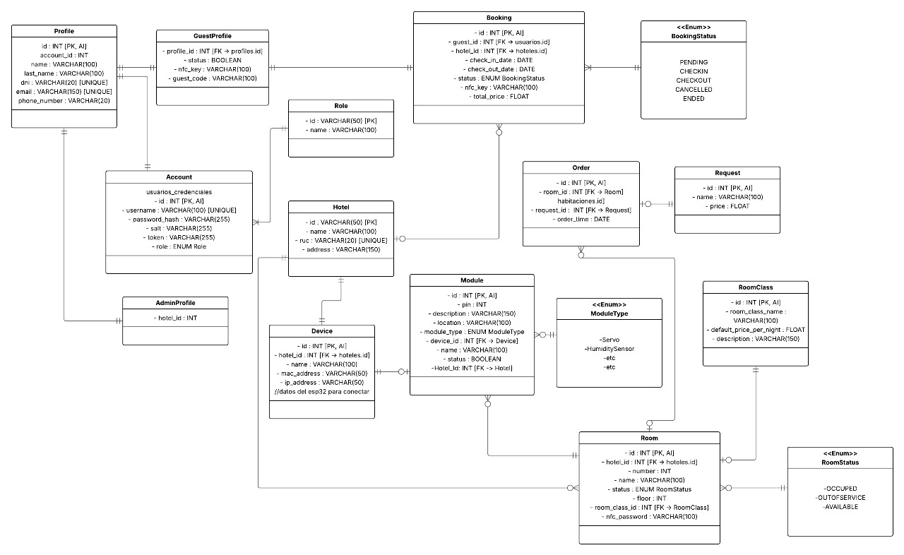

# **CAPÍTULO V: SOLUTION UI/UX DESIGN**

## 5.1. Style Guidelines

En esta sección se definen los estilos de diseño front-end que serán la base para dar forma a nuestro producto **IoT Hotel Management**, utilizando patrones que consideren la arquitectura de la información, la accesibilidad y la consistencia visual tanto en la **Landing Page**, la **Aplicación Web**, la **Aplicación Móvil** y las **interfaces IoT (paneles y dashboards)**.

### 5.1.1. General Style Guidelines

**Branding:**  
El branding del logo de nuestra plataforma “IoT Hotel Management” combina elementos que transmiten **innovación, seguridad y confort**, valores esenciales en la experiencia hotelera digital.  
El diseño del logotipo utiliza una tipografía moderna acompañada de un ícono alusivo a la conectividad IoT (ondas o nodos interconectados). Su forma transmite **tecnología, confiabilidad y elegancia**, reforzando la identidad de un sistema que integra gestión, automatización y hospitalidad inteligente.

**Typography:**  
Para la tipografía se ha seleccionado **Roboto**, por su legibilidad y adaptabilidad en diferentes dispositivos.  
Esta fuente equilibra un aspecto profesional y moderno, asegurando buena lectura en pantallas de administración (web) y en interfaces móviles para huéspedes.  
Se usa **Roboto Regular** para textos, **Roboto Medium** para subtítulos y **Roboto Bold** para títulos o botones interactivos.

**Colors:**  
La paleta de colores se centra en tonos **azules y grises tecnológicos**, que evocan profesionalismo, innovación y confianza, combinados con acentos cálidos en dorado o verde azulado que transmiten confort y hospitalidad.  
Los tonos claros se reservan para fondos o áreas de lectura, mientras que los tonos oscuros se aplican en paneles, encabezados y dashboards, favoreciendo el contraste visual y la legibilidad.

 

---

### 5.1.2 Web, Mobile and IoT Style Guidelines

Para los lineamientos visuales de **IoT Hotel Management**, se mantuvo un estilo **minimalista, funcional y moderno**, enfocado en la experiencia de uso tanto para administradores como para huéspedes.

- **Web (Administrador):** Interfaz con colores neutros, paneles laterales y componentes organizados por tarjetas. Se prioriza la lectura clara de métricas IoT y la gestión intuitiva de reservas y sensores.
- **Mobile (Huésped):** Diseño basado en interacción táctil con íconos grandes, colores de acento cálidos y transiciones suaves para controlar iluminación, temperatura o accesos.
- **IoT Dashboards:** Paneles visuales con indicadores en tiempo real (temperatura, ocupación, alertas), siguiendo un esquema visual claro y accesible.

El uso de **Roboto** y la paleta azul-gris mantienen coherencia entre todas las plataformas, garantizando una identidad visual sólida y confiable.

---

## 5.2 Information Architecture

### 5.2.1 Organization Systems

- **Segmento Huésped**

    - **Registro y Acceso de Usuario:**  
      Sistema seguro que permite el ingreso mediante credenciales, NFC o Bluetooth, garantizando una experiencia fluida y personalizada.

    - **Gestión de Reservas:**  
      Permite visualizar, modificar o cancelar reservas directamente desde la aplicación móvil, con sincronización en tiempo real con el sistema web.

    - **Control de Habitación:**  
      Los huéspedes pueden controlar luces, cortinas y temperatura desde la app móvil, generando un entorno personalizado.

    - **Solicitudes de Servicio:**  
      Opción para pedir servicio a la habitación o limpieza directamente desde la aplicación, con confirmación y seguimiento.

    - **Historial de Estancia:**  
      Registro de visitas anteriores y preferencias guardadas para futuras reservas.

---

- **Segmento Hotel (Administrador)**

    - **Gestión de Habitaciones y Reservas:**  
      Permite crear, editar o eliminar habitaciones, además de manejar las reservas y disponibilidad en tiempo real.

    - **Monitoreo de Sensores:**  
      Panel de control para supervisar los sensores de humo, gas y presencia, con alertas automáticas ante incidencias.

    - **Control Energético:**  
      Módulo para visualizar el consumo energético por habitación y aplicar estrategias de ahorro automatizadas.

    - **Gestión de Ofertas y Promociones:**  
      Creación y difusión de promociones o descuentos, integradas en la app del huésped.

    - **Reportes y Analítica:**  
      Visualización de métricas operativas e IoT (energía, accesos, alertas, ocupación) mediante dashboards interactivos.

---

### 5.2.2 Labeling Systems

- **Segmento Huésped**

    - **Etiqueta de Estado de Reserva:** Indica si la reserva está confirmada, pendiente o finalizada, mostrando además las fechas de check-in/out.
    - **Etiqueta de Dispositivos:** Muestra el estado de conexión de luces, cortinas o termostatos (encendido, apagado, automático).
    - **Etiqueta de Solicitudes:** Refleja el estado de pedidos de servicio (pendiente, en proceso, completado).
    - **Etiqueta de Alertas:** Notifica si existen incidencias de humo, gas o mantenimiento en curso.

- **Segmento Hotel**

    - **Etiqueta de Habitación:** Muestra disponibilidad, ocupación y estado de sensores.
    - **Etiqueta de Energía:** Visualiza consumo por habitación o piso.
    - **Etiqueta de Alertas IoT:** Informa en tiempo real sobre incidentes detectados.
    - **Etiqueta de Tareas:** Lista las actividades asignadas al personal en respuesta a alertas o pedidos de huéspedes.

---

### 5.2.3 SEO Tags and Meta Tags

Para la optimización de búsqueda en motores web, se definen las siguientes etiquetas:

- **Title:** IoT Hotel Management
- **Meta Tags:**
    - **Description:** Plataforma integral de gestión hotelera con automatización IoT, sensores inteligentes y control de habitaciones desde app y web.
    - **Keywords:** hoteles inteligentes, IoT, reservas, automatización, sensores, control de energía, hotel management.
    - **Author:** IoT Hotel Management Team

---

### 5.2.4 Searching Systems

- **Segmento Huésped**

    - **Búsqueda por Palabras Clave:** Permite buscar hoteles, habitaciones o servicios disponibles.
    - **Búsqueda por Filtros:** Incluye filtros por ubicación, precio, tipo de habitación, servicios IoT disponibles (luces, climatización).

- **Segmento Hotel**

    - **Búsqueda por Palabras Clave:** Permite al personal ubicar rápidamente huéspedes, reservas o habitaciones específicas.
    - **Búsqueda por Filtros:** Permite refinar resultados según estado de ocupación, tipo de sensor o rango de consumo energético.

---

### 5.2.5 Navigation Systems

- **Segmento Huésped**

    - **Menú de Navegación:** Barra inferior con accesos rápidos a control de habitación, reservas, pedidos y perfil.
    - **Enlaces Rápidos:** Accesos directos a funciones críticas como check-in/out, soporte y promociones activas.

- **Segmento Hotel**

    - **Panel de Navegación:** Barra lateral izquierda con secciones para gestión de reservas, monitoreo IoT, energía y reportes.
    - **Atajos Operativos:** Botones rápidos para responder alertas, asignar tareas o revisar el estado de habitaciones.

## 5.3 Landing Page UI Design
### 5.3.1 Landing Page Wireframe

### 5.3.2 Landing Page Mock-up

## 5.4 Applications UX/UI Design

### 5.4.1 Applications Wireframes

### 5.4.2 Applications Wireflow Diagrams

- **User Goal 1: Iniciar sesión y/o Registro de cuenta**

- **User Goal 2: El administrador crea su hotel en la aplicacion**

- **User Goal 3: El administrador una vez creado su hotel puede crear todos las habitaciones disponibles**

#### 5.4.2.1 Applications Mock-ups

### 5.4.3 Applications User Flow Diagrams

- **User Goal 1: Iniciar sesión y/o Registro de cuenta**

- **User Goal 2: Como administrador quiero crear y registrar mi hotel en la aplicacion**

- **User Goal 3: Como administrador una vez creado mi hotel quiero crear todos las habitaciones disponibles con las caracteristicas de cada una**

## 5.5 Applications Prototyping

Link de figma: https://www.figma.com/design/bbKcl86Op3sFtBF6jHzzG0/Dedalus-MuckUps?node-id=2001-1221&t=LA4A0IOFnLQJ93jI-1

# Capítulo VI: Product Implementation, Validation & Deployment

## 6.1 Software Configuration Management

Esta sección aborda de manera detallada la gestión de configuración del software, un componente clave en el desarrollo y mantenimiento de cualquier sistema tecnológico. Su propósito principal es asegurar la integridad y trazabilidad de todos los artefactos producidos a lo largo del ciclo de vida del software, permitiendo que el equipo de desarrollo pueda trabajar de manera coordinada y estructurada. A través de políticas claras de versionado, control de cambios, definición de entornos y procedimientos estandarizados, se garantiza que cada integrante tenga acceso a configuraciones consistentes y actualizadas. Además, se establecen mecanismos para documentar y validar las modificaciones realizadas, lo que reduce significativamente la posibilidad de errores o incompatibilidades en las etapas de integración y despliegue.

La correcta implementación de una estrategia de gestión de configuración no solo mejora la calidad del producto final, sino que también optimiza la colaboración entre equipos multidisciplinarios, agiliza la detección de problemas y fortalece la estabilidad del sistema en entornos de producción.

### 6.1.1 Software Development Environment Configuration

En esta sub-sección se describe la configuración técnica del entorno de desarrollo utilizado durante el proyecto. Se especifican las herramientas de software instaladas, sus versiones, rutas de acceso y cualquier dependencia necesaria para asegurar un entorno de trabajo homogéneo para todos los miembros del equipo. Esta documentación resulta esencial para prevenir discrepancias durante la ejecución de tareas, evitar conflictos entre versiones y facilitar la incorporación de nuevos integrantes al proyecto.

Asimismo, se detallan las configuraciones iniciales requeridas para compilar, ejecutar y probar el sistema, incluyendo ajustes en IDEs, variables de entorno, gestores de paquetes, y posibles contenedores o entornos virtualizados (como Docker). Este enfoque garantiza que el entorno de desarrollo se mantenga alineado con el entorno de producción, contribuyendo a una transición fluida entre etapas de desarrollo, pruebas y despliegue.

- **Visual Studio Code**: Editor de código utilizado para desarrollar la Landing Page. Su entorno ligero, personalizable y con soporte para múltiples lenguajes facilitó la colaboración entre desarrolladores y la implementación ágil de componentes web.

  

- **HTML5**: Lenguaje de marcado base para estructurar el contenido de la Landing Page. Permitió organizar la información de forma semántica y accesible, mejorando la navegación y la experiencia del usuario.

  

- **CSS3**: Utilizado para aplicar estilos visuales a la Landing Page. Ayudó a mantener una identidad gráfica coherente, responsiva y atractiva, lo cual es clave para captar la atención del usuario final.

  

- **JavaScript**: Lenguaje que permitió incorporar lógica e interactividad a la Landing Page, como animaciones, validaciones y mejoras en la experiencia dinámica del usuario.

  

- **GitHub**: Plataforma de control de versiones que centralizó el código del proyecto. Facilitó el trabajo colaborativo del equipo, permitió el seguimiento de cambios y mejoró la trazabilidad del desarrollo.

  

- **LucidChart**: Herramienta usada para crear diagramas de flujo, wireflows y modelos conceptuales. Contribuyó a la claridad en el diseño funcional y ayudó a definir la lógica de interacción entre pantallas y procesos.

  

- **Figma**: Plataforma de diseño colaborativo utilizada para la creación de wireframes y prototipos visuales de alta fidelidad. Permitió validar la interfaz gráfica con antelación y alinear al equipo de desarrollo con la visión de diseño.

  

- **Android Studio**: Entorno de desarrollo para la aplicación móvil. Proporcionó las herramientas necesarias para programar, depurar, probar y empaquetar la app en dispositivos Android.

  

- **Kotlin**: Lenguaje de programación moderno utilizado para desarrollar la aplicación móvil. Su sintaxis clara y concisa mejoró la eficiencia del código y la productividad del equipo, alineándose con las mejores prácticas de desarrollo en Android.

  

- **Trello**: Plataforma de gestión de tareas basada en tableros y tarjetas, utilizada para organizar y hacer seguimiento del progreso del equipo durante el desarrollo del proyecto. Facilitó la planificación de sprints, la asignación de responsabilidades y la visualización del avance en tiempo real, promoviendo una colaboración efectiva y una mejor administración del tiempo.

  

- **Angular**: Framework de desarrollo web basado en TypeScript, empleado para construir la interfaz del panel administrativo. Su arquitectura modular, compatibilidad con APIs REST y componentes reutilizables facilitaron el desarrollo de un entorno web responsivo, escalable y mantenible.

  

- **NestJS**: Framework progresivo de Node.js utilizado para el desarrollo del backend de la plataforma. Permite estructurar los microservicios de manera modular y escalable, integrando MQTT para la comunicación IoT, REST APIs para el consumo desde Angular y Flutter, y PostgreSQL como base de datos principal.

  

- **Node.js y npm**: Entorno de ejecución de JavaScript y su gestor de paquetes, utilizados para instalar dependencias y ejecutar scripts de desarrollo y despliegue tanto del frontend (Angular) como del backend (NestJS).

  

- **Postman**: Herramienta de testing de APIs utilizada para validar la comunicación entre el backend y los clientes web/móvil. Permitió automatizar peticiones HTTP, gestionar entornos y realizar pruebas de integración antes del despliegue.

  

- **Git**: Sistema de control de versiones distribuido utilizado para el seguimiento de cambios y la colaboración en el código fuente del proyecto. Permitió mantener ramas independientes por módulo (web, móvil, backend) y facilitar la integración continua.

  

Cada una de estas herramientas fue seleccionada estratégicamente para cumplir con los objetivos del proyecto, asegurando una solución tecnológica robusta, escalable y centrada en la experiencia del usuario.

### 6.1.2 Source Code Management

**Repositorio de la Landing Page:**  
Durante el desarrollo de la Landing Page, utilizamos un repositorio centralizado en GitHub para almacenar y gestionar el código fuente del proyecto. Esto permitió el trabajo colaborativo, el control de versiones y la trazabilidad de cambios en el desarrollo.

**Implementación de GitFlow:**  
Para nuestra estrategia de gestión de versiones con Git, nos basamos en el modelo de ramificación propuesto en el artículo _“A successful Git branching model”_ de Vincent Driessen. Adoptamos el enfoque **GitFlow**, el cual proporciona una estructura clara y organizada para el desarrollo colaborativo, facilitando la integración y el mantenimiento del código.

- **Rama Principal (`main`)**: Contiene la versión estable en producción.
- **Rama de Desarrollo (`develop`)**: Integra los últimos avances y funcionalidades en desarrollo. Actúa como entorno de integración continua.
- **Rama de Lanzamiento (`release`)**: Utilizada para preparar una nueva versión del producto, permitiendo ajustes finales antes de su despliegue.
    - Deriva de: `develop`
    - Se fusiona con: `develop` y `main`
- **Rama de Características (`feature`)**: Destinada al desarrollo de nuevas funcionalidades específicas del producto.
    - Deriva de: `develop`
    - Se fusiona con: `develop`
- **Rama de Corrección Rápida (`hotfix`)**: Diseñada para aplicar soluciones urgentes a errores críticos detectados en producción.
    - Deriva de: `main`
    - Se fusiona con: `develop` y `main`
- **Rama de Alcance (`scope`)**: Rama personalizada creada para gestionar desarrollos relacionados con un módulo o funcionalidad específica de gran tamaño o impacto. Su objetivo es permitir el aislamiento de tareas que abarquen múltiples ramas `feature`, mejorando la organización y facilitando su integración progresiva.
    - Deriva de: `develop`
    - Puede actuar como contenedor de varias `feature`
    - Se fusiona con: `develop` o `release`, según el caso

  

**Conventional Commits:**  
Para mantener claridad y consistencia en los mensajes de confirmación (`commits`), adoptamos la convención **Conventional Commits**, la cual estandariza la estructura semántica de cada mensaje, permitiendo una mejor comprensión del historial de cambios y una posible automatización en la generación de changelogs.

**Tipos de mensajes utilizados:**

- `feat`: Incorporación de nuevas funcionalidades.
- `fix`: Corrección de errores o bugs.
- `docs`: Cambios relacionados con la documentación.
- `style`: Ajustes de formato sin impacto funcional.
- `refactor`: Reestructuración del código sin alterar su comportamiento.
- `test`: Adición o modificación de pruebas automatizadas.
- `chore`: Tareas de mantenimiento y configuraciones del entorno.
- `perf`: Mejoras orientadas al rendimiento del sistema.

### 6.1.3 Source Code Style Guide & Conventions

Para garantizar un código legible, consistente y de fácil mantenimiento, se adoptaron las convenciones propuestas por Google en sus guías oficiales de estilo para HTML/CSS, JavaScript y Kotlin. La aplicación de estos lineamientos facilita el trabajo colaborativo, mejora la comprensión del código entre distintos desarrolladores y reduce significativamente la probabilidad de errores durante el desarrollo y mantenimiento del sistema.

#### Convenciones para HTML/CSS (Google HTML/CSS Style Guide)

Durante la implementación de la Landing Page, se aplicaron las siguientes buenas prácticas recomendadas:

- Declarar siempre el tipo de documento (`<!DOCTYPE html>`) al inicio.
- Usar minúsculas para los nombres de los elementos HTML (`
`, `<h1>`, `<section>`, etc.).
- Cerrar correctamente todos los elementos HTML (por ejemplo, `

`).
- Colocar entre comillas los valores de los atributos (por ejemplo, `
`).
- Incluir los atributos `alt`, `width` y `height` en las imágenes para accesibilidad y rendimiento.
- Evitar líneas de código excesivamente largas para facilitar la lectura.
- No omitir el elemento `<title>` dentro del `<head>`.
- Incluir `meta tags` relevantes al inicio del documento, como codificación, viewport y descripciones.

Estas convenciones aseguran una estructura semántica clara y una mejor interpretación por parte de navegadores y motores de búsqueda, además de contribuir a una experiencia de usuario coherente.

#### Convenciones para JavaScript (Google JavaScript Style Guide)

Para el desarrollo de funcionalidades interactivas con JavaScript, se aplicaron las siguientes convenciones:

- Usar notación **camelCase** para nombrar variables y funciones (por ejemplo: `numberArray`, `calculateSum()`).
- Emplear **comillas simples** para definir cadenas de texto (`'Este es un string'`).
- Finalizar todas las sentencias con punto y coma (`;`) para evitar errores de interpretación.
- Evitar el uso de `var` para declarar variables, priorizando `let` o `const` según la necesidad de reasignación.

Estas prácticas ayudan a mantener un estilo uniforme en el código fuente y previenen errores comunes relacionados con el scope, la redeclaración de variables o la gestión de valores dinámicos.

#### Convenciones para Kotlin (Google Kotlin Style Guide)

En el desarrollo de la aplicación móvil, se utilizó **Android Studio** como entorno de desarrollo, y se siguieron las convenciones oficiales para Kotlin propuestas por Google, que permiten escribir código más limpio, expresivo y seguro. Las principales directrices aplicadas fueron:

- Usar **camelCase** para variables, funciones y nombres de métodos (`userName`, `getUserData()`).
- Declarar constantes con `val` y variables mutables con `var` solo cuando sea estrictamente necesario.
- Utilizar nombres significativos, claros y descriptivos para funciones y clases.
- Omitir el punto y coma (`;`) al final de las sentencias, dado que no es necesario en Kotlin.
- Aplicar sangrías de 4 espacios y mantener una estructura clara de bloques.
- Utilizar funciones de extensión, lambdas y expresiones funcionales donde sea apropiado, siguiendo el estilo idiomático de Kotlin.
- Dividir clases largas en archivos separados para mejorar la mantenibilidad y legibilidad del código.

Estas convenciones permitieron desarrollar una aplicación Android robusta, con código fácilmente entendible y adaptable por cualquier miembro del equipo. Además, se favoreció el uso de buenas prácticas modernas en el entorno Android, alineándose con los estándares actuales de la industria.

La aplicación sistemática de estas convenciones fortaleció la calidad del código entregado en todas las capas del proyecto, promoviendo la claridad, la eficiencia y la colaboración efectiva entre los integrantes del equipo.

### 6.1.4 Software Deployment Configuration

#### Landing Page Deplyment
La Landing Page de Dedalus está desarrollada con el framework Angular, utilizando componentes modulares y estilos en Angular Material. El código fuente se mantiene dentro del repositorio `Dedalus_Landing_Page` en la organización `KamaqLabs` (GitHub).
El despliegue se realiza mediante GitHub Actions y GitHub Pages, asegurando una publicación continua (CI/CD) cada vez que se realizan cambios en la rama `develop`.

#### Flujo de Despliegue Automatizado
El proceso automatizado de despliegue está definido dentro del archivo:
`.github/workflows/deploy.yml`
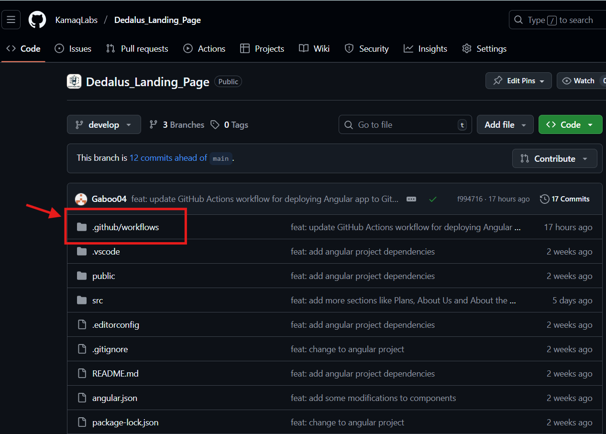

Cada vez que se realiza un push hacia la rama develop, se ejecuta el flujo con las siguientes etapas:
1. Checkout del repositorio
- El flujo obtiene el código fuente desde la rama develop.
2. Configuración del entorno Node.js
- Se instala Node.js versión 20.19.0, necesaria para ejecutar Angular CLI.
3. Instalación de dependencias
- Se ejecuta el comando npm ci para instalar todas las dependencias del proyecto sin modificar el package-lock.json.
4. Compilación del proyecto Angular
- Se genera la build optimizada para producción mediante:  
~~~
npm run build -- --configuration production --base-href="/Dedalus_Landing_Page/"
~~~
- El resultado se almacena en el directorio: 
~~~
dist/LandingPage/browser/
~~~
5. Configuración de soporte de rutas
- Se copia el archivo `index.html` como `404.html` dentro de la carpeta `browser` para asegurar el correcto enrutamiento de Angular en GitHub Pages.
6. Publicación automática
- Se usa la acción `JamesIves/github-pages-deploy-action@v4` para publicar el contenido generado en la rama gh-pages.
- La configuración de GitHub Pages en el repositorio está establecida para usar `gh-pages` como rama fuente.

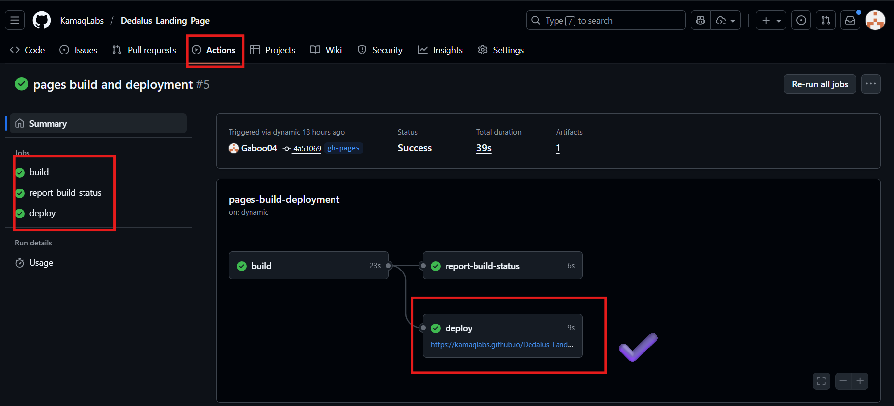

#### Resultado del despliegue
Una vez finalizado el flujo, GitHub Pages publica automáticamente la última versión compilada del sitio en la siguiente URL:  
🔗 [Enlace de landing page desplegada]: https://kamaqlabs.github.io/Dedalus_Landing_Page/

Este proceso elimina la necesidad de desplegar manualmente, garantizando que cada modificación aprobada en la rama `develop` se refleje directamente en la versión pública.

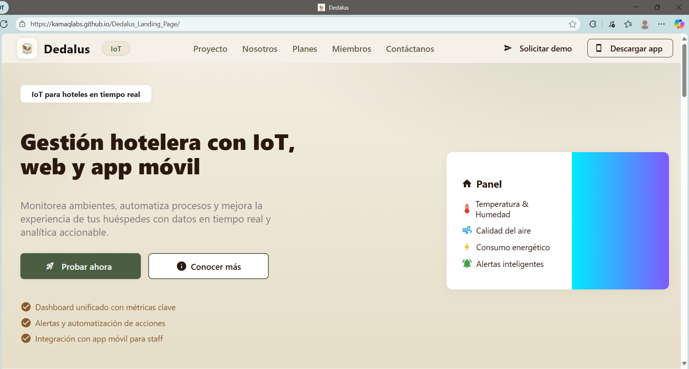

## 6.2 Landing Page, Services & Applications Implementation
En esta sección se detalla el proceso completo de implementación, pruebas, documentación y despliegue de la Landing Page, los Web Services y las Aplicaciones Móviles. Abarca desde la planificación inicial hasta la entrega final, asegurando que cada componente cumpla con los requisitos establecidos y funcione correctamente.

## 6.2.1 Sprint 1
En esta sección se registra y explica el avance en términos de producto y trabajo colaborativo para el Sprint 1. Durante este sprint, el equipo se enfocará en la implementación de la Landing  y de la web application, asegurando que cumpla con los requisitos establecidos y funcione correctamente.

### 6.2.1.1 Sprint Planning 1
En esta sección se especifican los aspectos principales del Sprint Planning Meeting. Este encuentro es fundamental para definir los objetivos y tareas del Sprint 1, asegurando que todos los miembros del equipo estén alineados y preparados para comenzar el trabajo. A continuación, se presenta un cuadro resumen del Sprint Planning Meeting, que incluye los puntos clave discutidos y las decisiones tomadas.

| **Sprint #**                       | Sprint 1                                                                                                                                                                                                                                                                                                                                                                                                                                                                                                                                                                                                                                                                      |
|------------------------------------|-------------------------------------------------------------------------------------------------------------------------------------------------------------------------------------------------------------------------------------------------------------------------------------------------------------------------------------------------------------------------------------------------------------------------------------------------------------------------------------------------------------------------------------------------------------------------------------------------------------------------------------------------------------------------------|
| **Sprint Planning Background**     |                                                                                                                                                                                                                                                                                                                                                                                                                                                                                                                                                                                                                                                                               |
| Date                               | 2025-09-23                                                                                                                                                                                                                                                                                                                                                                                                                                                                                                                                                                                                                                                                    |
| Time                               | 16:00 PM                                                                                                                                                                                                                                                                                                                                                                                                                                                                                                                                                                                                                                                                      |
| Location                           | Google Meet Reunion                                                                                                                                                                                                                                                                                                                                                                                                                                                                                                                                                                                                                                                           |
| Prepared by                        | Valentino Cervantes                                                                                                                                                                                                                                                                                                                                                                                                                                                                                                                                                                                                                                                           |
| Attendees (to planning meeting)    | Valentino Cervantes, Miguel Carpio, Mathias Vasquez, Gabriel Braithuaite, Sihuar Ccotarma                                                                                                                                                                                                                                                                                                                                                                                                                                                                                                                                                                                     |
| Sprint n - 1 Review  Summary       | Se completó y desplegó la Landing Page y el MVP de la Web Application cumpliendo la DoD (responsive ≥320px, SEO semántico básico, navegación por teclado, rendimiento aceptable en 4G para hero/CTA, enlaces externos seguros y formularios validados); se cerraron las US021, US022, US023, US024, US025, US026, US027, US028 y US029 con 23/23 SP (100%); entregables visibles: Home/hero+CTA, Proyecto, About the Product, About the Team, Miembros del grupo, Planes, Contacto y Footer; además, módulo administrador inicial operativo (login, navegación base, vistas para gestión de habitaciones/reservas y visualización de datos IoT básicos), sin bloqueadores abiertos al cierre.                                                                                                                                                                                                                                                                                                                                                                                                                                                                                                                                                                                                                                                   |
| Sprint n - 1 Retrospective Summary | Lo que salió bien: comunicación diaria breve, PRs pequeños y frecuentes, maquetación responsive consistente y deploy temprano que habilitó feedback; por mejorar: aumentar cobertura de pruebas (E2E para CTA y Contacto), documentar el playbook de deploy/rollback y afinar estimaciones de UI; acciones para Sprint 2: configurar E2E (Valentino), crear checklist de deploy/rollback y plantilla de release notes (Miguel), ampliar accesibilidad/ARIA en componentes clave (Sihuar), instrumentar analítica de CTA y eventos de navegación (Gabriel) y definir Definition of Ready para historias de la Web App (Mathias).                                                                                                                                                                                                                                                                                                                                                                                                                                                                                                                                                                                                                                             |
| **Sprint Goal & User Stories**     |                                                                                                                                                                                                                                                                                                                                                                                                                                                                                                                                                                                                                                                                               |
| Sprint 1 Goal                      | Our focus is on delivering the initial web presence and management interface for the Dedalus Platform, including a responsive landing page and a functional web module for administrators to manage rooms, reservations, and IoT device data.   We believe it delivers visibility, credibility, and early digital interaction for potential hotel clients, while providing administrators with the first version of the digital control panel for operational management.   This will be confirmed when the landing page is publicly accessible and administrators can successfully log in, create rooms, and visualize basic IoT sensor data from the web application. |
| Sprint 1 Velocity                  |           23                                                                                                                                                                                                                                                                                                                                                                                                                                                                                                                                                                                                                                                                    |
| Sum of Story Points                |      23                                                                                                                                                                                                                                                                                                                                                                                                                                                                                                                                                                                                                                                                         |

### 6.2.1.2 Aspect Leaders and Collaborators
En esta sección se especifican los aspectos principales del Sprint Planning Meeting. Este encuentro es fundamental para definir los objetivos y tareas del Sprint 1, asegurando que todos los miembros del equipo estén alineados y preparados para comenzar el trabajo. A continuación, se presenta un cuadro resumen del Sprint Planning Meeting, que incluye los puntos clave discutidos y las decisiones tomadas.

### 6.2.1.3 Sprint Backlog 1
En esta sección se presenta el Sprint Backlog del Sprint 1, que incluye las tareas y actividades planificadas para el desarrollo de la Landing Page y el avance de nuestro Web Application. Cada tarea está asociada a una User Story específica, lo que permite al equipo realizar un seguimiento del progreso y asegurarse de que se cumplan los objetivos del sprint.

| Sprint # | User Story Id | Title                          | Work Item Id | Task Title                                   | Description                                                                                                       | Estimation (Hours) | Assigned To | Status |
|---------:|---------------|-------------------------------|--------------|----------------------------------------------|-------------------------------------------------------------------------------------------------------------------|-------------------:|-------------|--------|
| Sprint 1 | US021         | Página inicial                | WI01         | Diseñar la estructura de la Landing Page     | Crear un esquema básico de la Landing (hero, header, secciones) y propuesta de valor inicial.                    |                1.0 | Valentino   | Done   |
| Sprint 1 | US021         | Página inicial                | WI01A        | Implementar hero + navegación básica         | Maquetar hero con CTA y header con anclas a secciones y scroll suave.                                            |                2.0 | Valentino   | To Do  |
| Sprint 1 | US022         | Sección Proyecto              | WI02         | Diseñar la sección “¿Qué es Dedalus?”        | Incluir descripción de funcionalidades clave (automatización, dashboard, sensores).                              |                1.0 | Mathias     | Done   |
| Sprint 1 | US022         | Sección Proyecto              | WI02A        | Maquetar sección con iconografía             | Implementar layout responsive con íconos/ilustraciones y copy aprobado.                                          |                2.0 | Mathias     | To Do  |
| Sprint 1 | US025         | Llamada a la acción (CTA)     | WI03         | Implementar botón de "Probar ahora"          | Crear un botón que lleve a la app web o al sign-up si no hay sesión.                                             |                1.0 | Gabriel     | Done   |
| Sprint 1 | US025         | Llamada a la acción (CTA)     | WI03A        | Analítica y accesibilidad del CTA            | Enviar evento de clic a métricas y asegurar foco visible/ARIA en el botón.                                       |                1.0 | Gabriel     | To Do  |
| Sprint 1 | US026         | Sección “About the Product”   | WI04         | Diseñar la sección "About the product"       | Incluir una descripción resumida del producto y beneficios.                                                       |                1.0 | Sihuar      | Done   |
| Sprint 1 | US026         | Sección “About the Product”   | WI04A        | Diagrama + enlace a documentación            | Agregar diagrama/arquitectura (SVG) y enlaces a documentación en nueva pestaña.                                  |                2.0 | Sihuar      | To Do  |
| Sprint 1 | US027         | Sección “About the Team”      | WI05         | Diseñar la sección "About the team"          | Incluir una breve presentación del equipo y roles principales.                                                    |                1.0 | Miguel      | Done   |
| Sprint 1 | US027         | Sección “About the Team”      | WI05A        | Grid de tarjetas con fotos y roles           | Implementar tarjetas con nombre, rol y foto (lazy-load) en layout responsive.                                    |                2.0 | Miguel      | To Do  |
| Sprint 1 | US024         | Sección de planes             | WI06         | Diseñar la sección "Planes de Pago"          | Incluir dos o más planes con precios y características.                                                           |                1.0 | Miguel      | Done   |
| Sprint 1 | US024         | Sección de planes             | WI06A        | Implementar cards y CTA por plan             | Maquetar cards comparables y redirección de cada CTA al flujo correspondiente.                                    |                2.0 | Miguel      | To Do  |
| Sprint 1 | US028         | Sección “Miembros del grupo”  | WI07         | Diseñar la sección "Miembros del grupo"      | Incluir fotos y nombres de los miembros del equipo de desarrollo.                                                 |                1.0 | Valentino   | Done   |
| Sprint 1 | US028         | Sección “Miembros del grupo”  | WI07A        | Perfiles con enlaces y texto alternativo     | Añadir enlaces a redes, ofuscación de correos y `alt` descriptivo en imágenes.                                    |                1.5 | Valentino   | To Do  |
| Sprint 1 | US023         | Sección de contacto           | WI08         | Diseñar la sección "Contacto"                | Incluir un formulario con campos: nombre, correo, teléfono y mensaje.                                             |                1.0 | Mathias     | Done   |
| Sprint 1 | US023         | Sección de contacto           | WI08A        | Validaciones + envío (mock/API)              | Validar campos en frontend y conectar envío a mock/API con manejo de respuesta y errores.                        |                2.0 | Mathias     | To Do  |
| Sprint 1 | US029         | Footer                        | WI09         | Diseñar el footer                            | Incluir un aviso de derechos de autor.                                                                            |                1.0 | Gabriel     | Done   |
| Sprint 1 | US029         | Footer                        | WI09A        | Enlaces legales y comportamiento de apertura | Añadir enlaces a privacidad/términos y abrir en nueva pestaña con `rel="noopener noreferrer"`.                   |                0.5 | Gabriel     | To Do  |

Screenshot del Sprint Backlog del Sprint 1 en Trello:

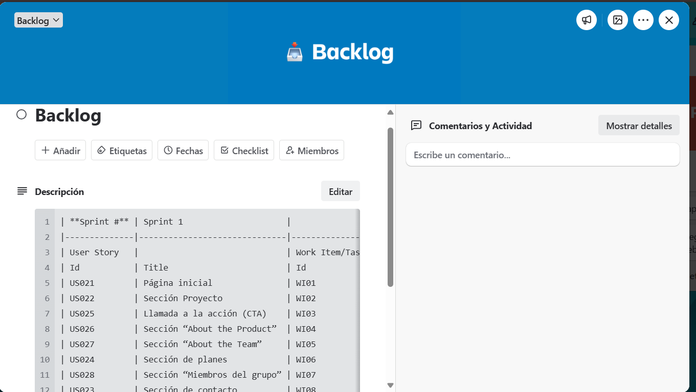

Enlace al Sprint Backlog del Sprint 1 en Trello: https://trello.com/c/ecIEDWCF

### 6.2.1.4 Development Evidence for Sprint Review
En esta sección se explican y presentan los avances en la implementación de los productos de la solución según el alcance del Sprint 1. Durante este sprint, el equipo se ha enfocado en la creación y despliegue de la Landing Page, asi como el avance de nuestra Web Application.

| Repository                          | Branch  | Commit Id | Commit Message                                                                      | Commit Message Body                                                                                                                                                            | Commited on (Date) |
|-------------------------------------|---------|-----------|-------------------------------------------------------------------------------------|--------------------------------------------------------------------------------------------------------------------------------------------------------------------------------|--------------------|
| Anx0123/Dedalus_Landing_Page        | main    | 6a185d8   | Initial commit                                                                      | Initial commit with basic project structure and dependencies.                                                                                                                  | 2025-09-03         |
| KiwiAmenazante/Dedalus_Landing_Page | main    | e9fc982   | Move HTML and CSS files to new locations                                            | Renamed index.html and main.css to new paths and updated the stylesheet link in index.html to reflect the new location. This helps organize assets under the public directory. | 2025-09-2022       | 
| LordSack/Dedalus_Landing_Page       | develop | 1ef8598   | feat: change to angular project                                                     | feat: change to angular project                                                                                                                                                | 2025-09-24         |
| Gabooo04/Dedalus_Landing_Page       | develop | f994716   | feat: update GitHub Actions workflow for deploying Angular app to GitHub Pages      | feat: update GitHub Actions workflow for deploying Angular app to GitHub Pages                                                                                                 | 2025-10-06         |
| KiwiAmenazante/Dedalus-FrontEndApp  | main    | 3e7366    | feat: add dashboard route and session storage service for improved state management | feat: add dashboard route and session storage service for improved state management                                                                                            | 2025-10-05         |
| Dedalus-FrontEndApp                 | main    | 4f6dd38   | feat: updating session storage                                                      | feat: updating session storage                                                                                                                                                 | 2025-10-06         |

Enlace al repositorio: https://github.com/KamaqLabs/Dedalus_Landing_Page

### 6.2.1.5 Testing Suite Evidence for Sprint Review
Para este sprint, no se han realizado pruebas automatizadas. Sin embargo, se han realizado pruebas manuales para asegurar que la Landing Page y la web application funcionen correctamente y cumplan con los requisitos establecidos.
Se podrían implementar pruebas automatizadas utilizando herramientas como Selenium en futuros sprints, pero por el momento, el equipo ha optado por realizar pruebas manuales para asegurar la calidad del producto.

### 6.2.1.6 Execution Evidence for Sprint Review
En este Sprint 1, el equipo ha desarrollado y desplegado la Landing Page y la primera version de nuestra Web Application, asegurando que cumpla con los requisitos establecidos y funcione correctamente. A continuación, se presentan las evidencias de ejecución del Sprint 1, que incluyen capturas de pantalla y descripciones de las funcionalidades implementadas.

 **Hero Section**: La sección principal de la Landing Page, que incluye una barra de navegación, un título
atractivo, una imagen llamativa y un botón de llamada a la acción.
  
 **About Section**: La sección que proporciona información sobre la aplicación y sus características principales.
Incluye un título, una descripción y una imagen representativa. Además, tiene uan sección sobre el equipo de
desarrollo.
  
  
 **Subscriptions Section**: La sección que muestra los diferentes planes de suscripción disponibles para los
usuarios. Incluye un título, una descripción y nuestros dos planes con precios y características.
  
 **Contact Section**: La sección que permite a los usuarios ponerse en contacto con el equipo de desarrollo.
Incluye un formulario de contacto con campos para el nombre, correo electrónico y mensaje.
  
 **Footer Section**: La sección que incluye un aviso de derechos de autor.
  

Y respecto a la Web Application aqui se puede evidenciar parte del avance que hemos realizado para esta entrega:

### 6.2.1.7 Services Documentation Evidence for Sprint Review
Este sprint 1 tuvo como enfoque principal la implementación de la Landing Page y la Web Application, por lo que no se han desarrollado Web Services. La documentación de Endpoints con OpenAPI y los detalles relacionados con Web Services serán relevantes en sprints futuros cuando se aborde la implementación y documentación de estos servicios.

### 6.2.1.8 Software Deployment Evidence for Sprint Review
#### Software Deployment Evidence – Landing Page
Durante este Sprint se realizó el despliegue de la Landing Page oficial de la plataforma Dedalus, la cual tiene como propósito presentar la solución al público objetivo (hoteles, resorts y hospedajes boutique) y proporcionar una primera interacción digital con la marca.
El despliegue se efectuó utilizando GitHub Pages como servicio de hosting estático y GitHub Actions como herramienta de automatización continua (CI/CD).
Este proceso permitió garantizar que cada actualización en el repositorio principal se publique automáticamente en el entorno productivo, manteniendo una entrega continua y trazable del producto.
#### Pasos del proceso de Deployment
1. **Creación y configuración del repositorio**
    - Se creó el repositorio público Dedalus_Landing_Page en GitHub para centralizar el código fuente de la landing.
    - La rama principal (develop) fue configurada como la fuente oficial de despliegue.
    - Se añadieron los archivos esenciales del proyecto (Angular / HTML-CSS / assets / config).
    - Estructura del repositorio: 
2. **Configuración de GitHub Pages**
    - En la sección Settings → Pages, se seleccionó la rama gh-pages (generada automáticamente por la acción de despliegue) como fuente del sitio.
    - Se habilitó el dominio del proyecto, generando la URL pública: https://kamaqlabs.github.io/Dedalus_Landing_Page/
    - La visibilidad se configuró como pública para permitir el acceso de los stakeholders y usuarios de prueba.
3. **Automatización mediante GitHub Actions (CI/CD)**
    - Se creó un archivo de flujo de trabajo (.github/workflows/deploy.yml) con la siguiente función:
        - Compilar automáticamente la landing page al hacer push en la rama develop.
        - Generar la carpeta dist/ optimizada para producción.
        - Publicar el contenido en la rama gh-pages de manera automática.
        - Script configurado: 
4. **Verificación del despliegue**
    - Se validó el acceso público a la landing desde el navegador.
    - Se comprobó la correcta carga de recursos (imágenes, estilos y scripts).
    - Los resultados de validación fueron satisfactorios: el sitio se muestra correctamente y con tiempo de carga óptimo.
    - Landing Page desplegada: 

### 6.2.1.9 Team Collaboration Insights during Sprint
Para el desarrollo de este sprint, el equipo designó a un integrante para el desarrollo de las actividades de implementación de la Landing Page.

GitHub insights del landing page y Web Application:

## 6.2.1 Sprint 2
En esta sección se registra y explica el avance en términos de producto y trabajo colaborativo para el Sprint 2. Durante este sprint, el equipo se enfocará en la implementación de la web application y desarrollar el mobile de nuestra aplicacion, asegurando que cumpla con los requisitos establecidos y funcione correctamente.

### 6.2.1.1 Sprint Planning 2
En esta sección se especifican los aspectos principales del Sprint Planning Meeting. Este encuentro es fundamental para definir los objetivos y tareas del Sprint 2, asegurando que todos los miembros del equipo estén alineados y preparados para comenzar el trabajo. A continuación, se presenta un cuadro resumen del Sprint Planning Meeting, que incluye los puntos clave discutidos y las decisiones tomadas.

| **Sprint #**                       | Sprint 2                                                                                                                                                                                                                                                                                                                                                                                                                                                                                                                                                                                                                                                                      |
|------------------------------------|-------------------------------------------------------------------------------------------------------------------------------------------------------------------------------------------------------------------------------------------------------------------------------------------------------------------------------------------------------------------------------------------------------------------------------------------------------------------------------------------------------------------------------------------------------------------------------------------------------------------------------------------------------------------------------|
| **Sprint Planning Background**     |                                                                                                                                                                                                                                                                                                                                                                                                                                                                                                                                                                                                                                                                               |
| Date                               | 2025-11-10                                                                                                                                                                                                                                                                                                                                                                                                                                                                                                                                                                                                                                                                    |
| Time                               | 16:00 PM                                                                                                                                                                                                                                                                                                                                                                                                                                                                                                                                                                                                                                                                      |
| Location                           | Google Meet Reunion                                                                                                                                                                                                                                                                                                                                                                                                                                                                                                                                                                                                                                                           |
| Prepared by                        | Valentino Cervantes                                                                                                                                                                                                                                                                                                                                                                                                                                                                                                                                                                                                                                                           |
| Attendees (to planning meeting)    | Valentino Cervantes, Miguel Carpio, Mathias Vasquez, Gabriel Braithuaite, Sihuar Ccotarma                                                                                                                                                                                                                                                                                                                                                                                                                                                                                                                                                                                     |
| Sprint n - 1 Review  Summary       | Se completó y desplegó la Landing Page y el MVP de la Web Application cumpliendo la DoD (responsive ≥320px, SEO semántico básico, navegación por teclado, rendimiento aceptable en 4G para hero/CTA, enlaces externos seguros y formularios validados); se cerraron las US021, US022, US023, US024, US025, US026, US027, US028 y US029 con 23/23 SP (100%); entregables visibles: Home/hero+CTA, Proyecto, About the Product, About the Team, Miembros del grupo, Planes, Contacto y Footer; además, módulo administrador inicial operativo (login, navegación base, vistas para gestión de habitaciones/reservas y visualización de datos IoT básicos), sin bloqueadores abiertos al cierre.                                                                                                                                                                                                                                                                                                                                                                                                                                                                                                                                                                                                                                                   |
| Sprint n - 1 Retrospective Summary | Lo que salió bien: comunicación diaria breve, PRs pequeños y frecuentes, maquetación responsive consistente y deploy temprano que habilitó feedback; por mejorar: aumentar cobertura de pruebas (E2E para CTA y Contacto), documentar el playbook de deploy/rollback y afinar estimaciones de UI; acciones para Sprint 2: configurar E2E (Valentino), crear checklist de deploy/rollback y plantilla de release notes (Miguel), ampliar accesibilidad/ARIA en componentes clave (Sihuar), instrumentar analítica de CTA y eventos de navegación (Gabriel) y definir Definition of Ready para historias de la Web App (Mathias).                                                                                                                                                                                                                                                                                                                                                                                                                                                                                                                                                                                                                                             |
| **Sprint Goal & User Stories**     |                                                                                                                                                                                                                                                                                                                                                                                                                                                                                                                                                                                                                                                                               |
| Sprint 1 Goal                      | Our focus is on delivering the initial web presence and management interface for the Dedalus Platform, including a responsive landing page and a functional web module for administrators to manage rooms, reservations, and IoT device data.   We believe it delivers visibility, credibility, and early digital interaction for potential hotel clients, while providing administrators with the first version of the digital control panel for operational management.   This will be confirmed when the landing page is publicly accessible and administrators can successfully log in, create rooms, and visualize basic IoT sensor data from the web application. |
| Sprint 1 Velocity                  |           23                                                                                                                                                                                                                                                                                                                                                                                                                                                                                                                                                                                                                                                                    |
| Sum of Story Points                |      23                                                                                                                                                                                                                                                                                                                                                                                                                                                                                                                                                                                                                                                                         |

### 6.2.1.2 Aspect Leaders and Collaborators
En esta sección se especifican los aspectos principales del Sprint Planning Meeting. Este encuentro es fundamental para definir los objetivos y tareas del Sprint 2, asegurando que todos los miembros del equipo estén alineados y preparados para comenzar el trabajo. A continuación, se presenta un cuadro resumen del Sprint Planning Meeting, que incluye los puntos clave discutidos y las decisiones tomadas.

### 6.2.1.3 Sprint Backlog 2
En esta sección se presenta el Sprint Backlog del Sprint 1, que incluye las tareas y actividades planificadas para el desarrollo de la Landing Page y el avance de nuestro Web Application. Cada tarea está asociada a una User Story específica, lo que permite al equipo realizar un seguimiento del progreso y asegurarse de que se cumplan los objetivos del sprint.

| Sprint # | User Story Id | Title                        | Work Item Id | Task Title                                          | Description                                                                                                                                          | Estimation (Hours) | Assigned To | Status      |
|---------:|---------------|-----------------------------|--------------|-----------------------------------------------------|------------------------------------------------------------------------------------------------------------------------------------------------------|-------------------:|-------------|-------------|
| Sprint 2 | US006         | Acceso con NFC              | WI10         | Diseñar flujo de acceso NFC en app móvil           | Definir pantallas y navegación para que el huésped inicie sesión, seleccione su habitación y utilice el botón de “Abrir con NFC” dentro de la app.  |                2.0 | Valentino   | Done        |
| Sprint 2 | US006         | Acceso con NFC              | WI10A        | Implementar lectura y validación de credenciales   | Programar en la app móvil la invocación al endpoint de credenciales NFC, manejo de estados (válida/expirada) y registro local del resultado.        |                3.0 | Mathias     | Done        |
| Sprint 2 | US007         | Acceso con Bluetooth        | WI11         | Configurar emparejamiento BLE en la app móvil      | Implementar la lógica para escanear cerraduras cercanas vía Bluetooth, seleccionar la habitación autorizada y guardar el dispositivo emparejado.    |                3.0 | Gabriel     | Done        |
| Sprint 2 | US007         | Acceso con Bluetooth        | WI11A        | Apertura de puerta vía comando BLE                 | Desarrollar la función que envía el comando de apertura a la cerradura, mostrando feedback en pantalla y registrando el evento en el log local.     |                2.0 | Gabriel     | Done        |
| Sprint 2 | US011         | Control de luces            | WI12         | UI de control de luces en app móvil                | Diseñar e implementar sliders/switches por ambiente (habitación, baño) para encender/apagar luces desde la pantalla principal de la habitación.     |                2.5 | Sihuar      | Done        |
| Sprint 2 | US011         | Control de luces            | WI12A        | Integración con API IoT de luces                   | Conectar la UI de la app móvil con el servicio REST/MQTT de luces, incluyendo reintentos y mensajes de error cuando no haya conexión.               |                3.0 | Sihuar      | Done        |
| Sprint 2 | US013         | Control de temperatura      | WI13         | Diseñar componente de termostato en app móvil      | Crear un control de temperatura (slider o stepper) que permita al huésped ajustar el setpoint dentro del rango permitido (18–26 °C).                |                2.0 | Valentino   | Done        |
| Sprint 2 | US013         | Control de temperatura      | WI13A        | Conectar termostato con backend                    | Implementar la llamada al backend para actualizar el setpoint, mostrar temperatura actual vs objetivo y manejar estados “Eco” y “Standby”.          |                3.0 | Mathias     | Done        |
| Sprint 2 | US004         | Crear/gestionar reservas    | WI14         | Vista de calendario de reservas en web application | Implementar en la aplicación web una vista de calendario donde el administrador pueda visualizar reservas por habitación y rango de fechas.         |                3.5 | Miguel      | In Progress  |
| Sprint 2 | US004         | Crear/gestionar reservas    | WI14A        | Formulario de creación/edición de reserva web      | Desarrollar el formulario para crear/modificar reservas en la web app, con validación de disponibilidad y mensajes claros de error/éxito.           |                3.0 | Miguel      | To Do       |
| Sprint 2 | US010         | Registro de accesos         | WI15         | Listado filtrable de accesos en web application    | Crear en la web app una tabla con los accesos por habitación/usuario/método, con filtros por fecha y paginación básica.                             |                2.5 | Sihuar      | In Progress  |
| Sprint 2 | US010         | Registro de accesos         | WI15A        | Exportación y detalle de acceso                    | Implementar la vista de detalle de cada acceso (fecha, método, dispositivo) y la opción de exportar el historial visible a CSV desde la web app.   |                2.0 | Mathias     | To Do       |

Screenshot del Sprint Backlog del Sprint 2 en Trello:

Enlace al Sprint Backlog del Sprint 2 en Trello: https://trello.com/invite/b/68db1fce75d44c2edfbab7de/ATTI5bd0a4792f4fb64ae03d2faff0bb8ad585EDC93F/sprint-1 

### 6.2.1.4 Development Evidence for Sprint Review
En esta sección se explican y presentan los avances en la implementación de los productos de la solución según el alcance del Sprint 2. Durante este sprint, el equipo se ha enfocado en el avance de nuestra Web y Mobile Application.

| Repository                          | Branch  | Commit Id | Commit Message                                                                      | Commit Message Body                                                                                                                                                            | Commited on (Date) |
|-------------------------------------|---------|-----------|-------------------------------------------------------------------------------------|--------------------------------------------------------------------------------------------------------------------------------------------------------------------------------|--------------------|
| https://github.com/KamaqLabs/Dedalus-MobileApp        | main    | f845bd4   | Initial commit                                                                      | chore(mvp): initial mobile MVP                                                                                                                  | 2025-11-12         |
| https://github.com/KamaqLabs/Dedalus-Platform | main    | 8b97fe4   |  feat: add endpoints to retrieve all bookingslocations                                            | feat: add endpoints to retrieve all bookings, bookings by hotelId, and bookings by guestId | 2025-11-12       | 
| https://github.com/KamaqLabs/Dedalus-Platform     | main | c3db5c9  | feat: add endpoint to retrieve all hotels                                                    | feat: add endpoint to retrieve all hotels and implement corresponding service method                                                                                                                                              | 2025-11-12         |

Enlace al repositorio: https://github.com/KamaqLabs/Dedalus_Landing_Page
Enlace al repositorio de la Web Application: https://github.com/KamaqLabs/Dedalus-Platform
Enlace al repositorio del Mobile Application: https://github.com/KamaqLabs/Dedalus-MobileApp

### 6.2.1.5 Testing Suite Evidence for Sprint Review
Para este sprint, no se han realizado pruebas automatizadas. Sin embargo, se han realizado pruebas manuales para asegurar que la Landing Page, la web application y el mobile app funcionen correctamente y cumplan con los requisitos establecidos.
Se podrían implementar pruebas automatizadas utilizando herramientas como Selenium en futuros sprints, pero por el momento, el equipo ha optado por realizar pruebas manuales para asegurar la calidad del producto.

### 6.2.1.6 Execution Evidence for Sprint Review
En este Sprint 2, el equipo ha desarrollado con una mayor precision la web applicacion y la primera version de nuestro mobile app, asegurando que cumpla con los requisitos establecidos y funcione correctamente. A continuación, se presentan las evidencias de ejecución del Sprint 1, que incluyen capturas de pantalla y descripciones de las funcionalidades implementadas.

Se puede evidenciar parte del avance que hemos realizado para esta entrega de nuestro web application:

Se puede evidenciar parte del avance que hemos realizado para esta entrega de nuestro mobile application:

### 6.2.1.7 Services Documentation Evidence for Sprint Review
Este sprint 2 tuvo como enfoque principal la implementación de la Web Application y la primera version del mobile application, por lo que no se han desarrollado Web Services. La documentación de Endpoints con OpenAPI y los detalles relacionados con Web Services serán relevantes en sprints futuros cuando se aborde la implementación y documentación de estos servicios.

### 6.2.1.8 Software Deployment Evidence for Sprint Review
#### Software Deployment Evidence – Landing Page
Durante este Sprint se realizó el despliegue de la Landing Page oficial de la plataforma Dedalus, la cual tiene como propósito presentar la solución al público objetivo (hoteles, resorts y hospedajes boutique) y proporcionar una primera interacción digital con la marca.
El despliegue se efectuó utilizando GitHub Pages como servicio de hosting estático y GitHub Actions como herramienta de automatización continua (CI/CD).
Este proceso permitió garantizar que cada actualización en el repositorio principal se publique automáticamente en el entorno productivo, manteniendo una entrega continua y trazable del producto.

#### Pasos del proceso de Deployment
1. **Creación y configuración del repositorio**
    - Se creó el repositorio público Dedalus_Landing_Page en GitHub para centralizar el código fuente de la landing.
    - La rama principal (develop) fue configurada como la fuente oficial de despliegue.
    - Se añadieron los archivos esenciales del proyecto (Angular / HTML-CSS / assets / config).
    - Estructura del repositorio: 
2. **Configuración de GitHub Pages**
    - En la sección Settings → Pages, se seleccionó la rama gh-pages (generada automáticamente por la acción de despliegue) como fuente del sitio.
    - Se habilitó el dominio del proyecto, generando la URL pública: https://kamaqlabs.github.io/Dedalus_Landing_Page/
    - La visibilidad se configuró como pública para permitir el acceso de los stakeholders y usuarios de prueba.
3. **Automatización mediante GitHub Actions (CI/CD)**
    - Se creó un archivo de flujo de trabajo (.github/workflows/deploy.yml) con la siguiente función:
        - Compilar automáticamente la landing page al hacer push en la rama develop.
        - Generar la carpeta dist/ optimizada para producción.
        - Publicar el contenido en la rama gh-pages de manera automática.
        - Script configurado: 
4. **Verificación del despliegue**
    - Se validó el acceso público a la landing desde el navegador.
    - Se comprobó la correcta carga de recursos (imágenes, estilos y scripts).
    - Los resultados de validación fueron satisfactorios: el sitio se muestra correctamente y con tiempo de carga óptimo.
    - Landing Page desplegada: 

### 6.2.1.9 Team Collaboration Insights during Sprint
Para el desarrollo de este sprint, el equipo designó a un integrante para el desarrollo de las actividades de implementación de la Landing Page.

GitHub insights del landing page y Web Application:

## 6.3 Validation Interviews  
### 6.3.1 Diseño de Entrevistas  
#### 1. Preguntas para Gestores de Empresas Hoteleras

| **Categoría**                   | **Preguntas**                                                                                                                               |
|---------------------------------|---------------------------------------------------------------------------------------------------------------------------------------------|
| **Edad y género**               | - ¿Podrías indicarme tu edad y género?                                                                                                      |
|                                 | - ¿Consideras que tu perfil demográfico influye en tu familiaridad o preferencias al usar plataformas de gestión?                            |
| **Ubicación del hotel**         | - ¿En qué ciudad o región se encuentra tu hotel?                                                                                            |
|                                 | - ¿Tu ubicación influye en la necesidad de interacción digital con los huéspedes?                                                           |
| **Experiencia en el sector hotelero** | - ¿Cuántos años de experiencia tienes en la gestión hotelera?                                                                       |
|                                 | - ¿Qué cambios o actualizaciones esperas en plataformas de gestión con base en tu experiencia?                                              |

#### 1.2 Evaluación del Landing Page y Aplicaciones

| **Categoría**                   | **Preguntas**                                                                                                                               |
|---------------------------------|---------------------------------------------------------------------------------------------------------------------------------------------|
| **Navegación y facilidad de uso** | - ¿Qué tan fácil encontraste navegar en el landing page y la aplicación de Logistic Master?                                                   |
|                                 | - ¿Hubo alguna sección que te costara trabajo localizar o entender?                                                                        |
| **Funcionalidades clave**       | - ¿Qué características te parecen útiles en la gestión hotelera?                                                                           |
|                                 | - ¿Qué opinas de la funcionalidad de notificaciones push en la plataforma?                                                                  |
| **Eficiencia en la gestión**    | - ¿Crees que la plataforma te facilita la gestión de tu hotel de manera eficiente?                                                         |
|                                 | - ¿Hay alguna funcionalidad que agregarías o mejorarías para adaptarla mejor a tus necesidades?                                            |

### 2. Preguntas para Huéspedes

| **Categoría**                   | **Preguntas**                                                                                                                               |
|---------------------------------|---------------------------------------------------------------------------------------------------------------------------------------------|
| **Edad y género**               | - ¿Podrías indicarme tu edad y género?                                                                                                      |
|                                 | - ¿Te sientes cómodo usando plataformas digitales para hacer reservas y recibir notificaciones?                                             |
| **Distrito de residencia**      | - ¿En qué distrito o ciudad resides actualmente?                                                                                            |
|                                 | - ¿Prefieres reservar en lugares cercanos a tu residencia o explorar destinos nuevos?                                                       |
| **Ocupación**                   | - ¿Cuál es tu ocupación actual?                                                                                                             |
|                                 | - ¿Crees que tu ocupación influye en la frecuencia o tipo de reservas que realizas?                                                         |

#### 2.2 Evaluación del Landing Page y Aplicaciones

| **Categoría**                   | **Preguntas**                                                                                                                               |
|---------------------------------|---------------------------------------------------------------------------------------------------------------------------------------------|
| **Interacción inicial**         | - ¿Fue fácil encontrar la información en el landing page y entender de qué trata Logistic Master?                                              |
|                                 | - ¿Tuviste problemas para registrarte o iniciar sesión en la aplicación?                                                                    |
| **Preferencias y expectativas** | - ¿Qué funcionalidades de la plataforma te resultaron más útiles para hacer reservas?                                                      |
|                                 | - ¿Te gustaría recibir más información personalizada o notificaciones sobre servicios disponibles en los hoteles?                          |
| **Experiencia de reserva**      | - ¿El flujo de reserva te pareció intuitivo? ¿Hubo algún paso que te generara dudas o frustración?                                         |
|                                 | - ¿Qué cambios sugerirías para mejorar la experiencia de reserva en la plataforma?                                                         |

### Conclusión de la Entrevista

| **Categoría**                   | **Pregunta**                                                                                                                                |
|---------------------------------|---------------------------------------------------------------------------------------------------------------------------------------------|
| **Pregunta Final**              | - ¿Hay algo más que consideres relevante compartir sobre tu experiencia interactuando con la plataforma y realizando reservas?             |

### 6.3.2 Registro de Entrevistas  

#### Entrevista 1
| **Datos del entrevistado** | 
|--------------------------|
| **Nombre:**  Miguel Polo |
| **Link del video:**  https://youtu.be/mzMYdfkO-wQ |
| **Edad:**  31 años |
| **Procedencia:**  Lima, San Isidro |
| |
| **Resumen:** Ramiro es un gestor de hotel en San Isidro, Lima, con cinco años de experiencia en la industria hotelera. El administra las reservas directamente en el sistema del hotel y le da mucha importancia a aspectos como el precio, la ubicación y las opiniones de los huéspedes. Aunque se siente cómodo gestionando reservas desde su smartphone, sugiere que las plataformas de reservas hoteleras deberían incluir más opciones de personalización, enviar recordatorios automáticos y ofrecer mayor claridad en las tarifas adicionales. Además, considera esencial recibir notificaciones y tener la opción de comunicarse directamente con los clientes a través de la plataforma. |

#### Entrevista 2
| **Datos del entrevistado** | 
|--------------------------|
| **Nombre:**  Aaron  |
| **Link del video:**  https://youtu.be/_SB_7uG-c-I|
| **Edad:**  22 años |
| **Procedencia:**  Lima, Villa Salvador |
| |
| **Resumen:** Roberto Franco  es un gestor de hotel en Lima con 4 años de experiencia en el sector. Maneja las reservas directamente en el sistema del hotel y considera esenciales factores como el precio, la ubicación y los comentarios de los huéspedes. Sugiere que las aplicaciones de reservas deberían ser más visuales, ofreciendo opciones de personalización, recordatorios automáticos y mayor claridad en los cargos adicionales. Para él, es crucial recibir notificaciones y tener la opción de comunicarse de forma directa con los clientes a través de la plataforma. |

## Segmento de huespedes

#### Entrevista 3
| **Datos del entrevistado** | 
|--------------------------|
| **Nombre:**  Jose Shuan https://youtu.be/PHPDHfchmEA  |
| **Link del video:** |
| **Edad:**  24 años |
| **Procedencia:**  Lima, Callao |
| |
| **Resumen:** Jose Shuan, un estudiante universitario de 24 años que reside en San Miguel, Lima, realiza la mayoría de sus reservas entre los 18 y 20 años, principalmente le gusta  hacer reservas a destinos nuevos , valorando el precio, la ubicación y las opiniones de otros usuarios. Se siente cómodo Logistic Master para realizar reservas, pero sugiere que nuestra plataforma  debería implementar mas facilidad a la hora de completar información detallada  acerca de su reserva. |

#### Entrevista 4
| **Datos del entrevistado** | 
|--------------------------|
| **Nombre:**  Lopez Diaz Gael Dario |
| **Link del video:**  https://youtu.be/tG7F4AsYnO8 |
| **Edad:**  20 años |
| **Procedencia:**  Lima, San Miguel |
| |
| **Resumen:** Gael, un estudiante universitario de 19 años que reside en San Miguel, Lima, realiza la mayoría de sus reservas entre los 18 y 20 años, principalmente le gusta  hacer reservas a destinos nuevos pero si no cuenta con mucho tiempo por la universidad prefiere cercanos  , valorando el precio, la ubicación y las opiniones de otros usuarios. Se siente Logistic Master cómodo usando  para realizar reservas, pero sugiere que nuestra plataforma  debería implementar mas facilidad a la hora de completar información detallada  acerca de su reserva . |

### 6.3.3 Evaluaciones segun heuristicas

- Escala de Severidad

| Escala | 1             | 2     | 3         | 4     | 5         |
|--------|---------------|-------|-----------|-------|-----------|
| Nivel  | No tan grave  | Leve  | Moderado  | Grave | Muy grave |

--------------------------------------------------------

| #Orden | Problema                                                                                         | Escala de Severidad | Heurística / Principio violado(a) |
|--------|--------------------------------------------------------------------------------------------------|---------------------|------------------------------------|
| #1     | Al iniciar sesión en el panel administrativo, la interfaz no muestra un estado claro de validación (pantalla queda estática sin mensaje de “cargando” o “verificando credenciales”).           | 4                   | Eficiencia de retroalimentación                  |
| #2     | Los íconos de sensores (humo, gas, ocupación) en el panel IoT no tienen etiquetas visibles ni leyenda explicativa. | 3                   | Eficiencia de reconocimiento visual             |
| #3     | No existe una opción inmediata para revertir una cancelación de reserva realizada por error en el panel de gerente.       | 3                   | Eficiencia de control del usuario                  |
| #4     | El reporte de ocupación no muestra claramente por qué una habitación está marcada como “Fuera de servicio” u “Ocupada”.           | 4                   | Eficiencia de interpretación de decisiones                  |
| #5     | El sistema permite revocar credenciales NFC/Bluetooth sin mensaje de confirmación ni resumen de la acción. | 5                 | Eficiencia de prevención de errores
| #6     | 	El historial de alertas de humo/gas está oculto a varios clics y sin buscador, dificultando encontrar incidentes previos. | 3                  | 	Eficiencia de recuperación de información

**Heurísticas y Recomendaciones:**

- **Problema #1: Falta de retroalimentación al iniciar sesión en el panel administrativo**
  - *Heurística:* Eficiencia de retroalimentación
  - *Recomendación:* Agregar un spinner o barra de progreso con el mensaje “Verificando credenciales…” mientras se procesa el login, y mostrar claramente los estados “Sesión iniciada” o “Credenciales incorrectas”. Esto evita que el usuario piense que el sistema está congelado o que el formulario no se envió.
 

- **Problema #2: Iconos de sensores sin etiquetas claras en el panel IoT**
  - *Heurística:* Eficiencia de reconocimiento visual
  - *Recomendación:* Añadir etiquetas breves bajo cada ícono (ej. “Humo”, “Gas”, “Ocupación”) y una leyenda de colores (verde = normal, amarillo = alerta, rojo = crítico). Así el administrador reconoce el estado sin memorizar significados.
 

- **Problema #3: Imposibilidad de deshacer cancelaciones de reserva recientes**
  - *Heurística:* Eficiencia de control del usuario
  - *Recomendación:* Incorporar una opción “Deshacer” visible durante unos segundos tras cancelar una reserva y un historial rápido de cambios recientes. Esto otorga al administrador control para corregir errores sin re-crear toda la reserva.
 

- **Problema #4: Reporte de ocupación sin explicación del estado de cada habitación**
  - *Heurística:* Eficiencia de interpretación de decisiones
  - *Recomendación:* Agregar una columna “Motivo de estado” (ej. mantenimiento, sobreventa, bloqueo manual) y tooltips que expliquen reglas de negocio. Así, el gerente entiende por qué el sistema marcó una habitación como ocupada o fuera de servicio.
 

- ¨**Problema #5: Revocación de credenciales IoT sin confirmación previa**
  - *Heurística:* Eficiencia de prevención de errores
  - *Recomendación:* Antes de revocar accesos, mostrar un diálogo de confirmación: “¿Deseas revocar todas las credenciales de la habitación 304? El huésped ya no podrá ingresar.” con opciones Confirmar / Cancelar. Esto reduce el riesgo de dejar a un huésped sin acceso por un clic accidental.
 

- **Problema #6: Historial de alertas de humo/gas difícil de localizar y filtrar**
  - *Heurística:* Eficiencia de recuperación de información
  - *Recomendación:* Ubicar un acceso directo al historial de alertas en el menú principal e incluir filtros por fecha, tipo de alerta y habitación, además de un buscador. De esta manera, el personal puede recuperar incidentes específicos de forma rápida para auditorías o investigación.
 
- - -

## 6.4 Video About-the-Product

## Conclusiones

1.  El proyecto Dedalus IoT de KamaqLabs ha logrado definir con claridad un problema real del sector hotelero peruano y latinoamericano: alta informalidad, baja digitalización, procesos manuales y deficiencias en seguridad y eficiencia operativa, lo que genera errores en reservas, pérdidas económicas y experiencias negativas para los huéspedes. A partir de este diagnóstico, se ha formulado una pregunta guía concreta sobre cómo integrar tecnología IoT en la gestión hotelera para mejorar eficiencia, seguridad y personalización de la experiencia, lo que enmarca de forma sólida todo el alcance del proyecto.
 

2. Como respuesta al problema identificado, se ha diseñado una propuesta de solución integral que combina gestión web para gerentes, aplicación móvil para huéspedes e infraestructura IoT (sensores de humo y gas, cerraduras electrónicas, luces y termostatos inteligentes), consolidando en una sola plataforma la gestión de reservas, accesos y automatización de habitaciones Esta arquitectura apunta a cubrir una brecha real del mercado, donde actualmente no existe una solución accesible que unifique estas capacidades para hoteles pequeños y medianos de la región. Además, el modelo de negocio proyecta ahorros energéticos de hasta 30 %, reducción de errores de reservas y accesos en alrededor de 80 % e incrementos de 15–20 % en satisfacción y retención de huéspedes, reforzando la viabilidad económica y el impacto práctico del sistema.
 

3. Metodológicamente, el proyecto ha avanzado con un enfoque Lean UX y centrado en el usuario, definiendo segmentos (administradores, personal operativo y huéspedes), supuestos de negocio y de uso, así como métricas de éxito ligadas a eficiencia, seguridad y experiencia del cliente. La incorporación de evaluaciones heurísticas basadas en principios de usabilidad reconocidos internacionalmente ha permitido identificar tempranamente problemas concretos en la interfaz (retroalimentación, control del usuario, prevención de errores y recuperación de información) y priorizar mejoras antes de un despliegue masivo, reduciendo riesgos de adopción y aumentando la probabilidad de que Dedalus IoT se perciba como una solución intuitiva y confiable en hoteles reales.

## Bibliografia

- Balaguruswamy Naidu, G. (2024). IoT innovation in hospitality: A comprehensive technical analysis of implementation and impact. International Journal for Multidisciplinary Research, 6(6).

- Gajić, T. (2024). Integrating artificial intelligence (AI) and the Internet of Things (IoT) for hotel operational efficiency and sustainability. Sustainability, 16(17), 7279.

- Jiang, H. (2022). Research on hotel management based on Internet of Things and big data. International Journal of Modeling, Simulation, and Scientific Computing.

- Kim, J. J., Kim, M., & Park, J. (2022). Hotel service innovation with smart technologies. Sustainability, 14(10), 5746.

- Jung, K. H., & Jung, B. (2022). Usability enhancement based on usability heuristics. Applied Ergonomics, 102, 103747.

- Nielsen, J. (2024). 10 usability heuristics for user interface design (updated). Nielsen Norman Group. 