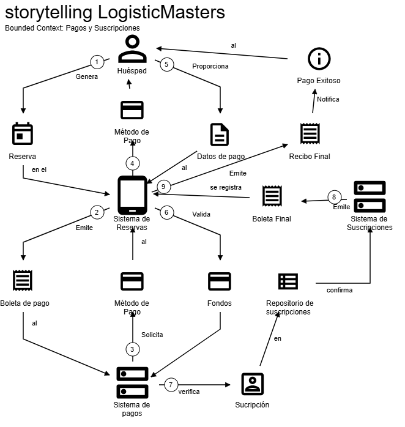

## Capítulo IV: Solution Software Design

### 4.1. Strategic-Level Domain-Driven Design

Para abordar la complejidad de un sistema orientado a la gestión integral de operaciones hoteleras, se aplicó el enfoque
de Domain-Driven Design a nivel estratégico. Este enfoque nos permitió identificar los distintos subconjuntos
funcionales del sistema o Bounded Contexts que reflejan las áreas clave de negocio de nuestros usuarios objetivos:
cadenas hoteleras, hoteles boutique y resorts.

El proceso se desarrolló mediante herramientas colaborativas como Event Storming y el Bounded Context Canvas.

### 4.1.1. EventStorming

Con el objetivo de comprender en profundidad el dominio del problema, se llevó a cabo una sesión de EventStorming. Con
esta dinámica se pudieron identificar eventos clave dentro del negocio hotelero, facilitando la visualización de
procesos críticos desde la reserva hasta la atención post-estadía del huésped, entre otros puntos de contacto. Esta
actividad no solo ayudó a identificar los eventos, sino que también permitió descubrir las interacciones entre ellos y
cómo se relacionan con los distintos actores involucrados.

**Objetivo de la sesión**: El objetivo de la sesión fue identificar los eventos clave del dominio del problema, así como
los actores involucrados y sus interacciones. A través de esta actividad, se buscó obtener una comprensión profunda del
negocio hotelero y sus procesos críticos.
Durante una sesión de aproximadamente 1 hora y 30 minutos, se desarrollaron las siguientes actividades:

1. **Identificación de eventos**: Se identificaron los eventos clave del dominio del problema, como "Reserva de
   habitación", "Check-in", "Check-out", entre otros. Estos eventos fueron representados en post-its de color naranja,
   lo que facilitó su visualización y comprensión.
2. **Identificación de actores**: Se identificaron los actores involucrados en el proceso, como "Huésped", "
   Recepcionista", "Gerente de hotel", entre otros.
3. **Interacciones entre eventos y actores**: Se establecieron las interacciones entre los eventos y los actores, lo que
   permitió visualizar cómo se relacionan y cómo influyen en el proceso general del negocio hotelero.
4. **Identificación de comandos y agregados**: Se identificaron los comandos y agregados asociados a cada evento, lo que
   permitió comprender cómo se gestionan los datos y las acciones dentro del sistema.

**Herramienta utilizada:** Para esta sesión se empleó Lucidchart, una herramienta colaborativa que permite crear
diagramas y visualizar procesos de manera efectiva. Esta herramienta facilitó la colaboración entre los participantes y
permitió documentar de manera clara y concisa los resultados de la sesión.

**Figura 1:**

En esta figura se puede observar el resultado de la sesión de EventStorming, donde el equipo identificó los eventos
clave del dominio del problema, los actores involucrados y sus interacciones.

### 4.1.1.1. Candidate Context Discovery

En esta sección se muestra como se llevó a cabo una sesión de Candidate Context Discovery con el fin de identificar los
posibles Bounded Contexts que estructurarán estratégicamente la solución

**Objetivo de la sesión**: La sesión tuvo como finalidad analizar los eventos, comandos y actores identificados
previamente para determinar los límites dentro del sistema.

**Técnica utilizada**: Look-For-Pivotal-Events

Se destacaron eventos de negocio que marcan cambios de estado significativos:

“Reserva confirmada” (transición de cliente interesado a huésped)

“Check-in completado” (inicio del proceso operativo interno)

“Check-out completado” (cierre del ciclo de atención)

**Herramienta utilizada**: Para esta sesión también se utilizó Lucidchart, para que de manera colaborativa el equipo
pueda crear diagramas y visualizar procesos de manera efectiva.

**Figura 2:**

En esta figura se puede observar el resultado de la sesión de Candidate Context Discovery, donde el equipo utilizó las
técnicas start-with
value, start-with-simple y look-for-pivotal-events.

### 4.1.1.2. Domain Message Flows Modeling

Una vez definidos los Bounded Contexts principales, se procedió a modelar los flujos de colaboración entre ellos mediante la técnica de Domain Storytelling.

**Figura 3:**

Esta figura muestra el flujo de colaboración entre el huésped y el sistema de reservas al momento de realizar una reserva. El proceso inicia con la solicitud del huésped, seguida por la verificación de disponibilidad y la confirmación de la reserva por parte del sistema. Posteriormente, se genera un registro de reserva.

**Figura 4:**

Esta figura ilustra el flujo de Gestión de Usuarios, donde se observa la interacción entre el sistema y el usuario al ingresar a la plataforma. El proceso incluye la autenticación del usuario, la verificación de sus credenciales y la gestión de su perfil.

**Figura 5:**

Esta figura representa el flujo de Gestión de Pagos y Suscripciones, donde se observa la interacción entre el sistema y el usuario al momento de realizar un pago. El proceso incluye la selección del método de pago, la validación de la transacción y la confirmación del pago.

### 4.1.1.3. Bounded Context Canvases

Los Bounded Contexts identificados en la sesión de Candidate Context Discovery fueron documentados utilizando el Bounded Context Canvas. Esta herramienta permite visualizar de manera clara y concisa los límites, interacciones y responsabilidades de cada contexto.

**Figura 6:**

Esta figura muestra el Bounded Context Canvas del contexto de "Guía de Reservas", donde se detallan los límites, interacciones y responsabilidades del sistema de reservas.

**Figura 7:**

Esta figura muestra el Bounded Context Canvas del contexto de "Gestión de Usuarios", donde se detallan los límites, interacciones y responsabilidades del sistema de gestión de usuarios.

**Figura 8:**

Esta figura muestra el Bounded Context Canvas del contexto de "Pagos y Suscripciones", donde se detallan los límites, interacciones y responsabilidades del sistema de gestión de pagos y suscripciones.
### 4.1.2. Context Mapping

Con el fin de establecer las relaciones entre los distintos Bounded Contexts identificados, se realizó un mapeo de contextos. Este mapeo permite visualizar cómo interactúan los diferentes contextos y cómo se comunican entre sí.

**Figura 9:**

Esta figura muestra el mapeo de contextos, donde se pueden observar las relaciones entre los distintos Bounded Contexts. Cada línea representa una relación de comunicación entre los contextos, lo que permite entender cómo fluyen los datos y las interacciones entre ellos.

¿Qué pasaría si movemos una capability?
Se pierde cohesión. Las órdenes responden a eventos que no necesariamente involucran al usuario.

¿Y si partimos un bounded context?
Se pierde la claridad de los límites. La gestión de reservas y la gestión de pagos son procesos interdependientes que deben mantenerse juntos para evitar confusiones y errores en el sistema.

¿Qué pasaría si duplicamos funcionalidad?
Se genera redundancia y confusión. La duplicación de funcionalidades puede llevar a inconsistencias en el sistema y dificultar su mantenimiento.

¿Y si creamos un shared service?
Se genera un acoplamiento innecesario. La creación de un servicio compartido puede llevar a una dependencia excesiva entre los contextos, lo que dificulta su evolución y mantenimiento. Aunque puede ser útil si se conectan más contexts o microservicios. Sería algo escalable en el futuro.

### 4.1.3. Software Architecture

Los diseños C4 son una forma efectiva de representar la arquitectura de un sistema de software de manera clara y concisa. En el caso del proyecto LogisticsMasters, los diseños C4 nos permiten visualizar la estructura y las interacciones entre los diferentes componentes del sistema. 

En el nivel más alto, el diseño C4 nos muestra el contexto del sistema, identificando los actores externos y los sistemas con los que interactúa LogistcsMasters. A medida que descendemos en los niveles de detalle, podemos ver los contenedores que componen el sistema, como la aplicación web, la base de datos y los servicios externos. Además, los diagramas C4 nos permiten visualizar los componentes internos de cada contenedor, como los módulos y las clases.

Estos diseños proporcionan una visión clara de la arquitectura del sistema, lo que facilita la comunicación entre los miembros del equipo y ayuda a identificar posibles problemas o mejoras. Al utilizar los diseños C4 en el proyecto LogistcsMasters, podemos asegurarnos de que todos los involucrados tengan una comprensión común de la arquitectura y puedan colaborar de manera efectiva en su implementación y evolución. 

### 4.1.3.1. Software Architecture Context Level Diagrams

### 4.1.3.2. Software Architecture Container Level Diagrams

### 4.1.3.3. Software Architecture Deployment Diagrams

### 4.2. Tactical-Level Domain-Driven Design

Esta es la propuesta táctica para el diseño de software de LogisticsMasters, aplicando Domain-Driven Design (DDD).

### 4.2.1. Bounded Context: Guia de Reservas

|Clases|Propósito|Atributos|Métodos|
|------|---------|---------|-------|
| Reservation| Gestiona los datos y estado de una reserva|reservationID(), reservationDate(), numberOfPeople(), table()| createReservation(), cancelReservation(), updateReservation()|
|Customer|Representa al cliente que realiza reservas.|paymentMethod, reservationList|register(), placeReserve(), makeReservation(), cancelReservation()|
|Worker|Empleado del hotel que gestiona reservas.|Position| manageReserve() (overloaded para Order y Reservation)|

- #### 4.2.1.1. Domain Layer
| Clase | Tipo | Propósito |
|-------|------|-----------|
Reserva | Entity | Representa una reserva realizada por un cliente en el sistema.
Customer | Entity | Representa al cliente que realiza una o más reservas.
Worker | Entity | Representa al trabajador asignado a gestionar reservas.
ReservaService | Domain Service | Lógica del negocio como validación de fechas, disponibilidad, etc.
ReservaFactory | Factory | Encargado de crear objetos Reserva consistentes.
IReservaRepository | Repository Interface | Interfaz para acceder a almacenamiento de reservas.
- #### 4.2.1.2. Interface Layer
Clase | Tipo | Propósito
|-|-|-|
ReservaController | Controller | Expone los endpoints de gestión de reservas (crear, cancelar, actualizar).
- #### 4.2.1.3. Application Layer
Clase | Tipo | Propósito
-|-|-
CrearReservaHandler | Command Handler | Ejecuta el proceso de creación de una reserva.
CancelarReservaHandler | Command Handler | Ejecuta la cancelación de una reserva.
ActualizarReservaHandler | Command Handler | Ejecuta la actualización de datos de una reserva.
- #### 4.2.1.4.Infrastructure Layer
Clase | Tipo | Propósito
-|-|-|
MySQLReservaRepository | Repository Implementation | Implementa IReservaRepository para persistencia en base de datos relacional.
EmailNotificacionService | External Service | Servicio de envío de notificaciones por email (ej. al confirmar reserva).
CalendarioAPI | External API | Servicio externo para validar disponibilidad de fechas.
- #### 4.2.1.5.Bounded Context Software Architecture Component Level Diagrams

**Figura 10:**

Este diagrama muestra la arquitectura de componentes del Bounded Context "Guía de Reservas". En él se pueden observar los distintos componentes que interactúan entre sí, así como sus responsabilidades y relaciones.

- #### 4.2.1.6.Bounded Context Software Architecture Code Level Diagrams

**Figura 11:**

Este diagrama muestra la estructura a nivel de clases para el Bounded Context "Guía de Reservas", siguiendo el modelo de capas de software. Se representan las principales entidades, servicios de dominio, controladores de interfaz, handlers de aplicación y componentes de infraestructura.

- #### 4.2.1.6.1.Bounded Context Domain Layer Class Diagrams

**Figura 12:**

### 4.2.2. Bounded Context: Gestión de Usuarios

Clase | Propósito | Atributos | Métodos
-|-|-|-
User | Representa a un usuario del sistema (cliente o trabajador) | id: String, name: String, username: String, password: String, email: String, role: Enum, reserveList: List<Reserva> | login(), logout(), checkReserves()
AuthenticationService | Lógica de autenticación y validación de credenciales | – | authenticate(username, password), logout(user)
UserValidationService | Verifica datos válidos de usuario (correo, contraseña, etc.) | – | validarCorreo(email), validarContrasena(password)
IUserRepository | Interfaz para acceder a usuarios en base de datos | – | save(user), findByUsername(username), delete(id)
MySQLUserRepository | Implementación de acceso a usuarios en base MySQL | – | Implementa IUserRepository
AuthController | Expone los endpoints de autenticación y gestión de sesión | – | POST /login, POST /logout, POST /register
LoginUserHandler | Maneja la lógica de login en la capa de aplicación | – | handle(LoginCommand)
LogoutUserHandler | Maneja el cierre de sesión | – | handle(LogoutCommand)
- #### 4.2.2.1. Domain Layer
Clase | Tipo | Propósito
-|-|-
User | Entity | Representa al usuario del sistema con sus atributos y rol.
AuthenticationService | Domain Service | Realiza autenticación basada en credenciales.
UserValidationService | Domain Service | Valida datos de entrada del usuario.
IUserRepository | Repository Interface | Interfaz para la persistencia y recuperación de usuarios.
- #### 4.2.2.2. Interface Layer
Clase | Tipo | Propósito
-|-|-
AuthController | Controller | Expone endpoints de login, logout y registro.
- #### 4.2.2.3. Application Layer
Clase | Tipo | Propósito
-|-|-
LoginUserHandler | Command Handler | Ejecuta lógica de inicio de sesión.
LogoutUserHandler | Command Handler | Ejecuta cierre de sesión de un usuario.
- #### 4.2.2.4.Infrastructure Layer
Clase | Tipo | Propósito
-|-|-
MySQLUserRepository | Repository Implementation | Implementa interfaz para acceder a datos del usuario.
JWTTokenService | External Service | Genera y valida tokens para autenticación.
EmailService | External Service | Notificación de bienvenida, recuperación de contraseña, etc.
- #### 4.2.2.5.Bounded Context Software Architecture Component Level Diagrams

**Figura 12:**

Este diagrama muestra la arquitectura de componentes del Bounded Context "Gestión de Usuarios". En él se pueden observar los distintos componentes que interactúan entre sí, así como sus responsabilidades y relaciones.

- #### 4.2.2.6.Bounded Context Software Architecture Code Level Diagrams

**Figura 13:** 

El siguiente diagrama muestra la estructura a nivel de clases para el Bounded Context Gestión de Usuarios, siguiendo el modelo de capas de software. Se representan las principales entidades, servicios de dominio, controladores de interfaz, handlers de aplicación y componentes de infraestructura.

- #### 4.2.2.6.1.Bounded Context Domain Layer Class Diagrams

**Figura 14:**

### 4.2.3. Bounded Context: Pagos y suscripciones
Clase | Propósito | Atributos | Métodos
-|-|-|-
PaymentMethod | Representa un pago realizado por un cliente | paymentID: String, amount: Float, paymentDate: Date, customerID: String, methodType: Enum | processPayment(), refund()
Suscription | Maneja la suscripción de un usuario a un plan | id: String, type: Enum, price: Float, status: Enum, startDate: Date, endDate: Date, userID: String | activate(), cancel(), renew()
PaymentService | Realiza operaciones de validación y procesamiento de pagos | – | validarPago(...), confirmarTransaccion(...)
SuscriptionService | Controla lógica de negocio de activación y renovación | – | asignarPlan(...), validarSuscripcionActiva(...)
IPaymentRepository | Interfaz para persistencia de pagos | – | save(payment), findByCustomerID(id)
ISuscriptionRepository | Interfaz para persistencia de suscripciones | – | save(suscription), findActiveByUserID(id)
MySQLPaymentRepository | Implementación concreta de IPaymentRepository | – | Implementa métodos de la interfaz
MySQLSuscriptionRepository | Implementación concreta de ISuscriptionRepository | – | Implementa métodos de la interfaz
PaymentController | Expone endpoints relacionados al pago | – | POST /pago, GET /pagos/:clienteId
SubscriptionController | Gestiona suscripciones | – | POST /suscripcion, GET /suscripciones/:usuarioId
ProcessPaymentHandler | Maneja la lógica de realizar un pago | – | handle(PaymentCommand)
RegisterSubscriptionHandler | Registra una suscripción para un usuario | – | handle(SuscriptionCommand)
- #### 4.2.3.1. Domain Layer
Clase | Tipo | Propósito
-|-|-
PaymentMethod | Entity | Representa un pago con monto, tipo y fecha.
Suscription | Entity | Representa un plan de suscripción que puede estar activo o cancelado.
PaymentService | Domain Service | Lógica de validación de pagos.
SuscriptionService | Domain Service | Control de activaciones y renovaciones.
IPaymentRepository | Repository Interface | Abstracción para guardar y consultar pagos.
ISuscriptionRepository | Repository Interface | Abstracción para acceder a suscripciones.
- #### 4.2.3.2. Interface Layer
Clase | Tipo | Propósito
-|-|-
PaymentController | Controller | Endpoint para procesar y consultar pagos.
SubscriptionController | Controller | Endpoint para registrar o consultar planes del usuario.
- #### 4.2.3.3. Application Layer
Clase | Tipo | Propósito
-|-|-
ProcessPaymentHandler | Command Handler | Maneja la lógica completa del flujo de pago.
RegisterSubscriptionHandler | Command Handler | Maneja el registro de una suscripción para un usuario.
- #### 4.2.3.4.Infrastructure Layer
Clase | Tipo | Propósito
-|-|-
MySQLPaymentRepository | Repository Implementation | Almacena y recupera datos de pagos desde base de datos.
MySQLSuscriptionRepository | Repository Implementation | Maneja la persistencia de planes de suscripción.
StripePaymentGateway | External Service | Conecta con Stripe (o similar) para procesar pagos reales.
BillingEmailService | External Service | Notificaciones sobre cobros, renovación o cancelación de planes.
- #### 4.2.3.5.Bounded Context Software Architecture Component Level Diagrams

**Figura 14:**

Este diagrama muestra la arquitectura de componentes del Bounded Context "Pagos y Suscripciones". En él se pueden observar los distintos componentes que interactúan entre sí, así como sus responsabilidades y relaciones.

- #### 4.2.3.6.Bounded Context Software Architecture Code Level Diagrams

**Figura 15:**

El siguiente diagrama muestra la estructura a nivel de clases para el Bounded Context "Pagos y Suscripciones", siguiendo el modelo de capas de software. Se representan las principales entidades, servicios de dominio, controladores de interfaz, handlers de aplicación y componentes de infraestructura.

- #### 4.2.3.6.1.Bounded Context Domain Layer Class Diagrams

**Figura 16:**

### 4.2.4. Bounded Context: Notificaciones y órdenes
Clase | Propósito | Atributos | Métodos
-|-|-|-
Notification | Representa un mensaje enviado al usuario sobre su reserva, orden u otra acción | id: String, type: Enum, message: String, status: Enum, recipientEmail: String | createMessage(), send(), markAsRead()
Controlador | Clase orquestadora que gestiona reservas, servicios y asignaciones a usuarios | orderList: List<Order>, users: List<User>, services: List<Service> | manageReserve(), assignOrderToWorker(), deliverMessage()
Order | Representa un pedido realizado por el cliente que puede incluir servicios adicionales | orderId: String, customerId: String, details: String, status: Enum | confirm(), cancel()
NotificationService | Lógica para envío y gestión de notificaciones | – | sendEmail(), notifyUser(), notifyAdmin()
OrderService | Lógica de negocio para asignar y controlar órdenes | – | assignToWorker(order, worker), trackStatus()
INotificationRepository | Interfaz para persistencia de notificaciones | – | save(notification), findUnreadByUser(id)
IOrderRepository | Interfaz para persistencia de órdenes | – | save(order), getByCustomer(id)
MySQLNotificationRepository | Implementación concreta del repositorio de notificaciones | – | Implementa INotificationRepository
MySQLOrderRepository | Implementación concreta para almacenar órdenes | – | Implementa IOrderRepository
NotificationController | Expone endpoints relacionados a notificaciones | – | GET /notificaciones/:usuarioId, POST /notificaciones
OrderController | Endpoint para gestionar pedidos de servicios | – | POST /orden, GET /orden/:clienteId
SendNotificationHandler | Encapsula el flujo de enviar una notificación | – | handle(NotificationCommand)
AssignOrderHandler | Encapsula el flujo de asignar una orden a un trabajador | – | handle(AssignOrderCommand)
- #### 4.2.4.1. Domain Layer
Clase | Tipo | Propósito
-|-|-
Notification | Entity | Almacena y gestiona información de mensajes hacia el usuario.
Order | Entity | Representa una solicitud de servicio o producto por parte del cliente.
NotificationService | Domain Service | Lógica de envío y validación de notificaciones.
OrderService | Domain Service | Maneja reglas de negocio de órdenes y asignación a trabajadores.
INotificationRepository | Repository Interface | Para persistencia de notificaciones.
IOrderRepository | Repository Interface | Para persistencia de órdenes.
- #### 4.2.4.2. Interface Layer
Clase | Tipo | Propósito
-|-|-
NotificationController | Controller | Exposición de notificaciones para clientes y administradores.
OrderController | Controller | Exposición de pedidos y solicitudes de servicio por los usuarios.
- #### 4.2.4.3. Application Layer
Clase | Tipo | Propósito
-|-|-
SendNotificationHandler | Command Handler | Lógica para crear y enviar una notificación.
AssignOrderHandler | Command Handler | Asigna un pedido a un trabajador para ejecución.
- #### 4.2.4.4.Infrastructure Layer
Clase | Tipo | Propósito
-|-|-
MySQLNotificationRepository | Repository Implementation | Persistencia de notificaciones en base de datos relacional.
MySQLOrderRepository | Repository Implementation | Manejo de órdenes persistidas por clientes.
EmailNotificationAdapter | External Service | Encapsula lógica de envío real vía SMTP, SendGrid, etc.
RealtimeNotificationAdapter | External Service | WebSocket o Pusher para actualizaciones en tiempo real.

- #### 4.2.4.5.Bounded Context Software Architecture Component Level Diagrams

**Figura 16:**

Este diagrama muestra la arquitectura de componentes del Bounded Context "Notificaciones y Órdenes". En él se pueden observar los distintos componentes que interactúan entre sí, así como sus responsabilidades y relaciones.

- #### 4.2.4.6.Bounded Context Software Architecture Code Level Diagrams

**Figura 17:**

El siguiente diagrama muestra la estructura a nivel de clases para el Bounded Context "Notificaciones y Órdenes", siguiendo el modelo de capas de software. Se representan las principales entidades, servicios de dominio, controladores de interfaz, handlers de aplicación y componentes de infraestructura.

- #### 4.2.4.6.1.Bounded Context Domain Layer Class Diagrams

**Figura 18:**

### 2.6.x.6.2.Bounded Context Database Design Diagram 

