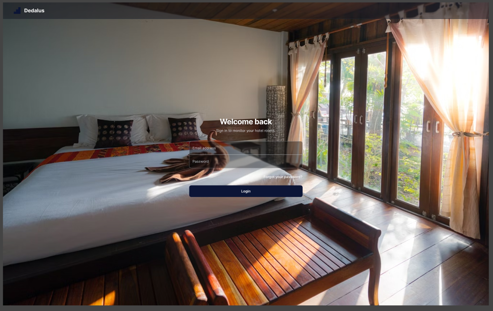
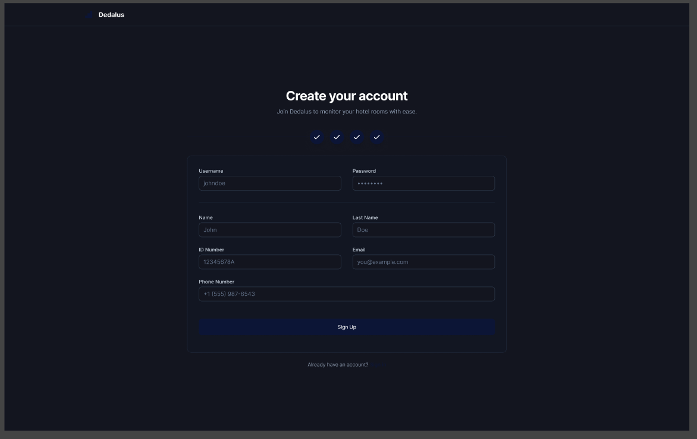
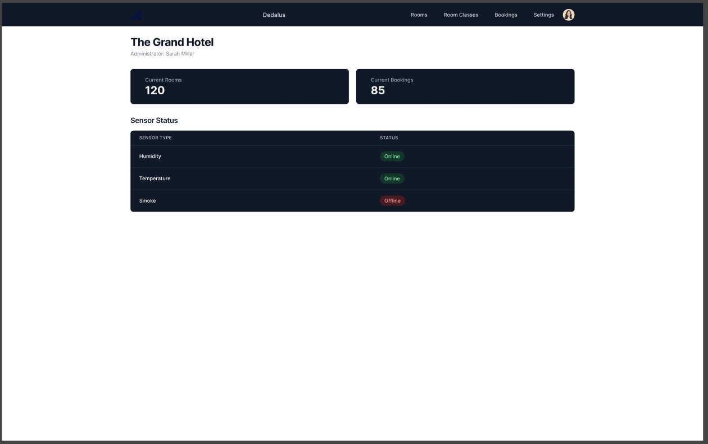
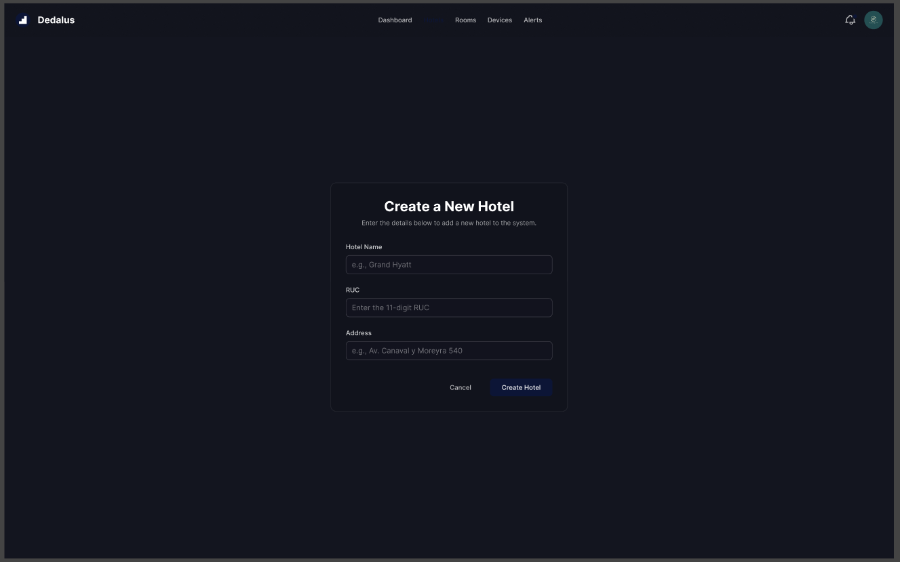
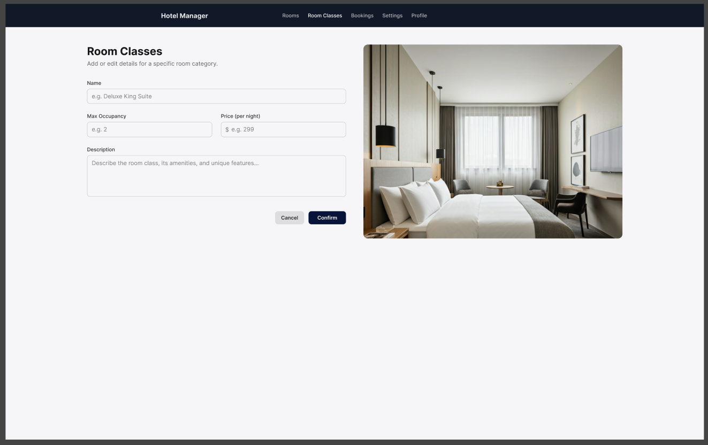

# Capítulo VI: Product Implementation, Validation & Deployment

## 6.1 Software Configuration Management

Esta sección aborda de manera detallada la gestión de configuración del software, un componente clave en el desarrollo y mantenimiento de cualquier sistema tecnológico. Su propósito principal es asegurar la integridad y trazabilidad de todos los artefactos producidos a lo largo del ciclo de vida del software, permitiendo que el equipo de desarrollo pueda trabajar de manera coordinada y estructurada. A través de políticas claras de versionado, control de cambios, definición de entornos y procedimientos estandarizados, se garantiza que cada integrante tenga acceso a configuraciones consistentes y actualizadas. Además, se establecen mecanismos para documentar y validar las modificaciones realizadas, lo que reduce significativamente la posibilidad de errores o incompatibilidades en las etapas de integración y despliegue.

La correcta implementación de una estrategia de gestión de configuración no solo mejora la calidad del producto final, sino que también optimiza la colaboración entre equipos multidisciplinarios, agiliza la detección de problemas y fortalece la estabilidad del sistema en entornos de producción.

### 6.1.1 Software Development Environment Configuration

En esta sub-sección se describe la configuración técnica del entorno de desarrollo utilizado durante el proyecto. Se especifican las herramientas de software instaladas, sus versiones, rutas de acceso y cualquier dependencia necesaria para asegurar un entorno de trabajo homogéneo para todos los miembros del equipo. Esta documentación resulta esencial para prevenir discrepancias durante la ejecución de tareas, evitar conflictos entre versiones y facilitar la incorporación de nuevos integrantes al proyecto.

Asimismo, se detallan las configuraciones iniciales requeridas para compilar, ejecutar y probar el sistema, incluyendo ajustes en IDEs, variables de entorno, gestores de paquetes, y posibles contenedores o entornos virtualizados (como Docker). Este enfoque garantiza que el entorno de desarrollo se mantenga alineado con el entorno de producción, contribuyendo a una transición fluida entre etapas de desarrollo, pruebas y despliegue.

- **Visual Studio Code**: Editor de código utilizado para desarrollar la Landing Page. Su entorno ligero, personalizable y con soporte para múltiples lenguajes facilitó la colaboración entre desarrolladores y la implementación ágil de componentes web.

  

- **HTML5**: Lenguaje de marcado base para estructurar el contenido de la Landing Page. Permitió organizar la información de forma semántica y accesible, mejorando la navegación y la experiencia del usuario.

  

- **CSS3**: Utilizado para aplicar estilos visuales a la Landing Page. Ayudó a mantener una identidad gráfica coherente, responsiva y atractiva, lo cual es clave para captar la atención del usuario final.

  

- **JavaScript**: Lenguaje que permitió incorporar lógica e interactividad a la Landing Page, como animaciones, validaciones y mejoras en la experiencia dinámica del usuario.

  

- **GitHub**: Plataforma de control de versiones que centralizó el código del proyecto. Facilitó el trabajo colaborativo del equipo, permitió el seguimiento de cambios y mejoró la trazabilidad del desarrollo.

  

- **LucidChart**: Herramienta usada para crear diagramas de flujo, wireflows y modelos conceptuales. Contribuyó a la claridad en el diseño funcional y ayudó a definir la lógica de interacción entre pantallas y procesos.

  

- **Figma**: Plataforma de diseño colaborativo utilizada para la creación de wireframes y prototipos visuales de alta fidelidad. Permitió validar la interfaz gráfica con antelación y alinear al equipo de desarrollo con la visión de diseño.

  

- **Android Studio**: Entorno de desarrollo para la aplicación móvil. Proporcionó las herramientas necesarias para programar, depurar, probar y empaquetar la app en dispositivos Android.

  

- **Kotlin**: Lenguaje de programación moderno utilizado para desarrollar la aplicación móvil. Su sintaxis clara y concisa mejoró la eficiencia del código y la productividad del equipo, alineándose con las mejores prácticas de desarrollo en Android.

  

- **Trello**: Plataforma de gestión de tareas basada en tableros y tarjetas, utilizada para organizar y hacer seguimiento del progreso del equipo durante el desarrollo del proyecto. Facilitó la planificación de sprints, la asignación de responsabilidades y la visualización del avance en tiempo real, promoviendo una colaboración efectiva y una mejor administración del tiempo.

  

- **Angular**: Framework de desarrollo web basado en TypeScript, empleado para construir la interfaz del panel administrativo. Su arquitectura modular, compatibilidad con APIs REST y componentes reutilizables facilitaron el desarrollo de un entorno web responsivo, escalable y mantenible.

  

- **NestJS**: Framework progresivo de Node.js utilizado para el desarrollo del backend de la plataforma. Permite estructurar los microservicios de manera modular y escalable, integrando MQTT para la comunicación IoT, REST APIs para el consumo desde Angular y Flutter, y PostgreSQL como base de datos principal.

  

- **Node.js y npm**: Entorno de ejecución de JavaScript y su gestor de paquetes, utilizados para instalar dependencias y ejecutar scripts de desarrollo y despliegue tanto del frontend (Angular) como del backend (NestJS).

  

- **Postman**: Herramienta de testing de APIs utilizada para validar la comunicación entre el backend y los clientes web/móvil. Permitió automatizar peticiones HTTP, gestionar entornos y realizar pruebas de integración antes del despliegue.

  

- **Git**: Sistema de control de versiones distribuido utilizado para el seguimiento de cambios y la colaboración en el código fuente del proyecto. Permitió mantener ramas independientes por módulo (web, móvil, backend) y facilitar la integración continua.

  

Cada una de estas herramientas fue seleccionada estratégicamente para cumplir con los objetivos del proyecto, asegurando una solución tecnológica robusta, escalable y centrada en la experiencia del usuario.

### 6.1.2 Source Code Management

**Repositorio de la Landing Page:**  
Durante el desarrollo de la Landing Page, utilizamos un repositorio centralizado en GitHub para almacenar y gestionar el código fuente del proyecto. Esto permitió el trabajo colaborativo, el control de versiones y la trazabilidad de cambios en el desarrollo.

**Implementación de GitFlow:**  
Para nuestra estrategia de gestión de versiones con Git, nos basamos en el modelo de ramificación propuesto en el artículo _“A successful Git branching model”_ de Vincent Driessen. Adoptamos el enfoque **GitFlow**, el cual proporciona una estructura clara y organizada para el desarrollo colaborativo, facilitando la integración y el mantenimiento del código.

- **Rama Principal (`main`)**: Contiene la versión estable en producción.  
- **Rama de Desarrollo (`develop`)**: Integra los últimos avances y funcionalidades en desarrollo. Actúa como entorno de integración continua.  
- **Rama de Lanzamiento (`release`)**: Utilizada para preparar una nueva versión del producto, permitiendo ajustes finales antes de su despliegue.  
  - Deriva de: `develop`  
  - Se fusiona con: `develop` y `main`  
- **Rama de Características (`feature`)**: Destinada al desarrollo de nuevas funcionalidades específicas del producto.  
  - Deriva de: `develop`  
  - Se fusiona con: `develop`  
- **Rama de Corrección Rápida (`hotfix`)**: Diseñada para aplicar soluciones urgentes a errores críticos detectados en producción.  
  - Deriva de: `main`  
  - Se fusiona con: `develop` y `main`  
- **Rama de Alcance (`scope`)**: Rama personalizada creada para gestionar desarrollos relacionados con un módulo o funcionalidad específica de gran tamaño o impacto. Su objetivo es permitir el aislamiento de tareas que abarquen múltiples ramas `feature`, mejorando la organización y facilitando su integración progresiva.  
  - Deriva de: `develop`  
  - Puede actuar como contenedor de varias `feature`  
  - Se fusiona con: `develop` o `release`, según el caso
  

  

**Conventional Commits:**  
Para mantener claridad y consistencia en los mensajes de confirmación (`commits`), adoptamos la convención **Conventional Commits**, la cual estandariza la estructura semántica de cada mensaje, permitiendo una mejor comprensión del historial de cambios y una posible automatización en la generación de changelogs.

**Tipos de mensajes utilizados:**

- `feat`: Incorporación de nuevas funcionalidades.
- `fix`: Corrección de errores o bugs.
- `docs`: Cambios relacionados con la documentación.
- `style`: Ajustes de formato sin impacto funcional.
- `refactor`: Reestructuración del código sin alterar su comportamiento.
- `test`: Adición o modificación de pruebas automatizadas.
- `chore`: Tareas de mantenimiento y configuraciones del entorno.
- `perf`: Mejoras orientadas al rendimiento del sistema.    

### 6.1.3 Source Code Style Guide & Conventions

Para garantizar un código legible, consistente y de fácil mantenimiento, se adoptaron las convenciones propuestas por Google en sus guías oficiales de estilo para HTML/CSS, JavaScript y Kotlin. La aplicación de estos lineamientos facilita el trabajo colaborativo, mejora la comprensión del código entre distintos desarrolladores y reduce significativamente la probabilidad de errores durante el desarrollo y mantenimiento del sistema.

#### Convenciones para HTML/CSS (Google HTML/CSS Style Guide)

Durante la implementación de la Landing Page, se aplicaron las siguientes buenas prácticas recomendadas:

- Declarar siempre el tipo de documento (`<!DOCTYPE html>`) al inicio.
- Usar minúsculas para los nombres de los elementos HTML (`
`, `<h1>`, `<section>`, etc.).
- Cerrar correctamente todos los elementos HTML (por ejemplo, `

`).
- Colocar entre comillas los valores de los atributos (por ejemplo, `
`).
- Incluir los atributos `alt`, `width` y `height` en las imágenes para accesibilidad y rendimiento.
- Evitar líneas de código excesivamente largas para facilitar la lectura.
- No omitir el elemento `<title>` dentro del `<head>`.
- Incluir `meta tags` relevantes al inicio del documento, como codificación, viewport y descripciones.

Estas convenciones aseguran una estructura semántica clara y una mejor interpretación por parte de navegadores y motores de búsqueda, además de contribuir a una experiencia de usuario coherente.

#### Convenciones para JavaScript (Google JavaScript Style Guide)

Para el desarrollo de funcionalidades interactivas con JavaScript, se aplicaron las siguientes convenciones:

- Usar notación **camelCase** para nombrar variables y funciones (por ejemplo: `numberArray`, `calculateSum()`).
- Emplear **comillas simples** para definir cadenas de texto (`'Este es un string'`).
- Finalizar todas las sentencias con punto y coma (`;`) para evitar errores de interpretación.
- Evitar el uso de `var` para declarar variables, priorizando `let` o `const` según la necesidad de reasignación.

Estas prácticas ayudan a mantener un estilo uniforme en el código fuente y previenen errores comunes relacionados con el scope, la redeclaración de variables o la gestión de valores dinámicos.

#### Convenciones para Kotlin (Google Kotlin Style Guide)

En el desarrollo de la aplicación móvil, se utilizó **Android Studio** como entorno de desarrollo, y se siguieron las convenciones oficiales para Kotlin propuestas por Google, que permiten escribir código más limpio, expresivo y seguro. Las principales directrices aplicadas fueron:

- Usar **camelCase** para variables, funciones y nombres de métodos (`userName`, `getUserData()`).
- Declarar constantes con `val` y variables mutables con `var` solo cuando sea estrictamente necesario.
- Utilizar nombres significativos, claros y descriptivos para funciones y clases.
- Omitir el punto y coma (`;`) al final de las sentencias, dado que no es necesario en Kotlin.
- Aplicar sangrías de 4 espacios y mantener una estructura clara de bloques.
- Utilizar funciones de extensión, lambdas y expresiones funcionales donde sea apropiado, siguiendo el estilo idiomático de Kotlin.
- Dividir clases largas en archivos separados para mejorar la mantenibilidad y legibilidad del código.

Estas convenciones permitieron desarrollar una aplicación Android robusta, con código fácilmente entendible y adaptable por cualquier miembro del equipo. Además, se favoreció el uso de buenas prácticas modernas en el entorno Android, alineándose con los estándares actuales de la industria.

La aplicación sistemática de estas convenciones fortaleció la calidad del código entregado en todas las capas del proyecto, promoviendo la claridad, la eficiencia y la colaboración efectiva entre los integrantes del equipo.

### 6.1.4 Software Deployment Configuration

#### Landing Page Deplyment
La Landing Page de Dedalus está desarrollada con el framework Angular, utilizando componentes modulares y estilos en Angular Material. El código fuente se mantiene dentro del repositorio `Dedalus_Landing_Page` en la organización `KamaqLabs` (GitHub).
El despliegue se realiza mediante GitHub Actions y GitHub Pages, asegurando una publicación continua (CI/CD) cada vez que se realizan cambios en la rama `develop`.

#### Flujo de Despliegue Automatizado
El proceso automatizado de despliegue está definido dentro del archivo:
`.github/workflows/deploy.yml`

Cada vez que se realiza un push hacia la rama develop, se ejecuta el flujo con las siguientes etapas:
1. Checkout del repositorio
- El flujo obtiene el código fuente desde la rama develop.
2. Configuración del entorno Node.js
- Se instala Node.js versión 20.19.0, necesaria para ejecutar Angular CLI.
3. Instalación de dependencias
- Se ejecuta el comando npm ci para instalar todas las dependencias del proyecto sin modificar el package-lock.json.
4. Compilación del proyecto Angular
- Se genera la build optimizada para producción mediante:  
~~~
npm run build -- --configuration production --base-href="/Dedalus_Landing_Page/"
~~~
- El resultado se almacena en el directorio: 
~~~
dist/LandingPage/browser/
~~~
5. Configuración de soporte de rutas
- Se copia el archivo `index.html` como `404.html` dentro de la carpeta `browser` para asegurar el correcto enrutamiento de Angular en GitHub Pages.
6. Publicación automática
- Se usa la acción `JamesIves/github-pages-deploy-action@v4` para publicar el contenido generado en la rama gh-pages.
- La configuración de GitHub Pages en el repositorio está establecida para usar `gh-pages` como rama fuente.

#### Resultado del despliegue 
Una vez finalizado el flujo, GitHub Pages publica automáticamente la última versión compilada del sitio en la siguiente URL:  
🔗 [Enlace de landing page desplegada]: https://kamaqlabs.github.io/Dedalus_Landing_Page/
                      
Este proceso elimina la necesidad de desplegar manualmente, garantizando que cada modificación aprobada en la rama `develop` se refleje directamente en la versión pública.

## 6.2 Landing Page, Services & Applications Implementation
En esta sección se detalla el proceso completo de implementación, pruebas, documentación y despliegue de la Landing Page, los Web Services y las Aplicaciones Móviles. Abarca desde la planificación inicial hasta la entrega final, asegurando que cada componente cumpla con los requisitos establecidos y funcione correctamente.

## 6.2.1 Sprint 1
En esta sección se registra y explica el avance en términos de producto y trabajo colaborativo para el Sprint 1. Durante este sprint, el equipo se enfocará en la implementación de la Landing  y de la web application, asegurando que cumpla con los requisitos establecidos y funcione correctamente.

### 6.2.1.1 Sprint Planning 1  
En esta sección se especifican los aspectos principales del Sprint Planning Meeting. Este encuentro es fundamental para definir los objetivos y tareas del Sprint 1, asegurando que todos los miembros del equipo estén alineados y preparados para comenzar el trabajo. A continuación, se presenta un cuadro resumen del Sprint Planning Meeting, que incluye los puntos clave discutidos y las decisiones tomadas.

| **Sprint #**                       | Sprint 1                                                                                                                                                                                                                                                                                                                                                                                                                                                                                                                                                                                                                                                                      |
|------------------------------------|-------------------------------------------------------------------------------------------------------------------------------------------------------------------------------------------------------------------------------------------------------------------------------------------------------------------------------------------------------------------------------------------------------------------------------------------------------------------------------------------------------------------------------------------------------------------------------------------------------------------------------------------------------------------------------|
| **Sprint Planning Background**     |                                                                                                                                                                                                                                                                                                                                                                                                                                                                                                                                                                                                                                                                               |
| Date                               | 2025-09-23                                                                                                                                                                                                                                                                                                                                                                                                                                                                                                                                                                                                                                                                    |
| Time                               | 16:00 PM                                                                                                                                                                                                                                                                                                                                                                                                                                                                                                                                                                                                                                                                      |
| Location                           | Google Meet Reunion                                                                                                                                                                                                                                                                                                                                                                                                                                                                                                                                                                                                                                                           |
| Prepared by                        | Valentino Cervantes                                                                                                                                                                                                                                                                                                                                                                                                                                                                                                                                                                                                                                                           |
| Attendees (to planning meeting)    | Valentino Cervantes, Miguel Carpio, Mathias Vasquez, Gabriel Braithuaite, Sihuar Ccotarma                                                                                                                                                                                                                                                                                                                                                                                                                                                                                                                                                                                     |
| Sprint n - 1 Review  Summary       | No aplica para este Sprint 1                                                                                                                                                                                                                                                                                                                                                                                                                                                                                                                                                                                                                                                  |
| Sprint n - 1 Retrospective Summary | No aplica para este Sprint 1                                                                                                                                                                                                                                                                                                                                                                                                                                                                                                                                                                                                                                                  |
| **Sprint Goal & User Stories**     |                                                                                                                                                                                                                                                                                                                                                                                                                                                                                                                                                                                                                                                                               |
| Sprint 1 Goal                      | Our focus is on delivering the initial web presence and management interface for the Dedalus Platform, including a responsive landing page and a functional web module for administrators to manage rooms, reservations, and IoT device data.   We believe it delivers visibility, credibility, and early digital interaction for potential hotel clients, while providing administrators with the first version of the digital control panel for operational management.   This will be confirmed when the landing page is publicly accessible and administrators can successfully log in, create rooms, and visualize basic IoT sensor data from the web application. |
| Sprint 1 Velocity                  |                                                                                                                                                                                                                                                                                                                                                                                                                                                                                                                                                                                                                                                                               |
| Sum of Story Points                |                                                                                                                                                                                                                                                                                                                                                                                                                                                                                                                                                                                                                                                                               |

### 6.2.1.2 Aspect Leaders and Collaborators
En esta sección se especifican los aspectos principales del Sprint Planning Meeting. Este encuentro es fundamental para definir los objetivos y tareas del Sprint 1, asegurando que todos los miembros del equipo estén alineados y preparados para comenzar el trabajo. A continuación, se presenta un cuadro resumen del Sprint Planning Meeting, que incluye los puntos clave discutidos y las decisiones tomadas.

### 6.2.1.3 Sprint Backlog 1  
En esta sección se presenta el Sprint Backlog del Sprint 1, que incluye las tareas y actividades planificadas para el desarrollo de la Landing Page y el avance de nuestro Web Application. Cada tarea está asociada a una User Story específica, lo que permite al equipo realizar un seguimiento del progreso y asegurarse de que se cumplan los objetivos del sprint.

| **Sprint #** | Sprint 1                     |                |                                          |                                                                                                                 |                       |              |        |
|--------------|------------------------------|----------------|------------------------------------------|-----------------------------------------------------------------------------------------------------------------|-----------------------|--------------|--------|
| User Story   |                              | Work Item/Task |                                          |                                                                                                                 |                       |              |        |
| Id           | Title                        | Id             | Title                                    | Description                                                                                                     | Estimation (Hours) | Assined To   | Status |
| US021        | Página inicial               | WI01           | Diseñar la estructura de la Landing Page | Crear un esquema básico de la Landing Page, incluyendo secciones principales y descripción inicial del sistema. | 1                     | Valentino    | Done   |
| US022        | Sección Proyecto             | WI02           | Diseñar la sección “¿Qué es Dedalus?”    | Incluir una descripción de las características principales del sistema.                                         | 1                     | Mathias      | Done   |
| US025        | Llamada a la acción (CTA)    | WI03           | Implementar botón de "Probar ahora"      | Crear un botón que permita a los usuarios ir hacia la aplicación web.                                           | 1                     | Gabriel      | Done   |
| US026        | Sección “About the Product”  | WI04           | Diseñar la sección "About the product"   | Incluir una descripción resumida del producto y sus beneficios.                                                 | 1                     | Sihuar       | Done   |
| US027        | Sección “About the Team”     | WI05           | Diseñar la sección "About the team"      | Incluir una breve descripción de que es Dedalus.                                                                | 1                     | Miguel       | Done   |
| US024        | Sección de planes            | WI06           | Diseñar la sección "Planes de Pago"      | Incluir dos planes de suscripción con precios y características.                                                | 1                     | Miguel       | Done   |
| US028        | Sección “Miembros del grupo” | WI07           | Diseñar la sección "Miembros del grupo"  | Incluir fotos y nombres de los miembros del equipo de desarrollo.                                               | 1                     | Valentino    | Done   |
| US023        | Sección de contacto          | WI08           | Diseñar la sección "Contacto"            | Incluir un formulario de contacto con campos para nombre, correo electrónico, teléfono y mensaje.               | 1                     | Mathias      | Done   |
| US029        | Footer                       | WI09           | Diseñar el footer                        | Incluir un aviso de derechos de autor.                                                                          | 1                     | Gabriel      | Done   |

Screenshot del Sprint Backlog del Sprint 1 en Trello: 

Enlace al Sprint Backlog del Sprint 1 en Trello: https://trello.com/c/ecIEDWCF

### 6.2.1.4 Development Evidence for Sprint Review  
En esta sección se explican y presentan los avances en la implementación de los productos de la solución según el alcance del Sprint 1. Durante este sprint, el equipo se ha enfocado en la creación y despliegue de la Landing Page, asi como el avance de nuestra Web Application.

| Repository                          | Branch  | Commit Id | Commit Message                                                                      | Commit Message Body                                                                                                                                                            | Commited on (Date) |
|-------------------------------------|---------|-----------|-------------------------------------------------------------------------------------|--------------------------------------------------------------------------------------------------------------------------------------------------------------------------------|--------------------|
| Anx0123/Dedalus_Landing_Page        | main    | 6a185d8   | Initial commit                                                                      | Initial commit with basic project structure and dependencies.                                                                                                                  | 2025-09-03         |
| KiwiAmenazante/Dedalus_Landing_Page | main    | e9fc982   | Move HTML and CSS files to new locations                                            | Renamed index.html and main.css to new paths and updated the stylesheet link in index.html to reflect the new location. This helps organize assets under the public directory. | 2025-09-2022       | 
| LordSack/Dedalus_Landing_Page       | develop | 1ef8598   | feat: change to angular project                                                     | feat: change to angular project                                                                                                                                                | 2025-09-24         |
| Gabooo04/Dedalus_Landing_Page       | develop | f994716   | feat: update GitHub Actions workflow for deploying Angular app to GitHub Pages      | feat: update GitHub Actions workflow for deploying Angular app to GitHub Pages                                                                                                 | 2025-10-06         |
| KiwiAmenazante/Dedalus-FrontEndApp  | main    | 3e7366    | feat: add dashboard route and session storage service for improved state management | feat: add dashboard route and session storage service for improved state management                                                                                            | 2025-10-05         |
| Dedalus-FrontEndApp                 | main    | 4f6dd38   | feat: updating session storage                                                      | feat: updating session storage                                                                                                                                                 | 2025-10-06         |

Enlace al repositorio: https://github.com/KamaqLabs/Dedalus_Landing_Page

### 6.2.1.5 Testing Suite Evidence for Sprint Review  
Para este sprint, no se han realizado pruebas automatizadas. Sin embargo, se han realizado pruebas manuales para asegurar que la Landing Page y la web application funcionen correctamente y cumplan con los requisitos establecidos.
Se podrían implementar pruebas automatizadas utilizando herramientas como Selenium en futuros sprints, pero por el momento, el equipo ha optado por realizar pruebas manuales para asegurar la calidad del producto.

### 6.2.1.6 Execution Evidence for Sprint Review  
En este Sprint 1, el equipo ha desarrollado y desplegado la Landing Page y la primera version de nuestra Web Application, asegurando que cumpla con los requisitos establecidos y funcione correctamente. A continuación, se presentan las evidencias de ejecución del Sprint 1, que incluyen capturas de pantalla y descripciones de las funcionalidades implementadas.

 **Hero Section**: La sección principal de la Landing Page, que incluye una barra de navegación, un título
atractivo, una imagen llamativa y un botón de llamada a la acción.
  
 **About Section**: La sección que proporciona información sobre la aplicación y sus características principales.
Incluye un título, una descripción y una imagen representativa. Además, tiene uan sección sobre el equipo de
desarrollo.
  
  
 **Subscriptions Section**: La sección que muestra los diferentes planes de suscripción disponibles para los
usuarios. Incluye un título, una descripción y nuestros dos planes con precios y características.
  
 **Contact Section**: La sección que permite a los usuarios ponerse en contacto con el equipo de desarrollo.
Incluye un formulario de contacto con campos para el nombre, correo electrónico y mensaje.
  
 **Footer Section**: La sección que incluye un aviso de derechos de autor.
  

Y respecto a la Web Application aqui se puede evidenciar parte del avance que hemos realizado para esta entrega:

### 6.2.1.7 Services Documentation Evidence for Sprint Review  
Este sprint 1 tuvo como enfoque principal la implementación de la Landing Page y la Web Application, por lo que no se han desarrollado Web Services. La documentación de Endpoints con OpenAPI y los detalles relacionados con Web Services serán relevantes en sprints futuros cuando se aborde la implementación y documentación de estos servicios. 

### 6.2.1.8 Software Deployment Evidence for Sprint Review  
#### Software Deployment Evidence – Landing Page
Durante este Sprint se realizó el despliegue de la Landing Page oficial de la plataforma Dedalus, la cual tiene como propósito presentar la solución al público objetivo (hoteles, resorts y hospedajes boutique) y proporcionar una primera interacción digital con la marca.
El despliegue se efectuó utilizando GitHub Pages como servicio de hosting estático y GitHub Actions como herramienta de automatización continua (CI/CD).
Este proceso permitió garantizar que cada actualización en el repositorio principal se publique automáticamente en el entorno productivo, manteniendo una entrega continua y trazable del producto.
#### Pasos del proceso de Deployment
1. **Creación y configuración del repositorio** 
   - Se creó el repositorio público Dedalus_Landing_Page en GitHub para centralizar el código fuente de la landing.
   - La rama principal (develop) fue configurada como la fuente oficial de despliegue.
   - Se añadieron los archivos esenciales del proyecto (Angular / HTML-CSS / assets / config).
   - Estructura del repositorio: 
2. **Configuración de GitHub Pages**
   - En la sección Settings → Pages, se seleccionó la rama gh-pages (generada automáticamente por la acción de despliegue) como fuente del sitio.
   - Se habilitó el dominio del proyecto, generando la URL pública: https://kamaqlabs.github.io/Dedalus_Landing_Page/
   - La visibilidad se configuró como pública para permitir el acceso de los stakeholders y usuarios de prueba.
3. **Automatización mediante GitHub Actions (CI/CD)**
   - Se creó un archivo de flujo de trabajo (.github/workflows/deploy.yml) con la siguiente función:
     - Compilar automáticamente la landing page al hacer push en la rama develop.
     - Generar la carpeta dist/ optimizada para producción.
     - Publicar el contenido en la rama gh-pages de manera automática.
     - Script configurado: 
4. **Verificación del despliegue**
   - Se validó el acceso público a la landing desde el navegador.
   - Se comprobó la correcta carga de recursos (imágenes, estilos y scripts).
   - Los resultados de validación fueron satisfactorios: el sitio se muestra correctamente y con tiempo de carga óptimo.
   - Landing Page desplegada: 
    
### 6.2.1.9 Team Collaboration Insights during Sprint  
Para el desarrollo de este sprint, el equipo designó a un integrante para el desarrollo de las actividades de implementación de la Landing Page.

GitHub insights del landing page y Web Application:

## 6.2.1 Sprint 2
En esta sección se registra y explica el avance en términos de producto y trabajo colaborativo para el Sprint 2. Durante este sprint, el equipo se enfocará en la consolidación de la **web application para administradores** (gestión de cuentas, hoteles, habitaciones y reservas) y en la **primera versión funcional del mobile para huéspedes**, asegurando que los flujos principales se conecten correctamente con el backend existente y funcionen de forma estable.

### 6.2.1.1 Sprint Planning 2
En esta sección se especifican los aspectos principales del Sprint Planning Meeting. Este encuentro es fundamental para definir los objetivos y tareas del Sprint 2, asegurando que todos los miembros del equipo estén alineados y preparados para comenzar el trabajo. A continuación, se presenta un cuadro resumen del Sprint Planning Meeting, que incluye los puntos clave discutidos y las decisiones tomadas.

| **Sprint #**                       | Sprint 2                                                                                            |
|------------------------------------|--------------------------------------------------|
| **Sprint Planning Background**     |                                                                                                                           |
| Date                               | 2025-11-10                                                                                                                                   |
| Time                               | 16:00 PM                                               |
| Location                           | Google Meet Reunión                                                                                       |
| Prepared by                        | Valentino Cervantes                                               |
| Attendees (to planning meeting)    | Valentino Cervantes, Miguel Carpio, Mathias Vasquez, Gabriel Braithuaite, Sihuar Ccotarma                                                     |
| Sprint n - 1 Review  Summary       | En el Sprint 1 se completó la Landing Page con todas sus secciones (home, hero, header, footer, about, planes, contacto) y se dejó desplegada públicamente como punto de entrada al proyecto, además de una primera versión del módulo web de administración con la estructura base de navegación y acceso al panel.    |
| Sprint n - 1 Retrospective Summary | Se identificó como fortaleza la coordinación diaria del equipo y el despliegue temprano para recibir feedback, y como oportunidades de mejora la necesidad de documentar mejor el flujo de despliegue/rollback y aumentar la cobertura de pruebas en la web application. Estos puntos se han considerado para planificar el Sprint 2 con tareas más acotadas y criterios de aceptación claros.                                                                                                                                      |
| **Sprint Goal & User Stories**     |                                                                                                                               |
| Sprint 2 Goal                      | Nuestro foco en el Sprint 2 es entregar la **primera versión funcional de la experiencia autenticada** en la plataforma: implementar los flujos de autenticación (sign-in, auth-me, refresh-token), la gestión básica de hoteles y habitaciones desde la web application, la pantalla web de reservas del hotel y la primera versión de la app móvil para que los huéspedes puedan solicitar servicios a la habitación, todo integrado con el backend ya desarrollado.                                                                                                                                                                                                                                                                                |
| Sprint 1 Velocity                  | 24                                                                                                                                            |
| Sum of Story Points                | 31                                                                                            |

### 6.2.1.2 Aspect Leaders and Collaborators
En esta sección se especifican los aspectos principales del Sprint Planning Meeting. Este encuentro es fundamental para definir los objetivos y tareas del Sprint 2, asegurando que todos los miembros del equipo estén alineados y preparados para comenzar el trabajo. 

### 6.2.1.3 Sprint Backlog 2
En esta sección se presenta el Sprint Backlog del Sprint 2, que incluye las tareas y actividades planificadas para el desarrollo de la **Web Application** y la **Mobile Application**. Cada tarea está asociada a una User Story específica, lo que permite al equipo realizar un seguimiento del progreso y asegurarse de que se cumplan los objetivos del sprint.

| Sprint # | User Story Id | Title                                   | Work Item Id | Task Title                                                  | Description                                                                                                                                                                                                                   | Estimation (Hours) | Assigned To | Status      |
|---------:|---------------|-----------------------------------------|--------------|-------------------------------------------------------------|-------------------------------------------------------------------------------------------------------------------------------------------------------------------------------------------------------------------------------|-------------------:|-------------|-------------|
| Sprint 2 | US006         | Inicio de sesión (sign-in)              | WI10         | Diseñar pantallas de login (web y mobile)                  | Definir y maquetar las pantallas de inicio de sesión en la web application y en la app móvil, incluyendo campos de credenciales y mensajes básicos de error.                                                                 |                2.0 | Valentino   | Done        |
| Sprint 2 | US006         | Inicio de sesión (sign-in)              | WI10A        | Implementar sign-in contra backend y cookies               | Consumir el endpoint de `sign-in` desde web y mobile, manejar credenciales válidas/ inválidas y guardar el token en cookies (web) según la lógica definida en el backend.                                                    |                3.0 | Mathias     | Done        |
| Sprint 2 | US007         | Verificación automática de sesión       | WI11         | Implementar `auth-me` en la web application                | Añadir la llamada a `auth-me` al cargar la web application para detectar sesiones activas y redirigir al dashboard si el usuario ya se encuentra autenticado.                                                                |                2.5 | Gabriel     | In Progress |
| Sprint 2 | US007         | Verificación automática de sesión       | WI11A        | Manejo de sesión expirada y redirección a login            | Implementar en web y mobile el manejo del caso en que `auth-me` falle (cookie expirada o inválida), redirigiendo al login y limpiando estado local cuando corresponda.                                                      |                2.0 | Gabriel     | To Do       |
| Sprint 2 | US011         | Gestión de hoteles                      | WI12         | UI de creación/edición de hotel en web application         | Diseñar e implementar en la web application una pantalla/formulario para crear y editar hoteles, alineada con los planes mostrados en la pantalla de prices.                                                                |                3.0 | Sihuar      | In Progress |
| Sprint 2 | US011         | Gestión de hoteles                      | WI12A        | Integración con endpoints de hoteles                       | Conectar la interfaz de gestión de hoteles con los endpoints de create/get/update/delete hotel, mostrando mensajes de éxito o error según la respuesta del backend.                                                         |                3.0 | Sihuar      | To Do       |
| Sprint 2 | US013         | Gestión de habitaciones (Rooms)         | WI13         | Listado de habitaciones por hotel en web application       | Implementar una vista en la web application que liste las habitaciones asociadas a un hotel, consumiendo los endpoints `get by hotelId` y mostrando información básica de cada room.                                        |                2.5 | Valentino   | In Progress |
| Sprint 2 | US013         | Gestión de habitaciones (Rooms)         | WI13A        | Operaciones básicas de rooms (create/update/delete)        | Añadir formularios y acciones para crear, actualizar y eliminar habitaciones desde la interfaz web, conectados a los endpoints de rooms y actualizando el listado en tiempo real tras cada operación.                       |                3.0 | Mathias     | To Do       |
| Sprint 2 | US015         | Pantalla web de reservas del hotel      | WI14         | Implementar listado de reservas por hotel                  | Desarrollar en la web application la pantalla de bookings que consume los endpoints de reservas por hotelId y muestra las reservas actuales en una tabla con información resumida.                                          |                3.5 | Miguel      | In Progress |
| Sprint 2 | US015         | Pantalla web de reservas del hotel      | WI14A        | Detalle básico de reserva                                  | Implementar la visualización de detalles de una reserva seleccionada (huésped, habitación, fechas, estado) conectando al endpoint de `get booking by id` y presentando la información en un panel o modal.                 |                3.0 | Miguel      | To Do       |
| Sprint 2 | US018         | App móvil – Solicitud de servicio       | WI15         | Diseñar interfaz móvil de servicios a la habitación        | Diseñar y maquetar en la app móvil la pantalla donde el huésped pueda seleccionar el tipo de servicio a la habitación (por ejemplo, limpieza, comida, etc.) y añadir comentarios opcionales.                               |                2.5 | Sihuar      | In Progress |
| Sprint 2 | US018         | App móvil – Solicitud de servicio       | WI15A        | Envío de pedido al backend y visualización en panel de staff | Consumir desde la app móvil el endpoint correspondiente para registrar el pedido de servicio, y verificar que dicho pedido aparezca en la pantalla de pedidos de huéspedes en la web application para el staff del hotel. |                3.0 | Mathias     | To Do       |

Screenshot del Sprint Backlog del Sprint 2 en Trello:

Enlace al Sprint Backlog del Sprint 2 en Trello: https://trello.com/invite/b/68db1fce75d44c2edfbab7de/ATTI5bd0a4792f4fb64ae03d2faff0bb8ad585EDC93F/sprint-1 

### 6.2.1.4 Development Evidence for Sprint Review
En esta sección se explican y presentan los avances en la implementación de los productos de la solución según el alcance del Sprint 2. Durante este sprint, el equipo se ha enfocado en el avance de nuestra Web y Mobile Application.

| Repository                          | Branch  | Commit Id | Commit Message                                                                      | Commit Message Body                                                                                                                                                            | Commited on (Date) |
|-------------------------------------|---------|-----------|-------------------------------------------------------------------------------------|--------------------------------------------------------------------------------------------------------------------------------------------------------------------------------|--------------------|
| https://github.com/KamaqLabs/Dedalus-MobileApp        | main    | f845bd4   | Initial commit                                                                      | chore(mvp): initial mobile MVP                                                                                                                  | 2025-11-12         |
| https://github.com/KamaqLabs/Dedalus-Platform | main    | 8b97fe4   |  feat: add endpoints to retrieve all bookingslocations                                            | feat: add endpoints to retrieve all bookings, bookings by hotelId, and bookings by guestId | 2025-11-12       | 
| https://github.com/KamaqLabs/Dedalus-Platform     | main | c3db5c9  | feat: add endpoint to retrieve all hotels                                                    | feat: add endpoint to retrieve all hotels and implement corresponding service method                                                                                                                                              | 2025-11-12         |

Enlace al repositorio: https://github.com/KamaqLabs/Dedalus_Landing_Page
Enlace al repositorio de la Web Application: https://github.com/KamaqLabs/Dedalus-Platform
Enlace al repositorio del Mobile Application: https://github.com/KamaqLabs/Dedalus-MobileApp

### 6.2.1.5 Testing Suite Evidence for Sprint Review
Para este sprint, no se han realizado pruebas automatizadas. Sin embargo, se han realizado pruebas manuales para asegurar que la Landing Page, la web application y el mobile app funcionen correctamente y cumplan con los requisitos establecidos.
Se podrían implementar pruebas automatizadas utilizando herramientas como Selenium en futuros sprints, pero por el momento, el equipo ha optado por realizar pruebas manuales para asegurar la calidad del producto.

### 6.2.1.6 Execution Evidence for Sprint Review
En este Sprint 2, el equipo ha desarrollado con una mayor precision la web applicacion y la primera version de nuestro mobile app, asegurando que cumpla con los requisitos establecidos y funcione correctamente. A continuación, se presentan las evidencias de ejecución del Sprint 1, que incluyen capturas de pantalla y descripciones de las funcionalidades implementadas.

Se puede evidenciar parte del avance que hemos realizado para esta entrega de nuestro web application:

Se puede evidenciar parte del avance que hemos realizado para esta entrega de nuestro mobile application:

### 6.2.1.7 Services Documentation Evidence for Sprint Review

En este Sprint 2, el equipo ha avanzado con mayor precisión en el desarrollo de la web application, la primera versión de la mobile app y la integración con los componentes IoT (Edge y dispositivo embebido), asegurando que todo el ecosistema cumpla con los requisitos establecidos y funcione correctamente. A continuación, se presentan las evidencias de ejecución del Sprint 2, que incluyen capturas de pantalla y descripciones de las funcionalidades implementadas tanto en la capa web/móvil como en la capa IoT.

### 6.2.1.8 Software Deployment Evidence for Sprint Review  

#### Software Deployment Evidence – Backend (Dedalus Platform API)

Durante este Sprint se realizó el despliegue del **backend de la plataforma Dedalus**, el cual expone la API REST utilizada por la web application, la app móvil y los componentes IoT (Edge y dispositivo embebido). El despliegue se efectuó utilizando **Coolify** como plataforma de orquestación y despliegue de contenedores, sobre un servidor con **Docker** y una base de datos **MySQL** dedicada para producción. La API se encuentra publicada y documentada mediante **Swagger** en la siguiente URL:

> https://sogw0gwg8w0w8ok8gkgwsso0.4.201.187.236.sslip.io/api  

A continuación, se detallan los pasos principales del proceso de deployment.

---

#### Pasos del proceso de Deployment

1. **Creación y configuración del repositorio del backend**
   - Se creó el repositorio público **`KamaqLabs/Dedalus-Platform`** en GitHub para centralizar el código fuente de la API RESTful.
   - La rama `main` se definió como rama estable para las versiones desplegables.
   - El proyecto incluye la estructura típica del backend (carpetas `src`, `migrations`, `test`, archivos `Dockerfile`, `docker-compose.yml`, configuración de TypeScript y scripts de npm).
   - Este repositorio es utilizado por Coolify como origen de código para la construcción de la imagen Docker del backend.  

   _[Línea para la imagen del repositorio en GitHub]_  

---

2. **Configuración del proyecto y entorno en Coolify**
   - En Coolify se definió el proyecto **“Dedalus”** con el entorno **`production`**, donde se gestionan los recursos de la plataforma.
   - Dentro de este entorno se configuraron:
     - Una aplicación de backend denominada **`kamaq-labs/dedalus-platform`**.
     - Una base de datos **`mysql-dedalus`** como almacenamiento de producción.
   - Desde la vista de *Resources* se puede observar la relación entre la aplicación backend y la base de datos asociada.  

   _[Línea para la imagen de la vista “Projects / Resources” en Coolify]_  

---

3. **Configuración de la aplicación backend en Coolify**
   - En la sección **Configuration** de la aplicación `kamaq-labs/dedalus-platform` se establecieron los siguientes parámetros:
     - **Build Pack:** `Dockerfile`, utilizando el `Dockerfile` del repositorio para construir la imagen.
     - **Base Directory:** `/` y **Dockerfile Location:** `/Dockerfile`, indicando la ubicación del archivo Docker dentro del repo.
     - **Dominio generado:** `http://sogw0gwg8w0w8ok8gkgwsso0.4.201.187.236.sslip.io`, que luego se usa para exponer la ruta `/api` con Swagger.
     - Configuración de variables de entorno para la conexión con `mysql-dedalus` (host, usuario, contraseña y nombre de base de datos).
   - Desde esta misma pantalla se ejecutan las acciones de **Redeploy**, **Restart** y se accede a los logs para monitoreo del servicio.  

   _[Línea para la imagen de la pantalla de configuración de la app en Coolify]_  

---

4. **Verificación del despliegue y documentación de la API**
   - Una vez completado el despliegue, se verificó el estado **Running** de la aplicación en Coolify y se revisaron los logs de inicio del contenedor.
   - Se accedió al endpoint público de Swagger en:  
     `https://sogw0gwg8w0w8ok8gkgwsso0.4.201.187.236.sslip.io/api`
   - Desde esta interfaz se validó el correcto funcionamiento de los principales grupos de endpoints:
     - **IAM:** `/api/v1/authentication/sign-in`, `/refresh-token`, `/me`, etc.
     - **Profiles:** endpoints para guest profiles y administrator profiles.
     - (y el resto de recursos del dominio del sistema).
   - La respuesta exitosa de estos endpoints confirma que el backend está desplegado, funcional y disponible para ser consumido por la web application, la app móvil y los componentes IoT.  

   _[Línea para la imagen de Swagger de la Dedalus Platform API]_  

#### Software Deployment Evidence – Front-end Web Application

Durante este Sprint se realizó el despliegue de la **aplicación web frontal de Dedalus**, la cual proporciona la interfaz gráfica para el acceso de administradores y futuros huéspedes (pantalla de bienvenida, log in, registro y navegación inicial hacia el panel). El despliegue se efectuó también mediante **Coolify**, utilizando un contenedor Docker propio para el front-end. La aplicación está publicada en el siguiente dominio público:

> https://vsc4k4koccgs40wgs804gkww.4.201.187.236.sslip.io/  

A continuación, se describen los pasos principales del proceso de deployment de la aplicación web.

---

##### Pasos del proceso de Deployment

1. **Configuración del proyecto front-end**
   - El código de la aplicación web se mantiene en un repositorio dedicado en GitHub, donde se administran las ramas de desarrollo y los cambios a través de pull requests.
   - El proyecto incluye su propio `Dockerfile`, que empaqueta el front-end en una imagen lista para producción.
   - Este repositorio se configura en Coolify como fuente de la aplicación **front-end**, permitiendo que cada redeploy tome la última versión estable del código.  

   _[Línea para la imagen del repositorio/estructura del front-end]_  

---

2. **Definición del recurso de front-end en Coolify**
   - Dentro del proyecto **“Dedalus”** y del entorno **`production`** en Coolify, se creó la aplicación **`kamaq-labs/-dedalus--front-end-app`**.
   - Desde la vista de *Projects → Resources* se puede observar la aplicación de front-end junto al backend y la base de datos MySQL que conforman el entorno productivo.
   - Esta configuración permite gestionar de forma centralizada los servicios de la plataforma (API, front-end y base de datos).  

   _[Línea para la imagen de la vista “Projects / Resources” con el front-end]_  

---

3. **Configuración de build y dominio en Coolify**
   - En la sección **Configuration** de la aplicación `kamaq-labs/-dedalus--front-end-app` se establecieron los siguientes parámetros:
     - **Build Pack:** `Dockerfile`, usando el `Dockerfile` del proyecto front-end para construir la imagen.
     - **Base Directory:** `/` y **Dockerfile Location:** `/Dockerfile`, indicando que el archivo Docker se encuentra en la raíz del repositorio.
     - **Domains:** se asignó el dominio generado por Coolify `http://vsc4k4koccgs40wgs804gkww.4.201.187.236.sslip.io`, el cual expone la aplicación al público.
   - Desde esta pantalla se dispone de acciones de **Redeploy**, **Restart** y **Stop**, y se pueden revisar los logs para monitorear el comportamiento de la aplicación en tiempo real.  

   _[Línea para la imagen de la pantalla de configuración del front-end en Coolify]_  

---

4. **Verificación del despliegue de la aplicación web**
   - Tras ejecutar el **redeploy** en Coolify, se verificó que el estado de la aplicación cambiara a **Running** sin errores en los logs de arranque.
   - Se accedió al dominio público del front-end para comprobar:
     - La carga correcta de la página principal “Welcome to Dedalus”.
     - La visualización de los botones **Log In** y **Register**, así como los enlaces **Sign Up** y **Sign In** en el header.
     - La correcta carga de estilos, imágenes de fondo y recursos estáticos.
   - Esta verificación confirma que la aplicación web de Dedalus se encuentra desplegada y accesible para los usuarios finales y para las pruebas de integración con el backend y los servicios IoT.  

   _[Línea para la imagen de la landing / home del front-end desplegado]_  

### 6.2.1.9 Team Collaboration Insights during Sprint
Para el desarrollo de este sprint, el equipo designó a integrantes para el desarrollo de las actividades de desarrollo de Web y Mobile Application:

GitHub insights de Web y Mobile Application:

## 6.3 Validation Interviews  
### 6.3.1 Diseño de Entrevistas  
#### 1. Preguntas para Gestores de Empresas Hoteleras

| **Categoría**                   | **Preguntas**                                                                                                                               |
|---------------------------------|---------------------------------------------------------------------------------------------------------------------------------------------|
| **Edad y género**               | - ¿Podrías indicarme tu edad y género?                                                                                                      |
|                                 | - ¿Consideras que tu perfil demográfico influye en tu familiaridad o preferencias al usar plataformas de gestión?                            |
| **Ubicación del hotel**         | - ¿En qué ciudad o región se encuentra tu hotel?                                                                                            |
|                                 | - ¿Tu ubicación influye en la necesidad de interacción digital con los huéspedes?                                                           |
| **Experiencia en el sector hotelero** | - ¿Cuántos años de experiencia tienes en la gestión hotelera?                                                                       |
|                                 | - ¿Qué cambios o actualizaciones esperas en plataformas de gestión con base en tu experiencia?                                              |

#### 1.2 Evaluación del Landing Page y Aplicaciones

| **Categoría**                   | **Preguntas**                                                                                                                               |
|---------------------------------|---------------------------------------------------------------------------------------------------------------------------------------------|
| **Navegación y facilidad de uso** | - ¿Qué tan fácil encontraste navegar en el landing page y la aplicación de Logistic Master?                                                   |
|                                 | - ¿Hubo alguna sección que te costara trabajo localizar o entender?                                                                        |
| **Funcionalidades clave**       | - ¿Qué características te parecen útiles en la gestión hotelera?                                                                           |
|                                 | - ¿Qué opinas de la funcionalidad de notificaciones push en la plataforma?                                                                  |
| **Eficiencia en la gestión**    | - ¿Crees que la plataforma te facilita la gestión de tu hotel de manera eficiente?                                                         |
|                                 | - ¿Hay alguna funcionalidad que agregarías o mejorarías para adaptarla mejor a tus necesidades?                                            |

### 2. Preguntas para Huéspedes

| **Categoría**                   | **Preguntas**                                                                                                                               |
|---------------------------------|---------------------------------------------------------------------------------------------------------------------------------------------|
| **Edad y género**               | - ¿Podrías indicarme tu edad y género?                                                                                                      |
|                                 | - ¿Te sientes cómodo usando plataformas digitales para hacer reservas y recibir notificaciones?                                             |
| **Distrito de residencia**      | - ¿En qué distrito o ciudad resides actualmente?                                                                                            |
|                                 | - ¿Prefieres reservar en lugares cercanos a tu residencia o explorar destinos nuevos?                                                       |
| **Ocupación**                   | - ¿Cuál es tu ocupación actual?                                                                                                             |
|                                 | - ¿Crees que tu ocupación influye en la frecuencia o tipo de reservas que realizas?                                                         |

#### 2.2 Evaluación del Landing Page y Aplicaciones

| **Categoría**                   | **Preguntas**                                                                                                                               |
|---------------------------------|---------------------------------------------------------------------------------------------------------------------------------------------|
| **Interacción inicial**         | - ¿Fue fácil encontrar la información en el landing page y entender de qué trata Logistic Master?                                              |
|                                 | - ¿Tuviste problemas para registrarte o iniciar sesión en la aplicación?                                                                    |
| **Preferencias y expectativas** | - ¿Qué funcionalidades de la plataforma te resultaron más útiles para hacer reservas?                                                      |
|                                 | - ¿Te gustaría recibir más información personalizada o notificaciones sobre servicios disponibles en los hoteles?                          |
| **Experiencia de reserva**      | - ¿El flujo de reserva te pareció intuitivo? ¿Hubo algún paso que te generara dudas o frustración?                                         |
|                                 | - ¿Qué cambios sugerirías para mejorar la experiencia de reserva en la plataforma?                                                         |

### Conclusión de la Entrevista

| **Categoría**                   | **Pregunta**                                                                                                                                |
|---------------------------------|---------------------------------------------------------------------------------------------------------------------------------------------|
| **Pregunta Final**              | - ¿Hay algo más que consideres relevante compartir sobre tu experiencia interactuando con la plataforma y realizando reservas?             |

### 6.3.2 Registro de Entrevistas  

#### Entrevista 1
| **Datos del entrevistado** | 
|--------------------------|
| **Nombre:**  Miguel Polo |
| **Link del video:**  https://youtu.be/mzMYdfkO-wQ |
| **Edad:**  31 años |
| **Procedencia:**  Lima, San Isidro |
| |
| **Resumen:** Ramiro es un gestor de hotel en San Isidro, Lima, con cinco años de experiencia en la industria hotelera. El administra las reservas directamente en el sistema del hotel y le da mucha importancia a aspectos como el precio, la ubicación y las opiniones de los huéspedes. Aunque se siente cómodo gestionando reservas desde su smartphone, sugiere que las plataformas de reservas hoteleras deberían incluir más opciones de personalización, enviar recordatorios automáticos y ofrecer mayor claridad en las tarifas adicionales. Además, considera esencial recibir notificaciones y tener la opción de comunicarse directamente con los clientes a través de la plataforma. |

#### Entrevista 2
| **Datos del entrevistado** | 
|--------------------------|
| **Nombre:**  Aaron  |
| **Link del video:**  https://youtu.be/_SB_7uG-c-I|
| **Edad:**  22 años |
| **Procedencia:**  Lima, Villa Salvador |
| |
| **Resumen:** Roberto Franco  es un gestor de hotel en Lima con 4 años de experiencia en el sector. Maneja las reservas directamente en el sistema del hotel y considera esenciales factores como el precio, la ubicación y los comentarios de los huéspedes. Sugiere que las aplicaciones de reservas deberían ser más visuales, ofreciendo opciones de personalización, recordatorios automáticos y mayor claridad en los cargos adicionales. Para él, es crucial recibir notificaciones y tener la opción de comunicarse de forma directa con los clientes a través de la plataforma. |

## Segmento de huespedes

#### Entrevista 3
| **Datos del entrevistado** | 
|--------------------------|
| **Nombre:**  Jose Shuan https://youtu.be/PHPDHfchmEA  |
| **Link del video:** |
| **Edad:**  24 años |
| **Procedencia:**  Lima, Callao |
| |
| **Resumen:** Jose Shuan, un estudiante universitario de 24 años que reside en San Miguel, Lima, realiza la mayoría de sus reservas entre los 18 y 20 años, principalmente le gusta  hacer reservas a destinos nuevos , valorando el precio, la ubicación y las opiniones de otros usuarios. Se siente cómodo Logistic Master para realizar reservas, pero sugiere que nuestra plataforma  debería implementar mas facilidad a la hora de completar información detallada  acerca de su reserva. |

#### Entrevista 4
| **Datos del entrevistado** | 
|--------------------------|
| **Nombre:**  Lopez Diaz Gael Dario |
| **Link del video:**  https://youtu.be/tG7F4AsYnO8 |
| **Edad:**  20 años |
| **Procedencia:**  Lima, San Miguel |
| |
| **Resumen:** Gael, un estudiante universitario de 19 años que reside en San Miguel, Lima, realiza la mayoría de sus reservas entre los 18 y 20 años, principalmente le gusta  hacer reservas a destinos nuevos pero si no cuenta con mucho tiempo por la universidad prefiere cercanos  , valorando el precio, la ubicación y las opiniones de otros usuarios. Se siente Logistic Master cómodo usando  para realizar reservas, pero sugiere que nuestra plataforma  debería implementar mas facilidad a la hora de completar información detallada  acerca de su reserva . |

### 6.3.3 Evaluaciones segun heuristicas

- Escala de Severidad

| Escala | 1             | 2     | 3         | 4     | 5         |
|--------|---------------|-------|-----------|-------|-----------|
| Nivel  | No tan grave  | Leve  | Moderado  | Grave | Muy grave |

--------------------------------------------------------

| #Orden | Problema                                                                                         | Escala de Severidad | Heurística / Principio violado(a) |
|--------|--------------------------------------------------------------------------------------------------|---------------------|------------------------------------|
| #1     | Al iniciar sesión en el panel administrativo, la interfaz no muestra un estado claro de validación (pantalla queda estática sin mensaje de “cargando” o “verificando credenciales”).           | 4                   | Eficiencia de retroalimentación                  |
| #2     | Los íconos de sensores (humo, gas, ocupación) en el panel IoT no tienen etiquetas visibles ni leyenda explicativa. | 3                   | Eficiencia de reconocimiento visual             |
| #3     | No existe una opción inmediata para revertir una cancelación de reserva realizada por error en el panel de gerente.       | 3                   | Eficiencia de control del usuario                  |
| #4     | El reporte de ocupación no muestra claramente por qué una habitación está marcada como “Fuera de servicio” u “Ocupada”.           | 4                   | Eficiencia de interpretación de decisiones                  |
| #5     | El sistema permite revocar credenciales NFC/Bluetooth sin mensaje de confirmación ni resumen de la acción. | 5                 | Eficiencia de prevención de errores
| #6     | 	El historial de alertas de humo/gas está oculto a varios clics y sin buscador, dificultando encontrar incidentes previos. | 3                  | 	Eficiencia de recuperación de información

**Heurísticas y Recomendaciones:**

- **Problema #1: Falta de retroalimentación al iniciar sesión en el panel administrativo**
  - *Heurística:* Eficiencia de retroalimentación
  - *Recomendación:* Agregar un spinner o barra de progreso con el mensaje “Verificando credenciales…” mientras se procesa el login, y mostrar claramente los estados “Sesión iniciada” o “Credenciales incorrectas”. Esto evita que el usuario piense que el sistema está congelado o que el formulario no se envió.
 

- **Problema #2: Iconos de sensores sin etiquetas claras en el panel IoT**
  - *Heurística:* Eficiencia de reconocimiento visual
  - *Recomendación:* Añadir etiquetas breves bajo cada ícono (ej. “Humo”, “Gas”, “Ocupación”) y una leyenda de colores (verde = normal, amarillo = alerta, rojo = crítico). Así el administrador reconoce el estado sin memorizar significados.
 

- **Problema #3: Imposibilidad de deshacer cancelaciones de reserva recientes**
  - *Heurística:* Eficiencia de control del usuario
  - *Recomendación:* Incorporar una opción “Deshacer” visible durante unos segundos tras cancelar una reserva y un historial rápido de cambios recientes. Esto otorga al administrador control para corregir errores sin re-crear toda la reserva.
 

- **Problema #4: Reporte de ocupación sin explicación del estado de cada habitación**
  - *Heurística:* Eficiencia de interpretación de decisiones
  - *Recomendación:* Agregar una columna “Motivo de estado” (ej. mantenimiento, sobreventa, bloqueo manual) y tooltips que expliquen reglas de negocio. Así, el gerente entiende por qué el sistema marcó una habitación como ocupada o fuera de servicio.
 

- ¨**Problema #5: Revocación de credenciales IoT sin confirmación previa**
  - *Heurística:* Eficiencia de prevención de errores
  - *Recomendación:* Antes de revocar accesos, mostrar un diálogo de confirmación: “¿Deseas revocar todas las credenciales de la habitación 304? El huésped ya no podrá ingresar.” con opciones Confirmar / Cancelar. Esto reduce el riesgo de dejar a un huésped sin acceso por un clic accidental.
 

- **Problema #6: Historial de alertas de humo/gas difícil de localizar y filtrar**
  - *Heurística:* Eficiencia de recuperación de información
  - *Recomendación:* Ubicar un acceso directo al historial de alertas en el menú principal e incluir filtros por fecha, tipo de alerta y habitación, además de un buscador. De esta manera, el personal puede recuperar incidentes específicos de forma rápida para auditorías o investigación.
 
- - -

## 6.4 Video About-the-Product

## Conclusiones

1.  El proyecto Dedalus IoT de KamaqLabs ha logrado definir con claridad un problema real del sector hotelero peruano y latinoamericano: alta informalidad, baja digitalización, procesos manuales y deficiencias en seguridad y eficiencia operativa, lo que genera errores en reservas, pérdidas económicas y experiencias negativas para los huéspedes. A partir de este diagnóstico, se ha formulado una pregunta guía concreta sobre cómo integrar tecnología IoT en la gestión hotelera para mejorar eficiencia, seguridad y personalización de la experiencia, lo que enmarca de forma sólida todo el alcance del proyecto.
 

2. Como respuesta al problema identificado, se ha diseñado una propuesta de solución integral que combina gestión web para gerentes, aplicación móvil para huéspedes e infraestructura IoT (sensores de humo y gas, cerraduras electrónicas, luces y termostatos inteligentes), consolidando en una sola plataforma la gestión de reservas, accesos y automatización de habitaciones Esta arquitectura apunta a cubrir una brecha real del mercado, donde actualmente no existe una solución accesible que unifique estas capacidades para hoteles pequeños y medianos de la región. Además, el modelo de negocio proyecta ahorros energéticos de hasta 30 %, reducción de errores de reservas y accesos en alrededor de 80 % e incrementos de 15–20 % en satisfacción y retención de huéspedes, reforzando la viabilidad económica y el impacto práctico del sistema.
 

3. Metodológicamente, el proyecto ha avanzado con un enfoque Lean UX y centrado en el usuario, definiendo segmentos (administradores, personal operativo y huéspedes), supuestos de negocio y de uso, así como métricas de éxito ligadas a eficiencia, seguridad y experiencia del cliente. La incorporación de evaluaciones heurísticas basadas en principios de usabilidad reconocidos internacionalmente ha permitido identificar tempranamente problemas concretos en la interfaz (retroalimentación, control del usuario, prevención de errores y recuperación de información) y priorizar mejoras antes de un despliegue masivo, reduciendo riesgos de adopción y aumentando la probabilidad de que Dedalus IoT se perciba como una solución intuitiva y confiable en hoteles reales.

### Links
#### Repositorios:
- **FrontEndApp:** https://github.com/KamaqLabs/Dedalus-FrontEndApp
- **BackEnd:** https://github.com/KamaqLabs/Dedalus-Platform
- **LandingPage:** https://github.com/KamaqLabs/Dedalus_Landing_Page/tree/develop 
- **MovileApp:** https://github.com/KamaqLabs/Dedalus-MobileApp 
- **SystenEndebbed:** https://github.com/KamaqLabs/IOT_v1_dedalus 
- **Edge Api:** https://github.com/KamaqLabs/Edge-api

#### Desplegados:
- **FrotEndApp:** https://vsc4k4koccgs40wgs804gkww.4.201.187.236.sslip.io/ 

## Bibliografia

- Balaguruswamy Naidu, G. (2024). IoT innovation in hospitality: A comprehensive technical analysis of implementation and impact. International Journal for Multidisciplinary Research, 6(6).

- Gajić, T. (2024). Integrating artificial intelligence (AI) and the Internet of Things (IoT) for hotel operational efficiency and sustainability. Sustainability, 16(17), 7279.

- Jiang, H. (2022). Research on hotel management based on Internet of Things and big data. International Journal of Modeling, Simulation, and Scientific Computing.

- Kim, J. J., Kim, M., & Park, J. (2022). Hotel service innovation with smart technologies. Sustainability, 14(10), 5746.

- Jung, K. H., & Jung, B. (2022). Usability enhancement based on usability heuristics. Applied Ergonomics, 102, 103747.

- Nielsen, J. (2024). 10 usability heuristics for user interface design (updated). Nielsen Norman Group. 
